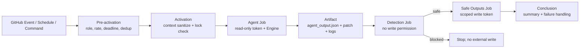
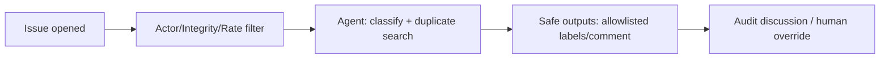
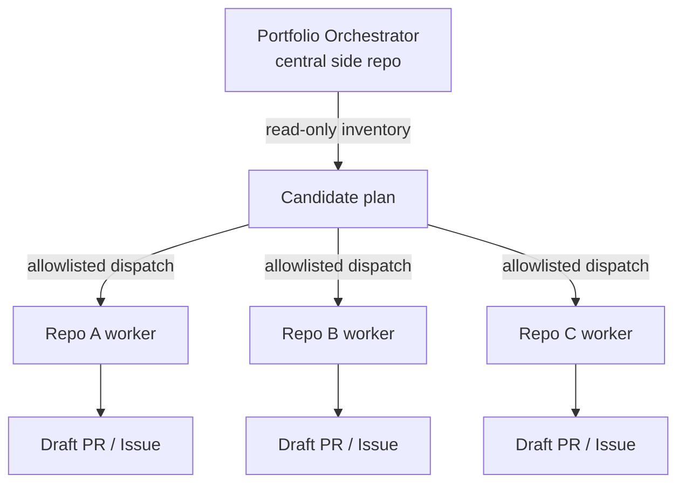
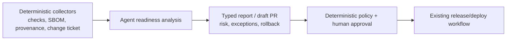

# GitHub Agentic Workflows 深度研究一手证据底稿

> [!abstract] 研究结论
> GitHub Agentic Workflows（`gh-aw`）不是替代 GitHub Actions 的新流水线引擎，而是运行在 Actions 之上的 **Agent Workflow 编译器与安全运行框架**：作者维护 Markdown 源文件，编译器将 Frontmatter 转成固定依赖、分 Job、可审计的 `.lock.yml`；运行时 AI Agent 在只读权限、沙箱和网络防火墙内完成判断，写操作由独立 Safe Outputs Job 执行。截至 2026-07-15，它处于 **Public Preview**，适合“高语义判断 + 结果可审查 + 下游确定性验证”的工作，不应直接接管生产部署、签名、制品晋级和回滚。

本底稿为 [[50_deepdives/github-agentic-workflows/90_report|专题主报告]] 提供当前状态、使用方法、技术原理、复杂实践和限制的一手证据。只使用 GitHub Docs、`github/gh-aw` 官方文档/源码说明、GitHub Changelog 以及 `githubnext/agentics` 官方示例。

> [!info] 证据标记
> - **事实**：官方文档、源码说明、官方仓库或第一方公告直接支持。
> - **官方示例**：GitHub/GitHub Next 发布的参考实现，不等同于独立生产效果证明。
> - **厂商自报**：GitHub 公告中的客户引语或效果描述，未经过独立对照实验。
> - **推断/建议**：基于机制归纳出的企业架构或落地要求，需要用本地任务集验证。

## 一、产品定位、成熟度和适用条件

### 1.1 当前状态

| 维度 | 截至 2026-07-15 的事实 | 判断 |
|---|---|---|
| 产品阶段 | GitHub 于 2026-02-13 宣布 Technical Preview，2026-06-11 升级为 **Public Preview**；官方文档仍提示能力可能显著变化 | 可试点，不宜当作稳定 GA 平台冻结多年接口 |
| 当前 Release | 官方 `releases/latest` 在观察日指向 `v0.81.6`（2026-06-27） | 这是时间截面，不应写死为长期“最新版” |
| 开源许可 | `github/gh-aw` 公开仓库采用 MIT License | 编译器可审查、可贡献；运行成本和上游服务条款仍分别适用 |
| 运行基础 | Markdown 编译成标准 GitHub Actions YAML，复用 Actions Runner Group 和已有 Policy | 它增强 Actions，不取代 Runner、Actions 权限和仓库规则 |
| 支持 Engine | Copilot（默认）、Claude、Codex、Gemini；OpenCode/Pi 在官方表中标为 experimental | 工作流格式可以跨 Engine，但功能并非完全等价 |
| 基本前提 | 有 AI 账户、仓库写权限、Actions 已启用、GitHub CLI 与 `gh aw` 扩展 | 生产使用还需要组织策略、预算、Secret、Runner 和安全评审 |
| Runner | 作者侧可用 Linux/macOS/Windows WSL；执行侧 AWF 依赖 Linux Runner，官方 Frontmatter 文档不支持 macOS/Windows Runner | 自托管 Runner 必须补齐 Docker、网络出口和 GHES 等要求 |

证据：

- [GitHub Changelog：Public Preview，2026-06-11](https://github.blog/changelog/2026-06-11-github-agentic-workflows-is-now-in-public-preview/)
- [GitHub Changelog：Technical Preview，2026-02-13](https://github.blog/changelog/2026-02-13-github-agentic-workflows-are-now-in-technical-preview/)
- [`github/gh-aw` 官方仓库及 MIT License](https://github.com/github/gh-aw)
- [`gh-aw v0.81.6` Release](https://github.com/github/gh-aw/releases/tag/v0.81.6)
- [GitHub Docs：Prerequisites 与 Public Preview 提示](https://docs.github.com/en/copilot/how-tos/github-agentic-workflows/creating-github-agentic-workflows)
- [官方 Engine 对照](https://github.github.com/gh-aw/reference/engines/)
- [官方 Frontmatter：Runner 支持范围](https://github.github.com/gh-aw/reference/frontmatter/#run-configuration-run-name-runs-on-runs-on-slim-timeout-minutes)

> [!warning] Preview 与版本风险
> 官方仓库曾要求撤回 `0.68.4`—`0.71.3`，原因是影响 Billing 的缺陷。这说明 `gh-aw` 的版本升级不是普通开发依赖升级：应固定扩展/Engine 版本、重新生成 Lock、比较 Job/权限/域名/Action Pin 变化，并在沙箱仓库回归。[官方仓库公告](https://github.com/github/gh-aw)

### 1.2 它与相邻能力的边界

| 能力 | 决定什么 | 不负责什么 |
|---|---|---|
| GitHub Actions | Event、Runner、Job、Token、Environment、Ruleset、Artifact | 不自动完成开放式语义判断 |
| `gh-aw` Compiler | 将 Agentic Markdown 编译为 Hardened Actions Job 图，校验配置并固定依赖 | 不保证模型答案正确，也不替代业务测试 |
| Coding Agent Engine | 读取上下文、选择 Tool、推理和生成候选结果 | 不应直接持有仓库写权限或生产凭据 |
| GitHub/MCP/CLI Tools | 提供可读取、查询、运行和编辑的能力面 | Tool 可达不代表业务授权，也不保证调用有意义 |
| Safe Outputs | 将允许的副作用做成类型化、限量、可过滤的写入请求 | 不等于 Merge、Deploy 或生产变更批准 |
| Threat Detection | 在写入前检查 Prompt Injection、Secret 泄漏和可疑 Patch | 是额外风险控制，不是形式化证明或完整安全扫描 |
| 确定性 CI/CD | 编译、测试、扫描、签名、Policy、Deploy、Rollback | 不擅长开放式调查和跨上下文解释 |

**推断：** GitHub Agentic Workflows 的核心创新不是“用 Markdown 代替 YAML”，而是把自然语言决策限制在编译器生成的 **Plan-level trust** 中：AI 负责候选计划，确定性 Job 决定哪些能力可见、哪些输出可外化。[官方 Security Architecture](https://github.github.com/gh-aw/introduction/architecture/)

## 二、如何使用：从安装到运行审计

### 2.1 最短可用路径

```bash
# 1. 登录并安装扩展
gh auth login --scopes repo,workflow
gh extension install github/gh-aw

# 2. 给仓库加入 Agentic Workflow authoring skill/agent/.gitattributes
gh aw init

# 3A. 从官方样例向导安装
gh aw add-wizard githubnext/agentics/daily-repo-status

# 3B. 或自行创建
gh aw new issue-triage

# 4. 编译与严格验证
gh aw compile --strict
gh aw validate --strict

# 5. 提交 .md 与 .lock.yml 后运行
gh aw run issue-triage

# 6. 观察与审计
gh aw status --ref main
gh aw logs issue-triage
gh aw audit <run-id>
```

官方依据：

- [GitHub Docs：创建和运行 Agentic Workflow](https://docs.github.com/en/copilot/how-tos/github-agentic-workflows/creating-github-agentic-workflows)
- [官方 Quick Start](https://github.github.com/gh-aw/setup/quick-start/)
- [官方 CLI Commands](https://github.github.com/gh-aw/setup/cli/)
- [官方 Compilation Process](https://github.github.com/gh-aw/reference/compilation-process/)
- [官方 Auditing Workflows](https://github.github.com/gh-aw/reference/audit/)

### 2.2 Authentication 选择

| Engine/场景 | 推荐凭据 | 关键边界 |
|---|---|---|
| Copilot，组织仓库 | `permissions: copilot-requests: write`，使用 Actions `GITHUB_TOKEN` | 需组织开启 “Allow use of Copilot CLI billed to the organization”；无须长期 PAT |
| Copilot，其他方式 | `COPILOT_GITHUB_TOKEN` Fine-grained PAT | 当声明 `copilot-requests: write` 时该 PAT 对推理会被忽略 |
| Claude | `ANTHROPIC_API_KEY`，或 Anthropic WIF/OIDC | WIF 避免仓库存放长期 API Key |
| Codex | `OPENAI_API_KEY` 或优先级更高的 `CODEX_API_KEY` | 第三方推理成本按相应 Provider 计费 |
| Gemini | `GEMINI_API_KEY` | Provider API Key 仍是 Secret |
| 跨仓读取/写入、Projects、触发 CI | Fine-grained PAT 或 GitHub App | 默认 `GITHUB_TOKEN` 的仓库和权限范围通常不够；优先短期 GitHub App Token |

证据：[Authentication Reference](https://github.github.com/gh-aw/reference/auth/)、[2026-06-11 无需 PAT 的 Copilot 更新](https://github.blog/changelog/2026-06-11-agentic-workflows-no-longer-need-a-personal-access-token/)。

> [!warning] Secret 放置
> 不要把 `${{ secrets.* }}` 放入工作流级 `env:`：官方说明这会直接传入 Agent Container，使 AI Runtime 可见；Strict Mode 会拒绝，非 Strict 会警告。Secret 应只注入需要它的 Engine、MCP Server、MCP Script 或下游 Safe Output Job。[Frontmatter：Environment Variables](https://github.github.com/gh-aw/reference/frontmatter/#environment-variables-env)

### 2.3 Day-2 运维命令

| 目的 | 命令/机制 | 输出 |
|---|---|---|
| 检查源文件与编译状态 | `gh aw list` / `gh aw status --ref main` | Engine、Enabled、最近 Run、Label、Schedule |
| 只校验不生成 | `gh aw compile --no-emit` | Schema/Expression/Import 等错误 |
| 完整验证 | `gh aw validate --strict` | Compile + Linters，无 Lock 输出 |
| Actions 安全扫描 | `gh aw compile --actionlint --zizmor --poutine` | YAML、Actions Security 和 Workflow 风险 |
| 清理孤儿 Lock | `gh aw compile --purge` | 删除没有源 Markdown 的遗留 Lock |
| 试运行 | `gh aw trial` / Safe Outputs `staged: true` | 观察候选输出而不执行外部写入 |
| 下载分析 Run | `gh aw logs` | Duration、Token/AIC、Tool、Firewall、Artifact |
| 深审单次 Run | `gh aw audit <run-id>` | MCP、Tool、Network、Policy、成本和创建对象 |
| 多 Run 趋势 | `gh aw logs --format markdown <workflow>` | 异常、成本、域名与 MCP 健康趋势 |
| 升级 | `gh extension upgrade aw`、`gh aw upgrade`、`gh aw update` | CLI/Engine、Codemod、上游 Workflow 与重新编译 |

证据：[CLI Reference](https://github.github.com/gh-aw/setup/cli/)、[Cost Management](https://github.github.com/gh-aw/reference/cost-management/)、[Staged Mode](https://github.github.com/gh-aw/reference/safe-outputs/#staged-mode)。

## 三、Workflow 文件和 Frontmatter

### 3.1 两段式源文件

Agentic Workflow 位于 `.github/workflows/<name>.md`，由两部分组成：

1. YAML Frontmatter：Event、权限、Engine、Tool、Network、Safe Output、预算、并发等控制面；
2. Markdown Body：Agent 的自然语言任务、判断规则、步骤、异常处理和输出契约。

编译后生成 `.github/workflows/<name>.lock.yml`，Actions 实际执行的是 Lock 文件。Markdown Body 在 Runtime 加载，因此只改正文不强制重新编译；Frontmatter 改动必须重新编译。官方仍建议两者都入库，Lock 文件不要手工编辑。[Workflow Structure](https://github.github.com/gh-aw/reference/workflow-structure/)

### 3.2 一个有边界的 CI 诊断示例

```markdown
---
description: Diagnose failed CI runs and report a bounded remediation plan
labels: [automation, ci, diagnostics]

on:
  workflow_run:
    workflows: [CI]
    types: [completed]

if: ${{ github.event.workflow_run.conclusion == 'failure' }}

permissions:
  contents: read
  actions: read
  issues: read
  copilot-requests: write

engine:
  id: copilot

timeout-minutes: 20
max-ai-credits: 500

network:
  allowed: [defaults, github]

tools:
  github:
    toolsets: [actions, repos, issues]
    allowed:
      - get_job_logs
      - get_workflow_run
      - list_workflow_jobs
      - search_issues

safe-outputs:
  create-issue:
    max: 1
    title-prefix: "[ci-diagnosis] "
    labels: [automation, ci]
  threat-detection: true
---

# CI failure diagnosis

Investigate only run `${{ github.event.workflow_run.id }}`.

1. Identify the first causal failure; distinguish code, test flake,
   dependency, runner, network and configuration failures.
2. Search for an open issue with the same error signature.
3. Do not retry workflows and do not modify code or CI configuration.
4. If the cause is actionable and not already tracked, create one issue with:
   evidence, confidence, owner suggestion, reproduction and next validation.
5. If evidence is insufficient, report missing data instead of guessing.
```

> [!note] 示例说明
> 这是依据官方语法整理的企业边界示例，不是逐字复制的官方 Workflow。Tool 的实际名称应通过当前 `gh aw mcp-inspect` / GitHub MCP Tool 列表核验，随后运行 `gh aw validate --strict`。官方 CI Doctor 参考实现见 [`githubnext/agentics/workflows/ci-doctor.md`](https://github.com/githubnext/agentics/blob/main/workflows/ci-doctor.md)。

### 3.3 Frontmatter 能力地图

| 类别 | 主要字段 | 解决的问题 |
|---|---|---|
| 触发/条件 | `on`、`if`、`stop-after`、`skip-if-match` | 何时值得消耗 Agent 预算 |
| 身份/权限 | `permissions`、`github-app`、`environment` | 谁能读，哪个隔离 Job 能写 |
| 模型 | `engine.id`、`model`、`version`、`api-target` | 运行哪个 Coding Agent/Provider/版本 |
| 资源边界 | `timeout-minutes`、`max-turns`、`max-ai-credits`、`max-daily-ai-credits` | 运行时长、循环和推理费用 |
| 能力面 | `tools`、`mcp-servers`、`mcp-scripts`、`skills` | Agent 可以发现并调用什么 |
| 数据面 | `checkout`、`cache-memory`、`repo-memory`、`imports` | 代码、共享策略和跨 Run 状态 |
| 隔离面 | `sandbox`、`network`、`container` | Filesystem、Process 和 Egress 边界 |
| 副作用 | `safe-outputs`、`protected-files`、`staged`、`threat-detection` | 哪些候选写入可以被外化 |
| 运维 | `concurrency`、`user-rate-limit`、`observability`、`labels` | 防重入、成本归属和可观测性 |

完整字段以[官方 Frontmatter Reference](https://github.github.com/gh-aw/reference/frontmatter/)为准。

### 3.4 Prompt/Markdown 写法

官方建议把 Markdown 写成新成员可执行的工作说明，而不是泛化角色扮演：明确上下文、判断条件、处理步骤、异常分支、输出格式和成功标准。Body 支持 GitHub Actions Expression 与条件模板；临时文件应写入 `/tmp/gh-aw/agent/`，该目录会作为 Run Artifact 保存。[Markdown Reference](https://github.github.com/gh-aw/reference/markdown/)

企业 Prompt 至少应声明：

- **范围**：本次 Run、目标 PR/Issue/Repo，不扫描无限集合；
- **证据顺序**：日志 → Check/Commit → 相关 Issue → 代码，不因表面错误直接改代码；
- **分类法**：Flake/Infra/Code/Dependency/Policy 等固定枚举；
- **停止条件**：证据不足、达到 Tool/Turn/Cost 上限、风险文件被触碰时停止；
- **禁止项**：不得改 Gate、删测试、降安全配置、绕过保护分支；
- **输出契约**：结论、证据、置信度、建议、验证方法；
- **幂等/去重**：用 Run ID、Error Signature、已有 Issue/PR 或 Memory 去重。

## 四、编译与 Lock File 原理

### 4.1 五阶段编译

官方把 `gh aw compile` 划分为五个阶段：[Compilation Process](https://github.github.com/gh-aw/reference/compilation-process/)

1. **Parse/Validate**：提取 Frontmatter，按 Schema 校验，限制可用 GitHub Expressions，解析 Imports；
2. **Job Construction**：构造 Pre-activation、Activation、Agent、Detection、Safe Output、Conclusion 和 Custom Jobs；
3. **Dependency Resolution**：检查 `needs`、循环依赖和拓扑顺序；
4. **Action Pinning**：将外部 Action 固定到 Commit SHA；
5. **YAML Generation**：生成 `.lock.yml`，加入 Metadata、依赖清单、Job 图和 Prompt 信息。

`imports` 使用确定性 BFS 解析，但各字段合并语义不同：Tools 深合并、Network 做并集、Safe Outputs 由主 Workflow 对同类型覆盖、Permissions 由主 Workflow 满足导入片段要求。共享策略一旦导入就会扩大 Tool/Network 面，因此导入变更必须像依赖升级一样审查。[Compilation Process：Import Resolution](https://github.github.com/gh-aw/reference/compilation-process/#import-resolution)

### 4.2 Lock File 不是普通生成 YAML

Lock 文件首行包含机器可读 Metadata，例如 `schema_version`、`frontmatter_hash`、`strict`、`agent_id`；随后列出使用的 Secret 和固定 SHA 的 Action。`.github/aw/actions-lock.json` 缓存 `action@version → SHA` 映射，以便不同编译环境复用同一 Pin。[Workflow Structure：Lock Header](https://github.github.com/gh-aw/reference/workflow-structure/#lock-file-header)、[Compilation：Action Pinning](https://github.github.com/gh-aw/reference/compilation-process/#action-pinning)

Frontmatter Hash 用于发现 Stale Lock，**不是防篡改安全边界**：拥有仓库写权限的人可以同时改 `.md` 和重编 Lock；默认 Hash 也不覆盖 Body，只有 `on.stale-check: "full"` 才把正文纳入检查。因此仍须 Branch Protection、CODEOWNERS 和 PR Review。[Frontmatter Hash Specification](https://github.github.com/gh-aw/reference/frontmatter-hash-specification/)

已有 Lock 的 Compile 还包含 Safe-update 检查；新增 Secret 或 Custom Action 时需要显式 `--approve`，用于防止生成物能力面静默扩张。它保护的是与上一个 Lock 的 Diff，同样不能替代对首个版本和批准者权限的审查。[CLI：Compile](https://github.github.com/gh-aw/setup/cli/#compile)

**建议的 Review Diff 顺序：**

1. Frontmatter：Trigger、Permission、Network、Tool、Safe Output、Budget 是否变化；
2. Lock Manifest：新增 Secret、Domain、MCP Server、Action 是否合理；
3. Job Graph：是否新增能接触写 Token 的 Job；
4. Action Pin：SHA 与版本注释是否来自预期 Release；
5. Runtime Prompt：Body 是否包含外部文本拼接和新的开放式指令；
6. `gh aw validate --strict` 与 Actions Security Scanner 是否通过。

> [!warning] 正文无需编译不等于无需 Review
> Body 是运行时 Prompt，改正文可立即改变 Agent 行为。Frontmatter Hash/Lock Freshness 主要保护配置编译一致性，不能替代对 Prompt 的 CODEOWNERS、PR Review 和回归任务集。

## 五、运行时技术架构

### 5.1 Actions Job 计划



官方编译流程说明，Activation 负责上下文/输入处理；Agent Job 初始化 Repo、Runtime、Cache 与 MCP，加载 Body 并运行 Engine；候选操作写入 Artifact；Detection 在隔离 Job 判断；Safe Outputs Job 下载结构化输出后才用相应权限调用 GitHub API；Conclusion 汇总运行。[Compilation：Job Types](https://github.github.com/gh-aw/reference/compilation-process/#job-types)

Detection、Safe Outputs 与 Conclusion 必须分 Job，是因为 Actions 权限在 Job 期间不可变。将 Threat Detection 与 Write Token 放在同一个 Job 会破坏隔离；独立 Job 还能用 `needs.detection.outputs.success` 做硬门禁。[Compilation：Why Separate Jobs](https://github.github.com/gh-aw/reference/compilation-process/#why-detection-safe-outputs-and-conclusion-are-separate-jobs)

### 5.2 Engine/Provider 抽象

```yaml
engine:
  id: copilot        # claude / codex / gemini
  model: gpt-5       # 可选；应按组织允许列表核验
  version: "0.0.422" # 示例；生产应固定经过验证的 CLI 版本
```

Engine 抽象统一了工作流格式，但并未消除差异：官方对照表显示 Custom Agent、Continuation、Web Search、Turn Limit、Bare/Harness 和 Tool Allowlist 的支持程度不同；切换 `engine` 后应重新跑安全、Tool Call 和结果回归，而不是只验证“能启动”。[AI Engines](https://github.github.com/gh-aw/reference/engines/)

**建议：**

- 固定 Engine CLI 版本；模型别名放到组织变量并保留允许列表；
- 为同一任务维护 Provider-neutral Prompt，另建小型 Engine-specific Adapter；
- 比较 Task Success、Tool Precision、回归率、Latency 和 AIC，而不是只比较输入 Token；
- 切 Engine 时检查是否仍由 Gateway 执行 Tool Allowlist；Claude `bypassPermissions` 模式尤其不能依赖客户端 Allowlist，Gateway 的 `allowed` 才是有效 Tool 边界。[Claude Tool Enforcement](https://github.github.com/gh-aw/reference/engines/#claude-tool-enforcement-security-model)

### 5.3 Tools、MCP、CLI 和 Skill 的关系

| 层 | 在 gh-aw 中的角色 | 典型配置 |
|---|---|---|
| Tool | Agent 可调用的单项能力；可以是 GitHub Tool、Bash、Edit、Web Fetch、Playwright、QMD 等 | `tools.github.toolsets`、`tools.github.allowed`、`tools.bash` |
| MCP Server | Tool/Resource 的协议化 Provider，由 MCP Gateway 聚合与过滤 | `mcp-servers.<id>.container/url/allowed` |
| MCP Script | 在 Workflow 内定义小型 JS/Shell/Python/Go Tool，Schema 与 Secret Scope 显式 | `mcp-scripts` |
| CLI | Agent 在沙箱中通过 Shell 调用的进程能力；也可把 MCP Server 用 `cli-proxy` 挂为命令 | `tools.bash`、`tools.cli-proxy: true` |
| Skill | 被导入的任务知识/工作法；影响 Agent 如何使用 Tool，不自动授权 Tool | `skills` / `imports` |

GitHub Tools 默认可提供当前 Repo 与公共 Repo 的读取能力；`toolsets` 选择 API Group，`allowed` 进一步把 Tool 缩小到名称并可设置 `max-calls`，Runtime 由 MCP Gateway 执行调用次数上限。[GitHub Tools](https://github.github.com/gh-aw/reference/github-tools/)

自定义 MCP 应优先使用固定 Digest/版本的 Container 或明确 HTTP Endpoint，并设置 `allowed`：

```yaml
mcp-servers:
  artifact-catalog:
    container: "ghcr.io/acme/artifact-mcp@sha256:<digest>"
    allowed: [get_artifact, get_provenance, get_sbom]
    env:
      CATALOG_TOKEN: ${{ secrets.CATALOG_READ_TOKEN }}
```

`allowed` 在 Gateway 侧生效，与 Engine 无关；MCP Server 自身仍须实施 Authentication/Authorization，不能把 Gateway Filter 当成业务权限系统。[Using MCPs](https://github.github.com/gh-aw/guides/getting-started-mcp/)

MCP Scripts 只给声明该 Tool 的 `env` 注入 Secret，Shell/Python/Go Tool 在隔离进程/Container 中执行，输出必须经过 JSON 解析、大小控制和 Secret Redaction。适合把内部确定性查询包装成窄 Tool，不适合在脚本里重新实现通用部署平台。[MCP Scripts Specification](https://github.github.com/gh-aw/specs/mcp-scripts-specification/)

### 5.4 Safe Outputs 的技术本质

Safe Outputs 是 Agent 可见的结构化 MCP Tool/输出契约，但外部写操作不由 Agent Job 直接执行：Agent 只写候选操作，独立 Job 按类型 Schema、数量、Label、Target Repo、Protected Files、文本 Sanitization 和 Token 权限再校验并执行。[Safe Outputs](https://github.github.com/gh-aw/reference/safe-outputs/)

一个容易忽略的默认是：没有 `safe-outputs:`，或只声明 System Output 时，Compiler 会保守地注入 `create-issue`（`max: 1`、Workflow 标识 Label/Title Prefix），用于报告结果/失败。若要求真正“零外部写入”，不能仅省略该字段，应显式配置期望的系统输出或使用 Staged/无副作用策略并检查 Lock。[Safe Outputs：默认行为](https://github.github.com/gh-aw/reference/safe-outputs/)

关键策略项：

- `max`：每次最多创建/修改多少对象；
- `allowed` / `blocked`：Label/User/Repo/Branch 等值域；
- `target`、`target-repo`、`allowed-repos`：目标范围；
- `title-prefix` / `required-title-prefix` / `required-labels`：对象来源和前置状态；
- `draft`：AI 代码修改默认进入 Draft PR；
- `protected-files`：涉及依赖、CI、Agent Instruction、CODEOWNERS 时请求人工 Review、阻断或降级为 Issue；
- `staged: true`：只预览不写入；
- `github-app` / `github-token`：写凭据只进入下游 Job；
- `environment`：复用 GitHub Environment Secret 与 Approval；
- `threat-detection`：写入前额外检查。

> [!warning] Safe Output 不是生产发布许可
> Safe Output 能证明“该操作属于预先声明的类型并通过指定检查”，不能证明版本满足 SLO、变更单获批、制品签名有效或回滚准备完成。生产发布必须继续经过确定性 Policy/Environment/Deployment Workflow。

### 5.5 Sandbox 与 Network Firewall

默认 `sandbox.agent: awf`。AWF 在 Container 中暴露用户路径 `$HOME`、`$GITHUB_WORKSPACE`、`/tmp` 为可写，系统路径只读，隐藏 Docker Socket；其重点是 Agent Runtime 隔离和基于域名的 Network Egress 控制。[Sandbox Configuration](https://github.github.com/gh-aw/reference/sandbox/)

`sandbox.mcp` 形式的统一 HTTP MCP Gateway 在官方文档中仍明确标为 **Experimental**；不要把它与已用于 GitHub Tool/Safe Output Enforcement 的内部 Gateway 概念混为一个稳定对外契约。[Sandbox：MCP Gateway Experimental](https://github.github.com/gh-aw/reference/sandbox/#mcp-gateway-experimental)

Network 默认是 `defaults` 基础设施域名；可用 `allowed` 精确增加生态或域名，也可用空对象阻断全部网络，`blocked` 优先于 `allowed`。同一个 Allowlist 还参与输出 URL Sanitization，未允许的 URL 会被 Redact。[Network Permissions](https://github.github.com/gh-aw/reference/network/)

```yaml
sandbox:
  agent: awf

network:
  allowed:
    - defaults
    - github
    - "https://api.internal.example.com"
  blocked:
    - "telemetry.vendor.example.com"
```

关闭 Agent Sandbox 需要显式 `sandbox.agent: false`，并提供至少 20 字符、不可用 Expression 的 `features.dangerously-disable-sandbox-agent` 理由；理由进入诊断和审计。此能力是 Break-glass，不应变成通用模板默认值。[Sandbox：Disabling](https://github.github.com/gh-aw/reference/sandbox/#coding-agent-sandbox)

### 5.6 Integrity Filtering：输入可信度控制

Prompt Injection 不只来自 Workflow Body，也来自 Issue、PR、Comment、Log 和外部 Tool Result。GitHub Integrity Filtering 由 MCP Gateway 拦截 GitHub Tool Result，按作者关系与 Merge 状态过滤 AI 能看到的内容；公共 Repo 默认 `min-integrity: approved`，Private/Internal Repo 默认不会自动注入同一 Guard Policy。若私有仓库仍接收低信任 Bot、Mirror 或跨仓内容，应显式配置 Integrity，不要依赖可见性替代内容可信度。[Integrity Filtering](https://github.github.com/gh-aw/reference/integrity/)

完整顺序为 `merged > approved > unapproved > none > blocked`。`blocked-users` 绝对拒绝；`refusal-labels` 可降级；`trusted-users`/`approval-labels` 可提升；过滤事件写入 `DIFC_FILTERED` Audit Log。

```yaml
tools:
  github:
    min-integrity: approved
    blocked-users: [known-spam-bot]
    approval-labels: [human-reviewed, safe-for-agent]
    refusal-labels: [needs-security-review, do-not-automate]
```

公共 Issue Triage 若要读取陌生用户内容，可能需要 `unapproved` 或 `none`；这等于主动扩大不可信输入面，必须同时保持只读 Agent、窄 Safe Output、严格 Label Allowlist、Staged Pilot 和人工抽检。官方 Issue Triage 文章也明确指出此取舍。[GitHub Next：Issue Triage](https://github.github.com/gh-aw/blog/2026-01-13-meet-the-workflows/)

### 5.7 Threat Detection 与 Protected Files

Safe Outputs 存在时，Threat Detection 默认启用。它读取 Prompt、`agent_output.json` 与 `aw.patch`，在无写权限的独立 Job 中检测 Prompt Injection、Secret Leakage 与 Malicious Patch；判断安全才允许 Safe Outputs Job 启动。可追加 Semgrep/TruffleHog 等确定性扫描，也可禁用 AI Detection 只运行自定义检测，但不建议无替代控制地关闭。[Threat Detection](https://github.github.com/gh-aw/reference/threat-detection/)

`create-pull-request` / `push-to-pull-request-branch` 对依赖清单、`.github/`、`.agents/`、Engine Instruction 和 `CODEOWNERS` 等 Protected Files 有专门策略。官方当前默认策略允许创建 PR 但提交 Request Changes，要求人审；也可配置 Block 或 Fallback-to-Issue。[Threat Detection：Protected Files](https://github.github.com/gh-aw/reference/threat-detection/#supply-chain-protection-protected-files)

> [!warning] 残余风险
> AI Threat Detection 仍是概率性分类器；若 Detection 与 Agent 使用同一 Provider/模型，也可能存在相关失效。高风险场景应叠加确定性 Scanner、Ruleset、CODEOWNERS、Artifact Attestation 与 Environment Approval。

## 六、触发、状态、成本和审计

### 6.1 触发器

`on` 支持标准 Actions Event，并增加人类友好 Schedule、Slash Command、Label Command、Reaction/Status Comment 等语法。Shorthand 编译为标准 Actions Trigger，并自动加入 `workflow_dispatch`。[Triggers](https://github.github.com/gh-aw/reference/triggers/)

| 模式 | 适合 | 风险控制 |
|---|---|---|
| `issues` / `pull_request` | 低延迟 Triage、Review、Clarification | Integrity、Path/Label/Actor Filter、User Rate Limit |
| `workflow_run` | CI Failure Diagnosis、Release Evidence 收集 | 仅处理指定 Workflow 与 Conclusion，Run ID 去重 |
| `schedule` | Maintenance、Drift、Portfolio 报告 | Fuzzy Schedule、Daily AIC、Open PR 上限、Memory 去重 |
| `workflow_dispatch` | 人工试运行、高风险前置分析 | 输入 Enum、Environment、Staged Mode |
| `slash_command` | `/investigate`、`/pr-fix` 等按需协作 | 仅允许有权角色、Centralized Router、Status Comment |
| `workflow_call` | 作为确定性流水线中的可复用推理阶段 | 明确 Inputs/Outputs，由 Caller 决定下一阶段 |
| `repository_dispatch` | 外部系统或跨仓编排 | Event Type、Payload Schema、Target Allowlist、Token |

Slash Command 必须位于 Comment/Body 的首词，Centralized Strategy 会生成一个共享 Router，再用 `aw_context` Dispatch 目标工作流；这是大规模 Command Bot 的降噪方式。[Command Triggers](https://github.github.com/gh-aw/reference/command-triggers/)

### 6.2 持久状态与幂等

| 状态机制 | 底层 | 保留/特性 | 适合 |
|---|---|---|---|
| `cache-memory` | GitHub Actions Cache | 默认短期、分支范围、快速、无版本历史 | 近期开销、已处理 Run ID、临时索引 |
| `repo-memory` | 专用 Git Branch | 持久、版本化、自动 Commit/Push、可限制文件和 Patch 大小 | 长期故障模式、跨 Run 进度、审计知识 |
| Issue/PR/Discussion | GitHub Object | 人可见、有权限和 Timeline | 决策、Override、待办与可追责结论 |
| Artifact/OTel | Actions Artifact / OTLP | Run 级证据与外部可观测性 | Log、Patch、成本和安全审计 |

证据：[Cache Memory](https://github.github.com/gh-aw/reference/cache-memory/)、[Repo Memory](https://github.github.com/gh-aw/reference/repo-memory/)、[MemoryOps](https://github.github.com/gh-aw/patterns/memory-ops/)。

**建议：** Memory 只能存事实、游标、Hash、结论和验证时间，不应存 Secret；长期 Memory 应设置 Schema Version、TTL/Review Date、`allowed-extensions`、`max-file-size`、`max-patch-size`，并把外部写入仍留在 Safe Outputs。

### 6.3 并发、限流与 Fan-out

官方 Compiler 会生成 Workflow 级与 Engine 级双重并发控制；PR 新 Commit 默认可取消旧 Run，而 Issue/Schedule 不同。多 Worker Fan-out 可用 `concurrency.job-discriminator` 区分；Safe Outputs 可用单独 `concurrency-group` 串行化，避免重复创建对象。[Concurrency Control](https://github.github.com/gh-aw/reference/concurrency/)

需要同时配置：

- `user-rate-limit`：避免公共 Comment/Command 触发成本攻击；
- `max-ai-credits`：每 Run 硬上限；
- `max-daily-ai-credits`：同 Workflow 24 小时滚动上限；
- `timeout-minutes` / `max-turns` / `tools.timeout`：控制循环与慢 Tool；
- `safe-outputs.*.max`：控制外部对象 Fan-out；
- Pre-activation：在 Agent 前检查 Open PR、已有 Issue、Release 状态等确定性条件。

### 6.4 成本模型

总成本至少包含两部分：Actions 分钟和 AI Provider 推理费用。`gh-aw` 使用 AI Credits（AIC）作为跨 Engine 的主要支出指标；官方规范定义 `1 AIC = 0.01 USD`，这是 **GitHub 的归一化/厂商自报口径**，不能替代 Provider 最终账单。默认每 Run `max-ai-credits: 1000`，并在接近上限时 Steering。Threat Detection 有独立 AIC Budget，不能只看主 Agent 费用。[AI Credits Specification](https://github.github.com/gh-aw/specs/ai-credits-specification/)、[Cost Management](https://github.github.com/gh-aw/reference/cost-management/)、[AIC 迁移公告](https://github.github.com/gh-aw/blog/2026-06-08-migrating-from-effective-tokens-to-ai-credits/)

> [!warning] Daily AIC 默认值的官方文档矛盾
> 当前官方资料内部不一致：规范性 [AI Credits Specification](https://github.github.com/gh-aw/specs/ai-credits-specification/#daily-ai-credits-guardrail) 与 [Rate Limiting Controls](https://github.github.com/gh-aw/reference/rate-limiting-controls/#daily-ai-credits-guardrail) 定义 24 小时默认 `5000 AIC`（约 50 USD，厂商口径），并描述生成表达式 `${{ vars.GH_AW_DEFAULT_MAX_DAILY_AI_CREDITS || '5000' }}`；但 [Frontmatter](https://github.github.com/gh-aw/reference/frontmatter/#daily-per-workflow-ai-credits-guardrail-max-daily-ai-credits) 与 Cost Management 的部分段落又称省略时默认禁用。企业不能依赖隐式默认：应在 Frontmatter 或组织变量中显式设置 `max-daily-ai-credits`，并在固定 CLI 版本的 `.lock.yml` 中核验实际生成值。手动、Slash/Label Command 和部分内部 Dispatch 路径还可能绕过 Daily Guardrail，应另配 User Rate、每 Run Budget 与并发控制。

应按场景核算：

$$
Cost_{task}=ActionsMinutes + AgentAIC + DetectionAIC + ExternalToolCost + HumanReviewCost
$$

并同时测量：Task Success、Accepted Output、重复对象、错误修改、人工撤销、P50/P95 Latency 和 Cost per Accepted Outcome。单纯 Token 下降不代表业务成本下降。

### 6.5 审计证据

`gh aw audit` 可分析单次或对比多次 Run，覆盖 Token/AIC、Turn、Tool/MCP 使用、MCP 健康、Firewall Domain、Policy、Redaction、Error/Warning 和创建对象；`gh aw logs --format markdown` 提供跨 Run 趋势。[Auditing Workflows](https://github.github.com/gh-aw/reference/audit/)

每次重要 Run 至少保留：

- Workflow `.md` 的实际版本和 Lock Metadata；
- Trigger Actor/Event/Payload Hash；
- Engine/Model/CLI Version；
- Prompt、Tool List、Tool Call、MCP/Firewall/Integrity 事件；
- Agent Candidate Output、Patch、Threat Detection 结果；
- Safe Output 的 Policy Decision、执行 Token 身份和最终 GitHub Object；
- AIC/Actions Duration；
- 下游 CI/Review/Merge/Deploy 的最终结果。

GitHub 2026-03-26 已支持在 Actions Run Summary 中直接查看该 Run 使用的 Agentic Workflow Markdown，便于复核实际配置。[GitHub Changelog](https://github.blog/changelog/2026-03-26-view-agentic-workflow-configs-in-the-actions-run-summary/)

## 七、复杂场景实践

### 7.1 Issue/PR Triage：从自动贴标签到可审计分流

**官方模式：** `githubnext/agentics` 的 Issue Triage 在 Issue Open/Reopen 时读取 Issue 与 Repo Context，使用限定 Label 集合和 `add-comment`；官方强调不同 Repo 的分类规则必须定制，并提醒公共 Repo 的 Integrity 取舍。[官方 Issue Triage 文章](https://github.github.com/gh-aw/blog/2026-01-13-meet-the-workflows/)

**生产拆分：**



推荐 Frontmatter 边界：

- `issues: read`，GitHub Tool 只开 `issues/search/labels`；
- `min-integrity: unapproved` 起步，确需覆盖陌生用户再评估 `none`；
- `add-labels.allowed` 使用有限业务标签，Block Trigger/Admin Label；
- `add-comment.max: 1`，禁止 Close/Assign/Merge；
- 要求输出 Confidence 与 Evidence；低置信度只加 `needs-human-triage`；
- 用 Existing Label/Assignee 与 Signature 查重；
- 定期输出分类报告供抽检，而非静默改变状态。

**复杂升级：** 将分类与处置分两条 Workflow。Triage 只生成结构化类别；另一个由 Maintainer Label/Command 触发的 Worker 才调查或生成 Draft PR。这样不可信 Issue 文本不会直接触达写代码的 Agent。

### 7.2 CI Failure：Diagnosis 与 Fix 必须分层

**官方 Diagnosis 示例：** CI Doctor 通过 `workflow_run` 监听指定 Workflow Failure，读取 Job Log，分类 Code/Infra/Dependency/Config/Flake/External Service，搜索历史 Issue，用 Cache Memory 记录已分析 Run，并创建 Issue 或补充已有 Issue。[`ci-doctor.md`](https://github.com/githubnext/agentics/blob/main/workflows/ci-doctor.md)

**官方 Fix 示例：** PR Fix 由 `/pr-fix` Command 按需触发，分析失败 Check、修改 PR Branch、运行 Test/Lint，再通过 `push-to-pull-request-branch` 和 Comment 输出结果。[`pr-fix.md`](https://github.com/githubnext/agentics/blob/main/workflows/pr-fix.md)

**建议的三级模式：**

| 层 | 触发 | 权限/输出 | 适合自动化 |
|---|---|---|---|
| D1 诊断 | `workflow_run: failure` | 只读 Logs/Repo；Issue/Comment | 根因、Flake/Infra 分类、Owner 推荐 |
| D2 候选修复 | Maintainer `/pr-fix` 或批准 Label | Edit/Bash；只能 Push 触发 PR Branch 或 Draft PR | 有明确失败测试、可本地复现的小修 |
| D3 合并/发布 | 原 CI、Review、Ruleset、Environment | 非 Agent 决策 | Test、Scan、Approval、Merge/Deploy |

复杂处理细节：

1. **证据窗口**：只拉失败 Job 与必要上下文，避免全量 Log 污染 Prompt；
2. **首因优先**：区分第一个因果 Failure 和后续级联 Error；
3. **错误签名**：`workflow + job + normalized error + dependency version` 用于去重；
4. **Flake 策略**：Agent 只能建议/触发受控 Retry Worker，不得静默标记成功；
5. **修复约束**：禁止删测试、放宽断言、关闭 Scanner 或修改 Branch Protection；
6. **验证闭环**：Patch 必须通过原 CI；Agent 自称测试成功不是 Gate；
7. **Protected Files**：CI YAML、Dependency Manifest、Agent Instruction 触发人审或 Fallback Issue；
8. **成本**：高频失败先由确定性规则聚类，Agent 只处理新 Signature 或超过阈值的复发。

### 7.3 跨仓/Portfolio Governance：Orchestrator 与 Worker 分权

官方提供 Feature Sync、Cross-repo Issue Tracking、Project Update、Cross-repo Safe Output 与 Workflow Dispatch 模式。Feature Sync 示例在 Upstream 路径或 Release 变化后，为 Downstream 创建 Draft PR；跨仓写入需要 PAT 或 GitHub App。[Feature Synchronization](https://github.github.com/gh-aw/examples/multi-repo/feature-sync/)、[Cross-repository Safe Outputs](https://github.github.com/gh-aw/reference/safe-outputs/#cross-repository-operations)

**推荐架构：**



约束原则：

- Orchestrator 只读取 Portfolio Metadata、生成 Plan、Dispatch Allowlisted Worker；
- 每个 Worker 只持有目标 Repo 的短期 Token、Tool、Network 和 Safe Output；
- 禁止通用模板使用 `target-repo: "*"`，优先显式 `allowed-repos`；
- `safe-outputs.*.max`、Engine Concurrency 和 `job-discriminator` 控制 Fan-out；
- 跨仓 Sync 默认 Draft PR，附 Source Commit、Compatibility、Migration 和 Rollback Notes；
- 组织级 Workflow 从中央 Repo 用 Tag 安装，Dev 用 Branch；更新经 `gh aw deploy` 或 PR，而不是直接覆盖消费 Repo；
- Repo 可选择 Fork，但必须记录版本、Owner 和偏差。

官方关于组织共享建议使用 `gh aw add owner/repo/workflow@version`、Imports、Stable Tag、`private: true` 和明确跨仓 Allowlist。[Sharing Workflows in the Organization](https://github.github.com/gh-aw/practices/sharing-workflows/)

> [!warning] 动态路由
> `target-repo: "*"` 允许 Agent 在 Tool Call 中提供任意目标，虽然 Handler 仍做配置校验，但会显著扩大 Blast Radius。Portfolio 场景应优先 `allowed-repos: [org/repo-a, org/repo-b]`，并由 GitHub App Installation 限定真实 Token 能力。

### 7.4 Security 与 Maintenance：读、建议、修复分开

官方 `githubnext/agentics` 提供 Malicious Code Scan、VEX Generator、Dependabot Bundler、Docs/Test/Performance Improver 等示例。[Agentics Catalog](https://github.com/githubnext/agentics)

**VEX Generator 官方示例：** 接收 Dismissed Dependabot Alert 的结构化输入，把 Dismissal Reason 映射到 OpenVEX Status；`no_bandwidth` 不生成“不受影响”声明，而是拒绝把资源不足误当安全判断；最终通过 PR 交付 VEX 文件。[`vex-generator.md`](https://github.com/githubnext/agentics/blob/main/workflows/vex-generator.md)

这揭示了一个可复用模式：

1. 确定性 System 收集 Alert/Package/SBOM/Scanner 事实；
2. Agent 在明确分类法中解释和补足 Context；
3. Safe Output 生成 Draft PR/Issue/Report；
4. Security Owner 与原 Scanner/Policy 验证；
5. 只有人或受控系统改变 Alert State、Waiver 或 Release Gate。

维护类 Agent 应设置：

- 每 Run Open PR 上限和 Pre-activation Backpressure；
- 路径白名单与 Protected Files；
- Dependency/CI/Security Config 默认 Request Review 或 Fallback Issue；
- 只允许确定性 Test/Lint/Scanner 命令，不允许任意下载执行；
- Network 只开放所需 Registry/Docs；
- Memory 记录已尝试任务、失败原因和 Revisit Date；
- 以 PR Accepted/Merged、Regression、Human Rework 衡量，不以“创建 PR 数”衡量。

官方 Repo Assist 示例本身实现了 Open PR 数 Pre-activation、Schedule + Command、多类型 Safe Output、Repo Memory 和动态任务权重，说明复杂 Agent 应把资源治理和状态选择写入确定性步骤，而不是完全交给模型。[`repo-assist.md`](https://github.com/githubnext/agentics/blob/main/workflows/repo-assist.md)

### 7.5 Release Readiness：Agent 生成证据包，不做最终放行

Release Readiness 很适合 Agent，因为证据来自多个系统且需要语义解释；但最终 Release/Deploy 是高风险、强确定性操作。推荐将其拆成四段：



Agent 可做：

- 汇总 Required Checks、Open Blocker、Security Alert、SBOM/Provenance、Migration 与 Rollback Evidence；
- 对 Breaking Change、Config Drift、跨 Repo Compatibility 做解释；
- 生成 `READY / NOT_READY / NEEDS_REVIEW` 建议与证据链接；
- 创建 Release-readiness Issue、Discussion 或 Draft PR；
- Dispatch Allowlisted Validation Worker。

Agent 不应做：

- 自行修改 Required Check、Environment Protection、Ruleset；
- 直接 Merge 默认分支或创建不可逆 Release；
- 持有 Production Cloud Credential、Signing Key、Artifact Promotion Token；
- 用“模型认为低风险”覆盖 Scanner/Policy Failure；
- 自动回滚未经过预先演练的生产变更。

可以使用 `environment:` 把下游 Safe Job 放入 GitHub Environment，从而复用环境 Secret/Approval；但更稳健的做法是 Safe Output 只触发已有的确定性 Reusable/Dispatch Workflow，让后者完成 Policy、Approval 和 Deploy。[Safe Outputs Environment](https://github.github.com/gh-aw/reference/safe-outputs/#environment-protection-environment)、[GitHub Actions Environments](https://docs.github.com/en/actions/how-tos/deploy/configure-and-manage-deployments/manage-environments)。

> [!danger] Merge 与 Deploy 边界
> 官方 `merge-pull-request` Safe Output 仍标为 experimental，并带 Mergeability、Status Check、Review、Thread、Label 和 Branch Gate；它还拒绝合并到 Repo 默认分支。这进一步说明当前 Agentic Workflows 的主路径是“生成候选变更并交给现有门禁”，不是无人值守生产合并。[Safe Outputs Pull Requests](https://github.github.com/gh-aw/reference/safe-outputs-pull-requests/)

## 八、失败模式、限制与不适用场景

### 8.1 已知技术限制

| 限制 | 影响 | 缓解 |
|---|---|---|
| Public Preview、版本快 | Schema、默认值、生成 Job 和 Billing 行为可能变化 | Pin、Lock Diff、Sandbox Regression、Upgrade Ring |
| 模型非确定性 | 相同输入可能产生不同 Tool/结论 | 明确输出 Schema、Task Eval、Downstream Deterministic Check |
| Engine 功能不对齐 | 换 Provider 后 Tool/Turn/Web/Agent 支持变化 | 每 Engine 建 Capability Matrix 和回归 |
| Linux/AWF 约束 | macOS/Windows Runner 不直接支持 | Linux Runner 或 WSL 作者环境；自托管补齐 Docker |
| Prompt/Repo 内容可注入 | Issue/PR/Log/MCP Result 都可能携带指令 | Integrity、Sanitize、Read-only、Narrow Tool、Detection |
| Safe Output 类型有限 | 自定义业务写操作需 Custom Job/Action/MCP | 优先调用现有受控 Workflow/API，不暴露通用 Shell |
| Cross-repo Token 扩权 | 一个 Workflow 可能触及大量 Repo | GitHub App Installation、Allowed Repo、Worker 分权 |
| Agent 与 Detection 相关失效 | 同类模型可能同时误判 | 确定性 Scanner、Ruleset、人审、不同 Detection Engine |
| Body Runtime Load | 不改 Lock 也能改变行为 | CODEOWNERS、Prompt Review、Signed Commit、任务集回归 |
| 成本随事件放大 | 公共事件、失败风暴和 Fan-out 可放大费用 | Pre-filter、Rate/Daily AIC、Dedup、Concurrency、Backpressure |

### 8.2 不适合交给 Agentic Workflow 的工作

- 能用明确条件、脚本或 Policy 可靠完成的格式检查、编译、单测、签名与部署；
- 毫秒级/秒级强实时门禁；
- 需要直接持有高权限生产 Credential 的不可逆动作；
- 没有可验证成功标准、没有 Review Owner 的开放式“持续优化”；
- 日志/Repo/外部内容高度敏感且不能进入模型 Provider 的场景；
- 法规要求完全确定、可重放、可形式化证明的决定；
- 高频低价值事件，Agent 成本高于人工或规则处理成本；
- 无现有 CI、Test、Policy 和 Observability 的代码自动修改。

### 8.3 不能被安全宣传替代的事实

GitHub 的 Public Preview 公告引用 Carvana、Marks & Spencer 和 Hud.io 对跨仓、维护和安全的正面评价，这些属于 **厂商自报客户引语**，不是公开任务集上的独立指标；不能直接推导本组织的成功率、节省工时或生产安全性。[Public Preview 公告](https://github.blog/changelog/2026-06-11-github-agentic-workflows-is-now-in-public-preview/)

## 九、Agentic CI/CD 的总体判断

### 9.1 适用性矩阵

| 任务 | 语义复杂度 | 破坏性 | 推荐角色 |
|---|---:|---:|---|
| Issue/PR 分类、重复项发现 | 中 | 低 | Agent 可执行，限量 Label/Comment |
| CI Failure Root Cause | 高 | 低 | Agent 主导诊断，输出 Issue/Comment |
| PR 小型修复 | 高 | 中 | 人触发，Draft PR/PR Branch，原 CI 门禁 |
| 跨仓变更规划 | 高 | 中 | 中央 Agent 规划，窄 Worker 执行 Draft PR |
| Dependency/Security 解释 | 高 | 中 | Agent 生成 Evidence/PR，安全 Owner 决策 |
| Release Readiness | 高 | 中 | Agent 汇总与建议，Policy/Human 放行 |
| Merge 默认分支 | 中 | 高 | 确定性 Ruleset + 人/受控系统 |
| Production Deploy/Promote/Sign/Rollback | 高 | 极高 | 现有确定性 CD；Agent 仅提供建议/证据 |

### 9.2 推荐目标架构

Agentic Workflow 应作为现有 CI/CD 的 **认知控制面**，而不是执行数据面的总替代：

1. **Deterministic Before**：Event/Role/Path/Cost/Dedup/数据收集先由普通 Step 完成；
2. **Bounded Agent**：只给当前任务所需 Repo、Tool、Network、Turn、Memory；
3. **Typed Candidate**：Agent 只能输出预声明的 Safe Output 或结构化 Artifact；
4. **Independent Detection**：概率 Detection + 确定性 Scanner 检查候选结果；
5. **Deterministic After**：原 Test、Scan、Ruleset、Environment、Change Approval 验证；
6. **Observable Outcome**：Run 与下游 PR/Merge/Deploy 关联，测量 Accepted Outcome 和 Rework；
7. **Progressive Autonomy**：Report → Comment/Label → Draft PR → PR Branch Fix → 受控 Dispatch；不直接跳到 Production Write。

### 9.3 一句话结论

> GitHub Agentic Workflows 的真正价值，是把 Agent 从“一个拥有广泛 Token 的 Action Step”改造成“由 Compiler 生成、可审计、最小权限、输出受控的 Actions 计划”；它能显著扩展 CI/CD 的调查和协调能力，但生产安全仍来自 Agent 之外的确定性门禁。

## 十、建议的企业试点验收

### 10.1 三阶段试点

| 阶段 | 场景 | 权限 | 验收 |
|---|---|---|---|
| P0 Shadow | CI Diagnosis / Release Readiness Report | Read-only，Safe Output Staged | 与人工 Root Cause/Readiness 对比，零写入 |
| P1 Assisted | Issue Label/Comment、Draft PR | Allowlisted Safe Output，人工 Review | Precision、Accepted Rate、Rework、No Policy Bypass |
| P2 Bounded | Maintainer `/pr-fix`、跨仓 Draft PR Worker | Command/Label Trigger，Target Allowlist | 原 CI 通过、回归率、成本、审计完整性 |

### 10.2 必测任务集

- 正常 CI Failure、Flaky、Runner Outage、Dependency Registry Outage、Secret Redaction；
- Log/Issue/PR 中的 Prompt Injection 与恶意 URL；
- Tool Result 中的伪指令；
- 触碰 `.github/workflows`、Dependency Manifest、CODEOWNERS、Agent Instruction；
- Cross-repo 非 Allowlist 目标；
- 高并发重复 Event、失败风暴、AIC 上限、Timeout；
- Engine 切换与 Version Upgrade；
- Safe Output API Failure、Threat Detection Block、Artifact Missing；
- Release Evidence 缺失、Policy Failure、Environment Approval 拒绝。

### 10.3 核心指标

| 类别 | 指标 |
|---|---|
| 质量 | Root Cause Top-1、Label Precision/Recall、PR CI Pass、False Ready |
| 效率 | Time-to-Triage、Time-to-Diagnosis、Maintainer Minutes、P50/P95 Duration |
| 成本 | AIC/Accepted Outcome、Actions Minutes、Detection/Agent Cost Ratio |
| 安全 | Integrity Filter、Blocked Domain、Threat Block、Protected File、Unauthorized Write = 0 |
| 稳定 | Duplicate、Timeout、Tool/MCP Failure、Upgrade Regression |
| 采用 | Comment Accepted、PR Merged、Human Edit Distance、Opt-out/Override |

## 十一、一手来源索引

### 产品、安装与状态

- [GitHub Docs：Creating GitHub Agentic Workflows](https://docs.github.com/en/copilot/how-tos/github-agentic-workflows/creating-github-agentic-workflows)
- [GitHub Changelog：Public Preview](https://github.blog/changelog/2026-06-11-github-agentic-workflows-is-now-in-public-preview/)
- [GitHub Changelog：Technical Preview](https://github.blog/changelog/2026-02-13-github-agentic-workflows-are-now-in-technical-preview/)
- [`github/gh-aw`](https://github.com/github/gh-aw)
- [Quick Start](https://github.github.com/gh-aw/setup/quick-start/)
- [CLI Commands](https://github.github.com/gh-aw/setup/cli/)
- [Authentication](https://github.github.com/gh-aw/reference/auth/)

### 语法、编译与运行

- [Workflow Structure](https://github.github.com/gh-aw/reference/workflow-structure/)
- [Frontmatter](https://github.github.com/gh-aw/reference/frontmatter/)
- [Markdown](https://github.github.com/gh-aw/reference/markdown/)
- [Compilation Process](https://github.github.com/gh-aw/reference/compilation-process/)
- [Triggers](https://github.github.com/gh-aw/reference/triggers/)
- [Command Triggers](https://github.github.com/gh-aw/reference/command-triggers/)
- [AI Engines](https://github.github.com/gh-aw/reference/engines/)

### Tools 与安全

- [GitHub Tools](https://github.github.com/gh-aw/reference/github-tools/)
- [Using MCPs](https://github.github.com/gh-aw/guides/getting-started-mcp/)
- [MCP Scripts](https://github.github.com/gh-aw/reference/mcp-scripts/)
- [MCP Scripts Specification](https://github.github.com/gh-aw/specs/mcp-scripts-specification/)
- [Safe Outputs](https://github.github.com/gh-aw/reference/safe-outputs/)
- [Safe Outputs Pull Requests](https://github.github.com/gh-aw/reference/safe-outputs-pull-requests/)
- [Threat Detection](https://github.github.com/gh-aw/reference/threat-detection/)
- [Security Architecture](https://github.github.com/gh-aw/introduction/architecture/)
- [Sandbox](https://github.github.com/gh-aw/reference/sandbox/)
- [Network](https://github.github.com/gh-aw/reference/network/)
- [Integrity Filtering](https://github.github.com/gh-aw/reference/integrity/)

### 状态、治理与审计

- [Cost Management](https://github.github.com/gh-aw/reference/cost-management/)
- [Auditing Workflows](https://github.github.com/gh-aw/reference/audit/)
- [Concurrency](https://github.github.com/gh-aw/reference/concurrency/)
- [Cache Memory](https://github.github.com/gh-aw/reference/cache-memory/)
- [Repo Memory](https://github.github.com/gh-aw/reference/repo-memory/)
- [Sharing Workflows](https://github.github.com/gh-aw/practices/sharing-workflows/)

### 复杂实践

- [`githubnext/agentics` 官方示例集合](https://github.com/githubnext/agentics)
- [Issue Triage 官方文章](https://github.github.com/gh-aw/blog/2026-01-13-meet-the-workflows/)
- [CI Doctor](https://github.com/githubnext/agentics/blob/main/workflows/ci-doctor.md)
- [PR Fix](https://github.com/githubnext/agentics/blob/main/workflows/pr-fix.md)
- [Repo Assist](https://github.com/githubnext/agentics/blob/main/workflows/repo-assist.md)
- [VEX Generator](https://github.com/githubnext/agentics/blob/main/workflows/vex-generator.md)
- [Feature Synchronization](https://github.github.com/gh-aw/examples/multi-repo/feature-sync/)

## 十二、仍需实验验证的问题

1. 不同 Engine 在相同 Tool Allowlist 下的 Tool Selection Precision 与 AIC 差异；
2. Threat Detection 对 Log/Issue/MCP Result Prompt Injection 的 Recall 和 False Positive；
3. CI Doctor 对真实历史 Failure 的 Root Cause Top-1 与 Flake 识别；
4. Body-only 修改在 Lock、Run Summary 与审计链中的可追溯体验；
5. 多仓 Fan-out 在 10/100/1000 Repo 下的 Token、API Rate、Queue 与回滚行为；
6. Repo Memory 的冲突、污染、Schema Migration 与人工修复成本；
7. Safe Outputs API Partial Failure/Replay 的幂等性；
8. Public Preview 升级造成的 Lock Diff、Action Pin 和 Default Policy 漂移。

> [!important] 证据边界
> 本研究没有安装扩展、配置 Secret、消耗付费推理或实际运行 Workflow。复杂场景代码为官方语法和官方示例基础上的架构建议；执行结果必须通过 [[50_deepdives/github-agentic-workflows/40_labs/README|专题实验计划]] 验证。
