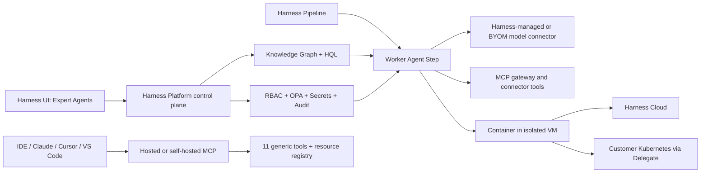

# Harness 公司与 Agentic Software Delivery 一手证据底稿

> [!abstract] 结论
> 截至 2026-07-16，Harness 已不只是给传统 CI/CD 加一个聊天框，而是把 AI 分成三个工作面：**Harness UI 中的 Expert Agents、IDE/MCP 入口、Pipeline 原生 Worker Agents**。其中最有差异化、也最晚发布的是 2026-06-30 上线的 Autonomous Worker Agents：Agent 作为受 Pipeline、RBAC、OPA、审批和审计约束的 Step 运行，面向代码完成后的构建、测试、安全、部署、修复和运营。
>
> 但“GA”“所有客户可用”“可安全用于生产”不能合并成一个判断。当前文档同时显示账户开通、Feature Flag、SaaS-only、模型 Provider、Stage 类型和触发方式限制；最关键的细粒度 scoped-token 功能仍需 `HARNESS_TOKEN_INJECT`，而 webhook、artifact、manifest、schedule 等 Trigger 发起的运行目前没有可继承的触发人 scoped token。现有安全验证、性能数字和客户效果几乎全部来自 Harness 自身或 Harness 托管的客户案例，尚不能视为独立审计或跨厂商基准。

本文件专指 [Harness Inc.](https://www.harness.io/) 与 Harness Software Delivery Platform，**不讨论通用 Agent Harness 工程框架**。观察期为 2025H2—2026-07-16；较早资料仅在解释合同冲突或产品基线时使用。

## 证据口径

| 标记 | 含义 | 能支持什么 | 不能直接支持什么 |
|---|---|---|---|
| **A：强** | 现行合同、官方产品文档、官方源码/仓库 | 接口、配置、权限、限制、合同责任、实现存在性 | 实际效果、独立安全有效性 |
| **B：中强** | Harness 工程博客、Release Notes、正式发布公告 | 架构意图、发布时点、厂商实现说明 | 第三方复现、普遍生产效果 |
| **C：中** | Harness 发布的署名客户案例或客户引语 | 该客户公开表述与厂商记录的结果 | 对照实验、跨客户普适性、独立验证 |
| **D：弱** | 产品页、愿景数字、路线图、未量化引语 | 产品定位、待验证假设 | 采购承诺、成熟度、SLA 或结果保证 |

> [!info] 独立证据状态
> 本轮按任务要求优先使用 Harness 官方文档、法律条款、GitHub、博客、发布稿和案例。检索到的效果证据均由 Harness 发布；没有找到客户官网、独立审计报告或第三方实验对 Worker Agents/Knowledge Graph/客户收益作同等粒度复核。因此，本文把“机制存在”与“效果已经证明”分开评级。

## 一、公司与平台边界

| Claim | 官方证据与日期 | 精确支持的事实 | 强度 | 状态 / 限制 |
|---|---|---|---|---|
| HAR-E01 | [About Harness](https://www.harness.io/company/about-us)，页面无发布日期，2026-07-16 访问 | Harness 自报 2017 年在旧金山成立、1,200+ 员工、1,000+ 客户、累计融资 5.7 亿美元；使命是让团队快速、可靠、高效、安全地交付代码 | D | 公司规模为厂商当前网页数字，不是审计财务披露 |
| HAR-E02 | [Harness Platform overview](https://developer.harness.io/docs/platform/get-started/overview/)，2026-06-10 更新 | Platform/Harness Manager 提供用户、访问控制、Secret、Connector、Audit、Notification 等公共层；CI、CD/GitOps、Feature Flags 等模块构建在其上 | A | 说明共享控制面，不代表所有模块或 Agent 功能同等可用 |
| HAR-E03 | [Harness AI: The Platform for Everything After Code](https://www.harness.io/blog/announcing-harness-ai)，2025-08-26 | Harness 将自身定位为“代码之后”的平台，覆盖测试、安全、部署和优化，并宣布 Harness AI 对 Harness 客户 GA | B | 是厂商定位；“GA”需继续拆到具体功能和账户开通状态 |
| HAR-E04 | [Subscription Terms](https://www.harness.io/legal/subscription-terms)，2026-02-26 版本 | 客户只能使用 Order Form 中购买的 Module，并受 License Unit、文档和具体 Order Form 限制 | A | 合同优先于笼统的“all customers”营销措辞 |

**判断：** Harness 是模块化 Software Delivery Platform 公司，2025H2 开始把统一的知识、模型和 Agent 层置于既有 CI/CD、测试、安全、FinOps、FME 与 SRE 模块之上。其“统一”首先是身份、Connector、Pipeline 和治理控制面的统一，不是单一自治 Agent 接管全生命周期。

## 二、2025H2—2026 发布轨迹

| 日期 | 公开发布 / 更新 | 精确支持的 Claim | 证据强度 | Caveat |
|---|---|---|---|---|
| 2025-08-26 | [Harness AI GA](https://www.harness.io/blog/announcing-harness-ai) | 宣布 Harness AI GA；提出 Software Delivery Knowledge Graph，描述 DevOps、SRE、Release、AppSec、Test、FinOps 专项 Agent | B | 文章中的 80%、50%、70% 等效果数字未给出统一实验设计，不能当行业基准 |
| 2025-11-20 | [Harness FME Fast and Furious](https://www.harness.io/blog/harness-fme-fast-and-furious) | Split/FME 前端迁入 Harness UI；Release Agent 增加实验指标摘要与追问；FME 接入 Harness RBAC/SSO | B | Release Agent 主要是 FME 助手和摘要能力，不等同于自治发布执行器 |
| 2025-12-04 | [Harness AI November 2025 Updates](https://www.harness.io/blog/harness-ai-november-2025-updates) | 发布 AWS IDE 入口、自然语言数据库迁移生成、改进的 Pipeline Error Analyzer，并声明持续评估 Claude/GPT 等模型 | B | 数据库“production-ready”与调试收益是厂商表述；需要实际迁移/回滚测试 |
| 2026-01-07 | [December 2025 Governance Updates](https://www.harness.io/blog/harness-ai-december-2025-updates) | AI 可生成 OPA/Rego，引用 Golden Templates；生成对象进入 Audit Trail，并标记 `ai_generated: true` | B | [OPA AI 文档](https://developer.harness.io/docs/platform/governance/policy-as-code/ai-for-policies/) 2026-07-08 仍要求 `OPA_ENABLE_CANARY_AI`，且要求人工检查生成逻辑 |
| 2026-01-29 | [January 2026 Updates](https://www.harness.io/blog/harness-ai-january-2026-updates) | Human-Aware Change Agent 将 Slack/Teams/Zoom 中的人类线索与 Deployment、Flag、Config、Infra、ITSM Change 相关联；AppSec Agent 用自然语言查询 STO/SCS 并生成 Policy | B | API 命名 98.7% 是 Harness 内部基准；AI SRE 多项能力仍有 Feature Flag/EA |
| 2026-02-26 | [February 2026 Updates](https://www.harness.io/blog/harness-ai-february-2026-updates) | WAAP Public MCP 宣布 GA；SAST/SCA、SRE Runbook 与 DevOps Agent 继续扩展 | B | DevOps Agent 升级当时仍标为即将逐步推出，不替代账户和模块 Release Notes 验证 |
| 2026-03-19 | [MCP v2 redesign](https://www.harness.io/blog/harness-mcp-server-redesign) | MCP 从 130+ Tool 收敛至 11 个通用 Tool，以 Registry 支撑 125+ Resource Type；强调 `describe/schema` 渐进发现 | B | 数量随后快速漂移；Token 节省是 Harness 估算 |
| 2026-03-19 | [Workday selection announcement](https://www.harness.io/press-and-news/harness-selected-by-workday-to-power-agentic-ai-software-delivery-at-enterprise-scale) | Workday “will use” Harness 增强软件交付 | C | 是采用计划，不是上线结果或量化 Case Study |
| 2026-04-07 | [Knowledge Graph + HQL architecture](https://www.harness.io/blog/why-harness-ai-uses-knowledge-graph) | 对已建模数据优先使用 Schema/Relationship/HQL，对长尾行动和外部系统使用 MCP；给出四层数据所有权模型 | B | 15–25 倍 Token 降幅与确定性收益为厂商架构估算，无独立复现 |
| 2026-06-30 | [Autonomous Worker Agents launch](https://www.harness.io/blog/introducing-autonomous-worker-agents) | Worker Agent 作为 Pipeline Step 运行；支持顺序、并行、条件、矩阵组合；发布 Agent Marketplace 和 Harness Managed Agents | B | 上线时间很短；“all customers”与当前 Support/Flag 条件存在张力 |
| 2026-07-13 | [Worker isolation architecture](https://www.harness.io/blog/how-we-secured-ai-worker-agents-in-harness) | 披露镜像、进程、Secret Broker、Egress Proxy 四层隔离及第一方 CVSS 9.0 回放 | B | 未见 Worker Runtime 专项第三方审计或完整测试工件 |
| 2026-07-16 | [Worker identity and permissions](https://www.harness.io/blog/identity-and-permissions-for-ai-worker-agents-in-harness) | 披露 Agent Resource RBAC、OPA、scoped token、MCP Tool intersection、per-call attribution 五层授权模型 | B | 文章发布当日；关键 scoped-token 功能的文档实现仍带 Feature Flag 与 Trigger 限制 |

## 三、AI/Agent 如何进入代码后的 CI/CD

| 阶段 | 已发布能力 | 在 Pipeline / 平台中的应用 | 最强官方证据 | 可证明程度 |
|---|---|---|---|---|
| Pipeline 设计与治理 | DevOps Agent、Harness AI Rules、OPA Agent | 自然语言创建/修改 Pipeline、Service、Environment、Connector、Template、GitOps 对象和 Rego；Rules 先引导，OPA 保存/运行时硬阻断 | [DevOps Agent](https://developer.harness.io/3k-docs/ai/devops-agent/)，2026-07-02；[AI Rules](https://developer.harness.io/docs/platform/harness-ai/harness-ai-rules/)，2026-06-02 | 机制 **A**；跨复杂 Pipeline 准确率仅厂商自测 **C** |
| Build/CI 诊断 | Error Analyzer、Autofix | 读取失败日志、诊断、生成代码修复、建 Branch/PR；Worker 版可重触发 CI，直到通过或达到 Turn 上限 | [Code Quality Agents](https://developer.harness.io/3k-docs/platform/getting-started/agents/code-quality/)，2026-07-02；[Worker launch](https://www.harness.io/blog/introducing-autonomous-worker-agents)，2026-06-30 | Workflow **A/B**；长期自愈率未知 |
| PR 质量 | Code Review、Code Coverage | Review PR Diff 并回写评论；Coverage Agent 生成 Unit Test、运行 Test、生成 Coverage 报告并创建 PR | [Code Quality Agents](https://developer.harness.io/3k-docs/ai/code-agent/)，2026-07-02 | 机制 **A**；90% 总覆盖、80% 单文件是目标/配置，不是普遍达成结果 |
| E2E 测试 | AI Test Automation | 自然语言/录制创建 Intent Test，多 Agent 执行与 Smart Selector 自愈；同一 CI/CD Step 可跑 Harness AI Test 或 Playwright Suite | [AIT overview](https://developer.harness.io/docs/ai-test-automation/get-started/overview/)，2026-07-06；[CI/CD integration](https://developer.harness.io/docs/ai-test-automation/integrations/harness-cd/)，2026-06-10 | 产品 **A**；业务效果主要是厂商案例 **C** |
| AppSec / Supply Chain | AppSec Agent、Security Remediation Worker、RiskSentinel 示例 | 查询 STO/SCS、SBOM、Exemption 与 Chain of Custody，生成 OPA；Worker 可针对漏洞或 IaC/Manifest 生成修复 | [January 2026 Updates](https://www.harness.io/blog/harness-ai-january-2026-updates)，2026-01-29；[Worker Marketplace docs](https://developer.harness.io/docs/platform/harness-ai/harness-agents/)，2026-07-09 | 能力面 **A/B**；生产修复效果与误修率未知 |
| Deployment / GitOps / IaC | Worker Agents、Manifest Remediation、IaCM Remediation | Agent Step 可加入 CI、CD、IaCM、STO、SCS、Custom Stage；可分析 K8s 部署失败、同步 GitOps、修改 IaC | [Worker Agents](https://developer.harness.io/docs/platform/harness-ai/harness-agents/)，2026-07-09 | Stage 支持 **A**；CD/Custom 必须置于 Containerized Step Group |
| Release / Feature Flag | Release Agent、Feature Flag Cleanup Worker | FME 内问答/实验摘要；Cleanup Agent 检查已全开/全关 Flag 并生成清理 PR | [Release Agent](https://developer.harness.io/docs/platform/harness-ai/release-agent/)，2026-02-20；[Worker launch](https://www.harness.io/blog/introducing-autonomous-worker-agents)，2026-06-30 | Release Agent **A**；“Agent 自动安全清理”仍主要是产品说明 **B** |
| 生产 Incident | AI Scribe、RCA Change Agent、Investigator Agent Pipeline、Runbooks | 汇总沟通和 Timeline，持续重算 Root-cause Theory/Confidence；Runbook 可通知、建票、执行 Pipeline、Rollback | [AI SRE overview](https://developer.harness.io/3k-docs/ai-sre/get-started/overview/)，2026-07-02；[RCA Agent](https://developer.harness.io/3k-docs/ai-sre/ai-agent/rca-change-agent/)，2026-07-02 | 核心 Workflow **A**；Investigator Pipeline 为 EA，Postmortem/On-call/Fire Drill 有 Flag |
| FinOps / 优化 | Harness AI Chat、CCM 建议、Rules | 查询成本、创建 CCM Perspective、生成预算/治理建议；可在交付决策中加入 Cost Context | [Harness AI overview](https://developer.harness.io/docs/platform/harness-ai/overview/)，2026-07-15；[AI Rules](https://developer.harness.io/docs/platform/harness-ai/harness-ai-rules/)，2026-06-02 | 机制 **A**；节省金额需客户数据验证 |

> [!important] 更准确的自治边界
> Worker Agent 不是替换 Pipeline Engine。官方示例显示它与 Shell、Plugin、Approval Gate 和确定性 Step 组合，Pipeline 继续负责触发、并行、Retry、Failure Strategy、Approval 与 Rollback。基于现有机制与合同中的人工复核要求，最可信的生产落点是“**Agent 生成候选行动或受限执行，确定性测试/Policy/审批决定是否晋级**”，而不是无人值守接管生产。

## 四、技术架构

### 4.1 三个工作面

1. **Harness UI**：DevOps/Support/OPA/Error Analyzer/Release 等 Expert Agents 利用当前页面、账户对象与 Knowledge Graph；DevOps Agent 和 AI Chat 使用 Harness-managed Model，当前不支持 BYOM。证据：[Core capabilities](https://developer.harness.io/docs/platform/harness-ai/core-capabilities/)，2026-07-13，**A**。
2. **IDE / 外部 Agent**：Harness MCP Server 把 Harness Resource 暴露给 Cursor、Claude Code、VS Code、Gemini CLI 等；Hosted MCP 通过 Harness ID OAuth 继承用户 RBAC，自托管/开源版使用 API Key。证据：[MCP docs](https://developer.harness.io/docs/platform/harness-aida/harness-mcp-server/)，2026-06，**A**。
3. **Pipeline**：Worker Agent 将 Instructions、Model Connector、可选 MCP Server 和 Inputs 封装为可版本化、可复用 Step。证据：[Worker Agents](https://developer.harness.io/docs/platform/harness-ai/harness-agents/)，2026-07-09，**A**。

### 4.2 Knowledge Graph/HQL 与 MCP 分工

| 组件 | 官方设计 | 合理结论 | 证据 / 强度 |
|---|---|---|---|
| Knowledge Graph | 存储类型、字段、Relationship 和聚合元数据；Type Selector 低温选择相关 Entity，再生成 HQL | 适合已建模的跨模块 Read/Analyze；Schema 约束可减少凭空猜字段，但不能保证源数据新鲜、完整或无冲突 | [Deterministic by Design](https://www.harness.io/blog/why-harness-ai-uses-knowledge-graph)，2026-04-07，**B** |
| HQL | 形式化 Grammar、显式 Field/Aggregation/Join，错误可重试；权限在查询层应用 | 比让模型拼多套 REST API 更可控；“deterministic answer”仍取决于 Query 与数据 | 同上，**B** |
| MCP v2 | 少量 `list/get/create/update/delete/execute/describe/schema/search/diagnose/status` Tool 经 Registry Dispatch 到 Resource Definition | 适合 Action、IDE 集成和未完全建模的长尾系统；Tool 数稳定但 Resource Catalog 快速变化 | [MCP docs](https://developer.harness.io/docs/platform/harness-aida/harness-mcp-server/)，2026-06；[official GitHub](https://github.com/harness/mcp-server)，2026-05-29 latest release snapshot，**A** |
| Agent Loop | Loop 在 MCP Host/IDE 中；MCP Server 处理单次 JSON-RPC Tool Call，任务状态留在 Host 或 Harness 底层系统 | MCP Server 本身不是自治 Orchestrator，也不负责最终业务 Policy | [Agent Loop architecture](https://www.harness.io/blog/agent-loop-new-os)，2026-04-23，**B** |

### 4.3 执行与模型

- Worker Agent 在 Docker Container + 隔离 VM 中运行；Harness Cloud 支持 CI/STO/SCS/IaCM，客户也可用 Delegate 在自有 Kubernetes 中运行。Agent 不与其他 Workload 共享 Memory、Filesystem 或 Network Namespace。证据：[Worker Agents](https://developer.harness.io/docs/platform/harness-ai/harness-agents/)，2026-07-09，**A**。
- CD 与 Custom Stage 的 Agent Step 必须放入 Containerized Step Group。证据同上，**A**。
- 当前文档列出 Anthropic（直连或 AWS Bedrock）与 OpenAI Model Connector，并提供 Harness-managed Connector；DevOps Agent/Chat 不支持 BYOM。证据：[Model connector](https://developer.harness.io/docs/platform/harness-ai/model-connector/)，2026-07-13；[Core capabilities](https://developer.harness.io/docs/platform/harness-ai/core-capabilities/)，2026-07-13，**A**。
- Harness-managed LLM 使用在 2026-08 之前包含于订阅，之后将单独计费；公开文档未给出费率。证据：[Model connector](https://developer.harness.io/docs/platform/harness-ai/model-connector/)，2026-07-13，**A**。

## 五、安全、身份与权限模型

### 5.1 从人到 Tool Call 的授权链

| 控制 | 官方实现 Claim | 精确边界 | 来源 / 日期 | 强度 |
|---|---|---|---|---|
| Agent Resource RBAC | Author、Publish、Execute 和 `use_in_agent`/Attach Connector 是不同权限，Account/Org/Project 服务端校验 | 控制谁可创建、发布、运行 Agent 或绑定高权限 Connector | [Identity & Permissions](https://www.harness.io/blog/identity-and-permissions-for-ai-worker-agents-in-harness)，2026-07-16 | B |
| OPA | Agent Definition 保存时和 Pipeline 触发时检查 Model、Connector、Turn Limit、命名、敏感变量与高风险权限 | OPA 是硬 Gate；自然语言 AI Rules 只是生成前的软指导 | 同上；[AI Rules](https://developer.harness.io/docs/platform/harness-ai/harness-ai-rules/)，2026-06-02 | A/B |
| Delegated identity | 默认在 Step Start 为触发人 Mint 临时 Token；`effective = triggering principal RBAC ∩ declared agent grants`；运行结束删除 | Agent 没有常驻 Superuser 身份；Grant 只能缩小触发人的权限 | [Identity & Permissions](https://www.harness.io/blog/identity-and-permissions-for-ai-worker-agents-in-harness)，2026-07-16 | B |
| Harness Resource scope | Grant 是 Resource Type + Verb，可进一步限制 Scope 和 Resource ID；Create/Edit/Delete/Push 等高 Blast Radius 动作需显式授权 | 比粗粒度 Role 更细，但当前 Verb 无 Enum，拼错会静默失败 | [Worker Agents](https://developer.harness.io/docs/platform/harness-ai/harness-agents/)，2026-07-09 | A |
| 第三方 MCP Tool | Connector 和 Agent 都设 Allowlist；Gateway 仅允许 `connector.allowedTools ∩ agent.allowedTools`，真实 Connector Credential 由 Gateway 附加 | scoped token 控 Harness Resource；MCP Gateway 另控第三方 Tool | [Identity & Permissions](https://www.harness.io/blog/identity-and-permissions-for-ai-worker-agents-in-harness)，2026-07-16 | B |
| Attribution | 每次出站 Tool Call 记录 Agent、Run、Principal、Tool、Parameters 与 Result | 可追溯到触发人；第三方系统本身可能仍显示 Connector Owner | 同上 | B |
| Approval / Pipeline governance | Agent Step 继承 Pipeline 的 Approval、Retry、Failure Strategy、Rollback 与 Audit | 需要把不可逆动作放在 Agent 之后的硬 Gate，而不是只写进 Prompt | [Worker launch](https://www.harness.io/blog/introducing-autonomous-worker-agents)，2026-06-30 | B |

> [!danger] Trigger 身份缺口
> 当前 Worker 文档明确写明：由 Pipeline Trigger 发起的 Agent Run **不会注入 scoped token**，因此无法把声明权限解析为某个触发 Principal 的子集；该模型当前适用于存在 Principal 的手动/API Trigger，Trigger 支持仍在 Roadmap。同时，Worker Pipeline 又支持 webhook、artifact、manifest、schedule 等标准 Trigger。故任何事件驱动生产 Agent 都必须在 PoC 中单独验证实际身份、Token、Connector 和审批路径，不能直接沿用“始终继承触发人”的发布口径。来源：[Worker Agents — Limitations](https://developer.harness.io/docs/platform/harness-ai/harness-agents/)，2026-07-09，**A**。

### 5.2 Runtime 四层隔离

| 层 | Harness 披露的机制 | 可支持的结论 | 未证明内容 |
|---|---|---|---|
| Image hardening | 去 Compiler、Package Manager、setuid/setgid；Read-only Root FS；Drop Capability | 缩小容器内 Exploit 工具面 | 未提供完整 Image/SBOM/Pod Spec 的独立审计链 |
| Process isolation | Agent、Credential Broker、Egress Proxy 使用三个不同非特权用户；Kernel 权限隔开文件和 Group | Agent User 不能直接遍历 Broker Secret 目录 | 单 Container 设计仍需实际内核、容器运行时和配置回归 |
| Secret isolation | 启动时把疑似 Secret 替换为单次 Placeholder；Broker 仅对绑定 Host 注入真实值；Cloud Credential 可按需 Mint | 按厂商设计，Agent Environment 不持有可用真实 Key | Secret 分类命名规则的漏报/误报率未公开 |
| Network isolation | 所有 Egress 经 Allowlist Proxy；Guard 阻断绕过；Kernel Firewall 固定 Agent User Route 并屏蔽 Metadata Endpoint | 即使模型执行恶意命令，默认不应任意外传 | Allowlist 配置错误、DNS/协议绕过和未知 Runtime 组合仍需外部测试 |

来源：[How We Secured AI Worker Agents](https://www.harness.io/blog/how-we-secured-ai-worker-agents-in-harness)，2026-07-13，**B**。

Harness 自报用真实 CVSS 9.0 Breach Chain 回放：原 Exploit 可 Dump 709 个含活 Secret 的环境变量；Hardened Image 返回 33 个变量且没有可用 Credential，8 种 Proxy 绕过均失败；每个 Layer 作为 Image Publish Gate 测试。该证据足以说明 Harness 有明确 Threat Model 和 First-party Regression Test，**不足以等同于独立 Penetration Test、SOC 2 Control 结论或形式化隔离证明**。

### 5.3 数据、模型与合同

| Claim | 当前强证据 | Caveat / 冲突 |
|---|---|---|
| Input/Output 归客户 | 2026 Subscription Terms §3.6(b) 把 Input/Output 定义为 Customer Data，Harness 放弃其所有权 | Output 可能不唯一；客户负责合法性、适用性和人工复核 |
| 不用于训练/改进 | §3.6(d) 规定 Harness 不得用 Customer Data 训练/改进第三方模型，也不得改进 Harness AI | §3.5 仍允许使用 Usage Data 运营、改进和 Benchmark；边界需结合 Order Form/DPA |
| 人工判断不可省 | §3.6(c) 明确 Harness AI 不替代 Human Judgment；对产生法律或类似重大影响的自动决定需要适当 Human Oversight | 对生产发布同样应把模型输出视为 Candidate，而非保证正确 |
| 敏感数据限制 | §1.2 禁止提交医疗记录、银行信息、Social Security Number、Credit Card、GDPR 特殊类别等 Prohibited Data | 具体行业例外需 Order Form/DPA，不应仅凭产品页判断 |
| 旧 Privacy 页面 | [Harness AI Data Privacy](https://www.harness.io/legal/harness-ai-data-privacy)，2023-06-19 仍写 User Engagement Data 可由 Harness/第三方生成式 AI Provider 用于改进 | 与 2026 合同的 Customer Data 禁止条款未在公开页完全解释；可能是 Usage Data/Customer Data 分类差异，也可能是旧页未同步，采购时必须书面澄清 |

现行合同来源：[Subscription Terms](https://www.harness.io/legal/subscription-terms)，2026-02-26，**A**。平台合规页自报 SOC 2 及 ISO 27001/27017/27018，并称每年由外部机构做 Penetration Test；这证明公司/平台安全项目存在，**不直接证明 Worker Agent 四层 Runtime 已被专项审计**。来源：[Harness Security](https://www.harness.io/security)，2026-07-16 访问，**B**。

## 六、可用性与成熟度快照

| 能力 | 官方状态 | 真实获得条件 | 2026-07-16 判断 |
|---|---|---|---|
| Harness AI 总体 | 2025-08 宣布 GA；2026 Overview 把 Harness Agents 标 GA | Account Admin 启用 Harness AI；仍受购买 Module/License 范围 | **平台 GA，功能级状态不一** |
| DevOps Agent / AI Chat | Enterprise License 中含 AI DevOps；有 Pipeline 的 Module 可使用，CCM 例外 | SaaS；SMP 不可用；只在 Harness UI；不支持 BYOM | **可用但边界明确**；模型与能力文档有漂移 |
| Worker Agents | 2026-06-30 宣布所有 Harness 客户可用；Docs/Overview 标 GA | 账户需出现 AI Agents；若没有要联系 Admin/Support；权限 Token 功能需 `HARNESS_TOKEN_INJECT` | **新近 GA + Controlled enablement**；不宜直接冻结生产架构 |
| Agent Marketplace | 已上线 Marketplace、Custom 两个 Catalog；Managed/Certified/Community 三层 | Managed 默认加载；Community 要提交审核；企业可用 OPA 限制 Tier | **已发布**；Certified 数量、评测门槛、签名/SBOM/SLA 细节未公开 |
| Hosted MCP | Harness SaaS Hosted Endpoint 已文档化 | OAuth 必须由 Support 为 Account 启用；SaaS only；Dedicated Cluster URL 需确认 | **可用但非零配置 GA** |
| 开源/自托管 MCP | 官方 GitHub MIT，支持 stdio/HTTP/API Key | 远程 HTTP 需 Auth Token；开源/自托管 OAuth “coming soon” | **成熟度高于托管 OAuth 的普适性**，但 Catalog 快速变化 |
| AI Test Automation | 当前完整产品文档与 CI/CD Step；历史公告称 GA | 需联系 Sales/`ait-interest@harness.io` 开通；旧 Quickstart 对 Firewall 内应用要求 Support | **产品可用、销售开通**；部署/数据边界需 PoC |
| AI SRE | Module 已有 Incident、Scribe、RCA、Runbook、On-call 文档 | 账户需启用 AI SRE；Investigator Pipeline 为 EA；Postmortem、On-call、Fire Drill 等有 Flag | **混合成熟度**，不能整体标成同一 GA |
| Release Agent | FME 内文档化 Chat、Metric/Experiment Summary | Admin 可关闭 Agent 或关闭 Experimentation Data Processing；OpenAI 为 Summary Subprocessor | **受控可用**；不是自治 Deployment Agent |

### 已知文档/状态冲突

| 冲突 | 一侧 | 另一侧 | 处理建议 |
|---|---|---|---|
| Worker 可用范围 | 发布博客称“available today for all Harness customers” | Docs 要求 AI Agents 已启用，缺失时联系 Support；关键 Permission Injection 还要 Flag | 以目标账户/Cluster 实测为准，Order Form 写明 Feature 和 Support |
| Trigger 身份 | 发布/身份博客概括 Agent 继承触发人的 RBAC | Worker Limitations 明确 Trigger-initiated Run 没 scoped token | 对 Schedule/Webhook 建单独 Threat Model，未验证前不授予高风险 Tool |
| DevOps Agent Model | 2026-07-15 Overview 与 DevOps Agent 页列 Claude Opus 4.6 | 同一 Overview 的 FAQ 仍保留 GPT-4o、Gemini Flash、Claude Opus 4.5 等较旧或不同用途模型 | 不把具体模型写入长期架构承诺；按功能、运行时和合同确认 |
| BYOM Provider | 产品页写“OpenAI-compatible endpoint” | 当前 Model Connector Docs 只列 Anthropic、AWS Bedrock、OpenAI | 采购按 Docs 的明确 Provider 做最低承诺，其他 Endpoint 现场验收 |
| MCP Catalog 数量 | 2026-03 Blog：11 Tool/125+ Resource/30 Toolset；2026 Docs：11/139 | 当前官方 GitHub README：196 Resource/32 Toolset | 把数量视为版本快照；固定 Package/Release 并生成本地 Inventory |
| AI 数据改进 | 2026 Terms 禁止 Customer Data 用于改进 Harness AI/第三方模型 | 2023 AI Privacy 仍允许 Engagement Data 用于 Harness/Provider 改进 | 书面确认 Usage/Engagement/Customer Data 分类、Retention、Subprocessor 和 Region |
| Security “proved” | Harness 发布 CVSS 回放与 Release Gate | 未公开第三方 Worker Runtime 专项报告、完整测试代码或结果 | 把它作为设计可信度加分，不代替客户 Pentest/Red Team 和 Trust Center Review |

## 七、第一方客户证据

| 客户 / 来源 | Harness 发布的结果 | 证据强度 | 不能外推什么 |
|---|---|---|---|
| United Airlines — [Worker launch quote](https://www.harness.io/blog/introducing-autonomous-worker-agents)，2026-06-30 | IT Director 称用 Harness 构建 RiskSentinel，四天从想法到“production-ready agent”，用于从发现安全问题走向受治理修复 | C | 没有任务规模、误修率、上线时长或独立复核；“production-ready”是客户引语 |
| Verint — [Worker launch quote](https://www.harness.io/blog/introducing-autonomous-worker-agents)，2026-06-30 | Director of Cloud Infrastructure 称 4 天构建 Kubernetes/Pipeline Troubleshooting Agent，计划在组织层推广并服务约 200 名运维和约 1,000 名开发者 | C | 仍是推广计划和客户引语，不是规模化生产结果 |
| Workday — [Harness press release](https://www.harness.io/press-and-news/harness-selected-by-workday-to-power-agentic-ai-software-delivery-at-enterprise-scale)，2026-03-19 | 宣布 Workday 将使用 Harness 增强高速度软件交付和治理 | C | 没有实施范围、Agent 名单、时间线或量化 Outcome |
| Wasimil — [Harness case study](https://www.harness.io/case-studies/wasimil)，无发布日期，2026-07-16 访问 | 自报从 Playwright 迁移 AIT 后 Failure Rate 从约 50% 降至低于 10%，维护从约 2 小时/天到 45–60 分钟/天，发布从每周两次到每日 | C | Harness 托管案例、样本单一，无对照；“Failure Rate”定义和观察期未披露 |
| Gameopedia — [Harness case study](https://www.harness.io/case-studies/gameopedia)，无发布日期，2026-07-16 访问 | 自报维护工作减少 >40%，每位 Tester 每天节省 2–3 小时，新人 Ramp-up 从约 30 天降至 2–5 天 | C | 案例当时称计划“下个月”才接入 CI/CD，不能证明完整 Pipeline 生产集成 |
| Siemens Healthineers — [Harness case study](https://www.harness.io/case-studies/siemens-healthineers)，无发布日期，2026-07-16 访问 | 在 Workforce Solutions 项目 PoC 中，场景创建从多日降到一小时内，Debug/Maintenance 从小时降到分钟，并开始跨项目 Onboard | C | 仍是 PoC/早期推广；未来 KPI 和 Portfolio-wide 计划不是已实现结果 |

**客户证据结论：** AIT 有三份具体但厂商托管的结果，证据成熟度高于 2026-06 才发布的 Worker Agents；Worker 现阶段只有首发引语和采用计划。没有发现署名客户公开证明 Agent 在生产 Deployment、Artifact Promotion、Rollback 或 Incident Remediation 上长期无人值守达到稳定 L4 自治。

## 八、关键限制与采购/PoC 必答项

1. **先问可获得性，不只问 GA。** 要求 Harness 对目标 Cluster、License、SaaS/SMP、Feature Flag、Support Enablement 和 Progressive Rollout 出具逐项确认。
2. **把触发式身份作为阻断项。** 分别测试 Manual、API、Webhook、Schedule、Artifact 和 Manifest Trigger 的 Principal、Token、Audit、Connector Credential 与失败清理。
3. **Rules 不是 Policy。** AI Rules 是 Natural-language Context；生产硬门禁必须用 OPA、RBAC、Approval、Environment/SCM Protection 和下游确定性验证。
4. **限制不可逆动作。** 默认只允许 Read、Comment、建 Candidate PR；Merge、Push、Delete、Deploy、Rollback、Feature Flag Toggle 和 Ticket Transition 需显式 Grant 与 Approval。
5. **验证 Broker/Egress，而不只看架构图。** 用 Prompt Injection、恶意 Repo、Tool Output、DNS/HTTP Redirect、Metadata、Error Echo 和 Placeholder Replay 复测四层隔离。
6. **固定 Agent/Model/MCP 版本。** MCP Resource Catalog 和 Agent Docs 在数周内已有明显漂移；不要用 `latest` 作为受监管生产基线。
7. **成本尚未稳定。** 记录每成功任务的 Model Token、Agent Turn、Pipeline Compute、Retry、人工 Review 和第三方 MCP Cost；Harness-managed LLM 将在 2026-08 后单独计费。
8. **Marketplace Tier 不是充分信任。** 对 Managed/Certified/Community 分别要求 Owner、Version、签名、SBOM、Prompt/Tool Diff、Eval、SLA、Deprecation 与 Rollback 证据。
9. **安全认证不可替代 Agent 专项验证。** SOC/ISO 是平台/组织控制；Worker Runtime、MCP Gateway 和 delegated identity 需要单独 Trust Review。
10. **效果证据仍薄。** 用企业自己的 Failure Corpus、Repo、Policy、Deployment 和 Incident 数据做 Blind Replay；同时记录成功率、误操作、漏报、恢复时长、Human Minutes 和总成本。

## 九、可执行成熟度判断

| 问题 | 当前答案 | 置信度 |
|---|---|---|
| Harness 是否真的发布了 Agentic Post-code 平台？ | **是。** UI Agent、MCP、Knowledge Graph、Worker Agent Step、AIT、AI SRE 均有当前文档/仓库 | high for existence |
| Worker Agent 是否只是 Demo？ | **不是纯 Demo。** 已有 Pipeline Step、Catalog、Model/MCP Connector、Runtime、RBAC/OPA/Audit 文档 | high for mechanism |
| 是否已证明可普遍无人值守接管生产交付？ | **否。** Trigger 身份有缺口、功能有 Flag，合同要求 Human Review，客户证据不支持普遍 L4 | high |
| 安全模型是否有实质内容？ | **有。** Isolation、Secret Broker、Egress、scoped identity、Tool intersection 是具体机制 | medium-high; vendor evidence |
| 可否直接用于企业试点？ | **可以，适合受限 PoC。** 首选 Read/Diagnose/PR/Test 任务，保留硬 Policy 与 Approval | medium-high |
| 是否适合现在冻结长期采购承诺？ | **只适合按功能和验收条款采购。** 不能按统一“GA Harness AI”概括全部能力 | high |

## 十、Primary Source Register

### 官方文档 / 法律 / 源码

- [Overview of Harness AI](https://developer.harness.io/docs/platform/harness-ai/overview/) — 2026-07-15 更新；功能和 GA 总览、模型列表。
- [Core capabilities of Harness AI](https://developer.harness.io/docs/platform/harness-ai/core-capabilities/) — 2026-07-13 更新；UI/IDE/Pipeline 工作面、SMP/BYOM FAQ。
- [Harness AI DevOps Agent](https://developer.harness.io/3k-docs/ai/devops-agent/) — 2026-07-02 更新；能力、License、SMP/BYOM、Opus 4.6 与 50 Stage 自测。
- [Worker Agents](https://developer.harness.io/docs/platform/harness-ai/harness-agents/) — 2026-07-09 更新；Stage、Runtime、Marketplace、权限、Trigger 与限制。
- [Model connector](https://developer.harness.io/docs/platform/harness-ai/model-connector/) — 2026-07-13 更新；Provider 与 2026-08 后计费。
- [Harness Agents reference](https://developer.harness.io/docs/platform/harness-ai/core-capabilities/in-your-pipelines/harness-agents-references/) — 2026-07-15 更新；Agent Definition Fields 与 Step 配置。
- [Harness AI Rules](https://developer.harness.io/docs/platform/harness-ai/harness-ai-rules/) — 2026-06-02 更新；Rules/OPA 分工与 Rule RBAC coming soon。
- [Build policies using Harness AI](https://developer.harness.io/docs/platform/governance/policy-as-code/ai-for-policies/) — 2026-07-08 更新；`OPA_ENABLE_CANARY_AI` 与人工复核。
- [Harness MCP Server docs](https://developer.harness.io/docs/platform/harness-aida/harness-mcp-server/) — 2026-06 更新；Hosted/Self-hosted Transport、OAuth、Tool Reference、限制。
- [harness/mcp-server](https://github.com/harness/mcp-server) — 2026-05-29 为检索时 Latest Release Snapshot；MIT 源码与 Resource Registry。
- [Code Quality Agents](https://developer.harness.io/3k-docs/platform/getting-started/agents/code-quality/) — 2026-07-02 更新；Review/Coverage/Autofix Workflow。
- [AI Test Automation overview](https://developer.harness.io/docs/ai-test-automation/get-started/overview/) — 2026-07-06 更新；产品、Sales Enablement、多 Agent/自愈。
- [AI Test Automation with CI/CD](https://developer.harness.io/docs/ai-test-automation/integrations/harness-cd/) — 2026-06-10 更新；AI Test/Playwright Pipeline Step。
- [AI SRE overview](https://developer.harness.io/3k-docs/ai-sre/get-started/overview/) — 2026-07-02 更新；Incident、Scribe、RCA、Runbook、On-call、Flag。
- [What's Supported in AI SRE](https://developer.harness.io/docs/ai-sre/resources/whats-supported/) — 2026-06-30 更新；Integration、EA 与 Feature Flag。
- [RCA Change Agent](https://developer.harness.io/3k-docs/ai-sre/ai-agent/rca-change-agent/) — 2026-07-02 更新；持续重算 Theory/Confidence。
- [Release Agent](https://developer.harness.io/docs/platform/harness-ai/release-agent/) — 2026-02-20 更新；FME Chat、Summary、OpenAI Subprocessor 与准确性 Disclaimer。
- [Subscription Terms](https://www.harness.io/legal/subscription-terms) — 2026-02-26 版本；Module、Customer Data、AI Input/Output、人工复核、训练限制。
- [Harness AI Data Privacy](https://www.harness.io/legal/harness-ai-data-privacy) — 2023-06-19 版本；Submission/Engagement Data 的旧口径，仅用于识别冲突。
- [Harness Security](https://www.harness.io/security) 与 [Trust Center](https://trust.harness.io/) — 2026-07-16 访问；平台级认证与安全材料入口。

### 官方发布 / 工程文章 / 客户材料

- [Harness AI: The Platform for Everything After Code](https://www.harness.io/blog/announcing-harness-ai) — 2025-08-26。
- [Harness AI November 2025 Updates](https://www.harness.io/blog/harness-ai-november-2025-updates) — 2025-12-04。
- [Harness AI December 2025 Updates](https://www.harness.io/blog/harness-ai-december-2025-updates) — 2026-01-07。
- [Harness AI January 2026 Updates](https://www.harness.io/blog/harness-ai-january-2026-updates) — 2026-01-29。
- [Harness AI February 2026 Updates](https://www.harness.io/blog/harness-ai-february-2026-updates) — 2026-02-26。
- [Architecting MCP for AI Agents](https://www.harness.io/blog/harness-mcp-server-redesign) — 2026-03-19。
- [The Agent Loop Is the New OS](https://www.harness.io/blog/agent-loop-new-os) — 2026-04-23。
- [Deterministic by Design](https://www.harness.io/blog/why-harness-ai-uses-knowledge-graph) — 2026-04-07。
- [Autonomous Worker Agents](https://www.harness.io/blog/introducing-autonomous-worker-agents) — 2026-06-30。
- [How We Secured AI Worker Agents](https://www.harness.io/blog/how-we-secured-ai-worker-agents-in-harness) — 2026-07-13。
- [Identity and Permissions for AI Worker Agents](https://www.harness.io/blog/identity-and-permissions-for-ai-worker-agents-in-harness) — 2026-07-16。
- [Workday selection](https://www.harness.io/press-and-news/harness-selected-by-workday-to-power-agentic-ai-software-delivery-at-enterprise-scale) — 2026-03-19。
- [Wasimil](https://www.harness.io/case-studies/wasimil)、[Gameopedia](https://www.harness.io/case-studies/gameopedia)、[Siemens Healthineers](https://www.harness.io/case-studies/siemens-healthineers) — 页面无发布日期，2026-07-16 访问。
