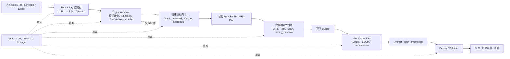

# 大模型时代的 CI/CD 基础设施深度洞察报告

**观察日：** 2026-07-28<br>
**重点时间窗：** 2023-01-01 至 2026-07-28，重点核验 2025—2026 增量<br>
**研究对象：** 代码仓、流水线、构建系统、制品仓，以及身份、证据、审计和成本控制<br>
**受众：** CTO、研发效能负责人、平台工程负责人

> [!summary] 一句话判断
> 大模型没有让 CI/CD 基础设施消失，而是迫使它从“面向人的自动化工具链”升级为“面向 Agent 的上下文与隔离执行面 + 模型不可篡改的确定性控制面”。代码仓正在成为 Agent 任务控制面，CI 正扩展为高频验证基础设施，构建图/缓存/远程执行从提速工具升级为成本与反馈底座，制品仓从二进制存储扩展为供应链信任和受限行动面；与此同时，身份、权限、证据和成本成为规模化采用的主约束。

## 一、先区分：大模型本身与软件工程 Agent

如果大模型只在 IDE 中补全代码或回答问题，CI/CD 基础设施的直接变化很小，主要影响是候选变更量和审核负担。结构性变化来自 **Agent**：

- 能接收 Issue、PR 评论、定时任务或 Pipeline Event；
- 能读取仓库、日志、测试、制品和策略；
- 能执行命令、运行构建、反复修复；
- 能创建 PR/MR，甚至调用制品、发布和身份管理 API；
- 能长时间、并行、无人盯守地工作。

一旦模型从“建议者”变成“有工具的工作负载”，基础设施就必须回答五个传统聊天界面没有的问题：

1. 它以谁的身份运行？
2. 它能看到和调用什么？
3. 它在哪里执行，如何隔离？
4. 谁判断任务真的成功？
5. 哪些副作用可以自动发生，如何证明和回退？

因此，本报告讨论的不是把 Chatbot 嵌进 DevOps 控制台，而是 **Agent 进入交付控制回路后，基础设施职责如何重组**。

## 二、核心结论

### 1. CI/CD 正形成双控制面

- **概率性 Agent 面：** 理解自然语言、聚合上下文、提出假设、生成候选代码或动作；
- **确定性控制面：** 身份、权限、Runner/Sandbox、Build/Test/Scan、Policy、签名、Attestation、Review、Environment Gate 和回退。

前者提高长尾任务处理能力，后者决定候选是否可以被接受。Agent 可以发起验证，但不能同时修改并裁决自己的成功判据。

### 2. 代码仓已经成为 Agent 的任务、上下文和治理控制面

GitHub Copilot Coding Agent 于 **2025-09-25 GA**：任务可来自 Issue、Agents UI 或 PR 评论，Agent 在 GitHub Actions 支撑的临时环境中工作，并通过 Branch/Draft PR 请求 Review。GitLab Duo Agent Platform 已 GA，Custom Flows 于 **GitLab 19.2（2026-07-16）GA**，Issue、MR、评论提及和 Pipeline Event 都可成为 Flow 入口。

这不是“多了一个聊天框”，而是 Repository 开始同时保存：

- 任务与状态；
- 代码和历史上下文；
- `AGENTS.md`、Setup、Skill、MCP、Flow 配置；
- Agent Session 与运行日志；
- 候选 Branch/PR/MR；
- Ruleset、Required Check、Review 和部署规则。

Repository 的 Source of Truth 角色没有被削弱，反而因 Agent 增加了新的主体、配置和审计关系。

### 3. CI 从一次性终点门禁扩展为持续验证基础设施

传统 CI 假设人已经在本地做过基本验证，提交后一次 Fan-out 尽可能收集完整反馈。Agent 则会多轮试错、并行工作，每轮都需要快速、结构化、可直接消费的反馈。

业界已出现三类实现：

- GitHub Agentic Workflows 把自然语言 Markdown 编译成标准 Actions YAML，在现有 Runner/Policy 内运行，**截至观察日为 Public Preview**；
- Buildkite 以 MCP 提供 Build/Log/Trigger，并允许 Agent 作为 Pipeline Step；
- CircleCI Chunk Sidecar/Microbuild 用预热快照、增量同步和精简结果形成 Agent 内循环；Harness CI Autofix、Nx Self-Healing 则形成有轮次或 Task 范围限制的修复—复验循环。

关键不是取消完整 CI，而是分层：

```text
快速内环：受影响任务、增量、低延迟、有限轮次
完整外环：干净环境、Required Checks、扫描、策略、集成验证
发布门禁：Artifact Digest、Attestation、Environment Policy、SLO/人工批准
```

### 4. 构建系统最重要的变化不是“AI 编译”，而是旧能力升值

Build Graph、Affected Analysis、Incremental Build、Remote Cache、Remote Execution 和 Hermetic/Isolated Build 早于大模型存在。Agent 到来后，它们承担新的系统作用：

- Graph 告诉 Agent 和调度器“什么真正受影响”；
- Cache/Incremental 降低每轮试错成本；
- Remote Execution 承接并行 Agent 工作负载；
- Isolation/Reproducibility 防止环境偶然和缓存污染；
- Task-level Oracle 给候选变更提供稳定 Backpressure。

因此不能把 Bazel/Nx 的缓存和远程执行写成“Agent 时代新发明”。更准确的判断是：**它们从性能优化项升级为 Agent 能否经济、可信运行的前提。**

### 5. 制品仓正在成为供应链事实、信任和受限行动面

变化已超出“让 Agent 查一个包版本”：

- Sonatype MCP 把版本、漏洞、许可证和推荐版本前移到 Agent 选择依赖的时点；
- Cloudsmith MCP 将 CLI/API 暴露为本地 Tool，可查询漏洞、版本并管理部分制品；但当前公开边界只允许非破坏性动作，Policy 激活保留人工；
- JFrog MCP 已覆盖 Repository、Xray、SBOM、Evidence、Release 与部分 Identity/Governance Tool，但截至观察日仍为 **Beta**；
- GitHub Artifact Attestations 已 GA，可将 Workflow、Repository、Commit、Environment 与 Artifact Digest 绑定，并关联 SBOM。

制品仓的对象也在扩展。JFrog Agent Packages Repository 已开始存放 Skills、Plugins、Prompts、Hooks、MCP Servers、Instructions 和 Agents，使 Agent 行为资产本身进入供应链治理；相关 Skills/扫描能力仍处 Open Beta。

### 6. 身份模型从“共享 Bot Token”转向任务级委托

Agent 的有效权限不应由一个长期 Token 决定，而应来自多重求交：

```text
Effective Permission
= Initiator 权限
∩ Agent 声明权限
∩ Tool / Connector 权限
∩ Repository / Environment Policy
∩ Run TTL、预算与动作范围
```

GitLab Composite Identity 取触发人与 Service Account 的较小权限并保留归因；Harness 的 Runtime Token 与第三方 Tool Scope 也采用交集思路；GitHub Cloud Agent 使用独立 Agent/MCP Secret 通道，Agentic Workflows 可使用组织 `GITHUB_TOKEN`，减少长期 PAT。

如果一个定时器、Webhook 或 Artifact Event 没有真实 Principal，平台必须显式使用受限服务身份和审批规则，不能悄悄继承管理员权限。

### 7. “绿灯”正在扩展为完整证据链

未来的最小交付证据不是一个 Pipeline Pass，而是：

```text
谁发起
→ 哪个 Agent/Session/Tool 处理
→ 修改哪个 Commit
→ 哪个 Builder 以何输入执行
→ 哪些 Test/Scan/Policy 通过
→ 产生哪个 Artifact Digest
→ 哪个 Attestation/签名证明来源
→ 谁批准、部署到何环境
→ 上线结果如何
```

GitHub Agent Audit、GitLab Flow Session、SLSA Provenance、Artifact Attestation 和 Linked Artifact 都在填补这张图，但覆盖尚不完整：本地 Prompt、全部 MCP 往返、模型/Skill 版本与外部批准并不总能被统一保存。

### 8. 行业已跨过概念验证，但没有跨过普遍自治

已进入 GA 的样本包括 GitHub Cloud Agent、GitLab Agent Platform/Custom Flows、GitHub Artifact Attestations。与此同时：

- GitHub Agentic Workflows 是 Public Preview；
- JFrog MCP 是 Beta；
- Agent Skills Repository/扫描能力有 Open Beta；
- Cloudsmith 高风险动作与 Policy 激活仍受限；
- Agent 对 CI/CD 配置的实际修改仍是少数场景；
- 2026 年 CI-Repair-Bench 的 567 个真实故障中，最佳受测模型修复成功率为 18.9%。

因此可下结论的是“基础设施接入已经真实发生”，不能下结论的是“全链路无人值守交付已经成熟”。

## 三、目标架构：Agent 内环必须被确定性外壳包住



这张图的核心边界有四个：

1. **Agent Runtime 与凭据/Secret 分离；**
2. **候选变更与正式接受分离；**
3. **Repairer 与 Validator/Signer 分离；**
4. **Artifact Tag/名称与不可变 Digest/Provenance 分离。**

## 四、四类基础设施分别发生了什么

### 1. 代码仓：从协作界面到 Agent Control Plane

| 以前的主角色 | 新增角色 | 已有证据 | 仍需保持的边界 |
|---|---|---|---|
| Git 对象、Issue、PR/MR、Review | Agent Task Queue、Session、运行配置、Tool/Skill/MCP 载体、候选变更出口 | GitHub Cloud Agent GA；GitLab Custom Flows GA；Agent Audit/Composite Identity | Source of Truth、Ruleset、Required Check、CODEOWNERS、人工/环境批准 |

关键变化不是仓库自动“理解”代码，而是平台把异步 Agent 作为一种正式工作负载和 Actor：

- 可分派任务；
- 有独立 Session 与环境；
- 有专用 Secret/Token；
- 以 PR/MR 提交候选；
- 留下 Agent/发起人归因；
- 受同一分支与部署规则约束。

新的治理对象是 Agent Config。`AGENTS.md` 是上下文，不是 Policy；Setup Script、MCP Config、Custom Flow 定义和 Skill 则可能直接改变执行面，必须使用 CODEOWNERS、Ruleset 和 Review 保护。

### 2. 流水线：从固定 DAG 到“固定外壳中的动态决策岛”

| 以前的主角色 | 新增角色 | 已有证据 | 仍需保持的边界 |
|---|---|---|---|
| 执行固定 YAML、收集日志、给出 Gate | Agent Step、日志调查、候选修复、有界循环、Token/AI Cost | GitHub AW、Buildkite、Harness、CircleCI、Nx | Runner Policy、Secret/Network、Max Turns、Required Checks、发布批准 |

自然语言 Workflow 并不意味着整个 Pipeline 应变成不可预测的自由循环。更安全的结构是：

- 编译/声明阶段固定 Trigger、Permission、Tool、Safe Output 和预算；
- Agent Job 内允许动态推理；
- 输出只能跨过类型化、可验证的接口；
- 写入与发布由独立 Job/Identity 执行。

GitHub Safe Output 和 Harness Pipeline Step 的共同价值就在这里：动态决策被限制在确定性外壳中，而不是让 Agent 直接持有仓库与生产凭据。

### 3. 构建系统：从执行引擎到 Agent 的验证与 Backpressure 基础设施

| 以前的主角色 | 新增角色 | 已有证据 | 仍需保持的边界 |
|---|---|---|---|
| 编译、测试、缓存、远程执行 | Agent 高频反馈、受影响任务选择、失败上下文、自愈复验、成本控制 | Nx Project Graph/Self-Healing、CircleCI Microbuild、Bazel RBE/Cache | 输入输出完整性、可信 Cache Writer、干净外环、独立 Oracle |

平台团队需要把“验证反馈”当作产品接口：

- Environment 可以创建、快照、恢复和销毁；
- 测试结果结构化，保留原始日志；
- Agent 只运行受影响任务，但最终 Gate 运行完整集合；
- Cache 按 Trust Domain 分区，只有可信 Builder 写；
- 并发由 Graph、历史耗时和预算分配，不能由 Agent 无限 Fan-out；
- 每次尝试有最大轮次、时间和成本。

### 4. 制品仓：从保存文件到供应链信任和 Agent 行动面

| 以前的主角色 | 新增角色 | 已有证据 | 仍需保持的边界 |
|---|---|---|---|
| 存包、代理上游、权限、扫描、晋级 | Agent 实时依赖情报、MCP Tool、Evidence/SBOM/Release 查询、Agent Package 分发 | Cloudsmith、JFrog、Sonatype、GitHub Attestations/SLSA | Digest、Signer/Builder、Policy、Waiver/Promotion/Delete 独立授权 |

对制品操作应分为五档：

1. **查询：** 版本、漏洞、License、SBOM、Attestation；
2. **建议：** 推荐版本、Promotion/Waiver Plan；
3. **可逆写：** 非生产 Tag、Copy、Quarantine 请求；
4. **接受性写：** Policy Activation、Waiver、Promotion；
5. **破坏/生产：** Delete、Token/OIDC/Role、Signer、Production Release。

前两档可以较早开放；后三档必须按不可逆性、爆炸半径和职责分离设置独立身份与批准。

## 五、哪些是真正新增，哪些只是旧能力升值

| 分类 | 能力 | 判断 |
|---|---|---|
| **真正新增/产品化** | Repository Agent Session、Issue→Agent→PR；自然语言 Workflow 编译；Agent 专用 Runtime/Secret；Safe Output；低延迟 Sidecar/Microbuild；Agent Package Repository | 大模型/Agent 直接推动的新产品层 |
| **既有能力的新包装** | API/CLI→MCP；CI Log→Agent Context；Webhook/Event→Agent Task；Runner→Agent Runtime | 接口与使用者改变，底层能力延续 |
| **既有能力升值** | Build Graph、Affected、Cache、RBE、Hermetic Build、PR/Ruleset、OIDC、SBOM、Provenance、Attestation | 从效率/最佳实践上升为 Agent 规模化运行前提 |
| **仍未发生** | Agent 普遍自主合并、发布、豁免、删除制品；统一的高风险 Tool 审批标准；完整跨平台 Agent Lineage；被独立数据证明的行业 ROI | 保持 `unverified` 或阻塞 |

## 六、为什么这些变化会发生

### 1. 负载形态变了

Agent 可以并行、长时间、多轮工作。基础设施从承接“人提交的一次变更”转向承接“机器产生的一组尝试”。这放大 Queue、Cold Start、Cache、Egress、Log Token 和 Runner 成本。

### 2. 反馈对象变了

人可以阅读长日志、跳转多个 UI、理解含糊错误；Agent 更需要结构化、最小、可定位、带原始证据链接的反馈。Build/Test/Artifact 数据开始成为 Tool Contract。

### 3. 风险速度变了

一个错误的人类操作通常是单次；一个错误 Agent 加上循环和高权限 Token 可以在分钟内重复、并行、跨仓放大。因此 Rate Limit、TTL、Idempotency、Typed Action、Circuit Breaker 和 Approval 必须进入后端。

### 4. 信任对象变了

过去主要追踪“哪个人提交了代码”。现在还要追踪“哪个 Agent、Skill、Prompt、MCP Server、Model、Session 和 Tool 参与了变更”，并把它们连接到 Builder、Artifact 与 Deployment。

## 七、企业应该如何演进

推荐顺序不是先采购“AI DevOps 平台”，而是按控制依赖推进：

1. **可信基线：** Required Checks、可复现构建、Cache Writer 隔离、Digest、Attestation 验证、短期身份；
2. **只读上下文：** 给 Agent 读 Repo/CI/Artifact 的结构化接口；
3. **候选变更：** 只写临时分支、Draft PR/MR、Issue/Plan；
4. **验证内环：** Graph、Affected、Cache、隔离环境、结构化失败、Turn/Cost 预算；
5. **Task-level Auto-apply：** 只对白名单 Task 和 PR Branch；
6. **制品受限动作：** 先非生产、可逆、绑定 Digest/Plan；
7. **生产动作最后开放：** 独立 Publisher、强审批、SLO、回退与熔断。

详细控制、指标和采购问题见 [[50_deepdives/llm-era-cicd-infrastructure/60_playbook|企业演进手册]]。

## 八、主要反例与限制

### 反例 1：Agent 并未普遍修改 CI/CD

2026 年预印本研究显示，CI/CD 配置约占受测 Agent 变更的 3.25%，说明“Coding Agent 自然演进为 Delivery Agent”尚不是普遍事实。产品潜力不能替代采用率证据。

### 反例 2：通用 CI 自愈仍很难

CI-Repair-Bench 的最佳受测模型只修复 18.9% 的真实 CI 故障，环境、依赖和配置问题尤其困难。因此企业应按故障类别和固定 Oracle 白名单化，而不是追求一个总“自愈率”。

### 反例 3：新接口未必带来新授权

MCP 往往只是既有 API/CLI 的机器可发现包装，最终权限仍由 OAuth/API Key/Platform RBAC 决定。没有 Tool-level Scope、参数限制和审批，MCP 可能只让高风险 API 更容易被连续调用。

### 反例 4：更快内环未必更可信

预热 Sidecar 与增量验证可以加速反馈，但可能不具备完整 Hermetic、全量集成和发布环境条件。它必须由干净外环复验。

### 反例 5：Attestation 未必产生安全收益

GitHub 与 SLSA 都强调：Attestation 需要被验证并与期望策略比较。它证明来源和过程，不证明制品无漏洞、无恶意或满足业务需求。

### 证据限制

- 多数产品机制由官方材料证明，跨客户成效仍以厂商自述为主；
- DORA 是广义 AI 辅助开发研究，不能隔离某一种 Agent 基础设施的因果收益；
- 两项学术材料为预印本，样本偏向公开 GitHub；
- 产品状态变化快，应在 2026-09-28 前复核 Preview/Beta 项。

## 九、逐主张事实审计

| 正式主张 | 证据入口 | 状态审计 | 结论 |
|---|---|---|---|
| Repository 成为 Agent 控制面 | [[00_sources/briefs/2026-github-cloud-agent-repository-control-plane]]、[[00_sources/briefs/2026-gitlab-duo-agent-platform]] | GitHub 核心 GA；GitLab Platform/Custom Flows GA；扩展能力分开标状态 | 通过 |
| CI 分化为 Agent 内环与确定性外环 | [[00_sources/briefs/2026-circleci-agentic-validation-infrastructure]]、[[00_sources/briefs/2026-nx-self-healing-ci]]、[[00_sources/briefs/2026-github-agentic-workflows]] | 可用/GA/Public Preview 已区分；效果限定为厂商自述 | 通过 |
| Build Graph/Cache/RBE 是旧能力升值 | [[50_deepdives/llm-era-cicd-infrastructure/research-pipeline-build-2026-07-28]] | Bazel/Nx 官方机制与 Agent 新层分开 | 通过 |
| Agent Runtime 需要硬隔离 | [[00_sources/briefs/2026-github-agentic-workflows]]、[[00_sources/briefs/2026-harness-worker-agent-security]]、[[00_sources/briefs/2026-gitlab-duo-agent-platform]] | Preview/厂商自述边界已标 | 通过 |
| 制品仓成为信任与受限行动面 | [[00_sources/briefs/2026-cloudsmith-mcp-artifact-management]]、[[00_sources/briefs/2026-jfrog-skills-and-mcp]]、[[00_sources/briefs/2025-sonatype-guide-supply-chain]] | Cloudsmith/JFrog/Sonatype 当前边界逐项标注 | 通过 |
| Agent 行为资产进入供应链 | [[00_sources/briefs/2026-jfrog-skills-and-mcp]] | 单厂商、Open Beta，行业普遍性未外推 | 通过 |
| 任务级委托身份成为关键 | [[00_sources/briefs/2026-gitlab-duo-agent-platform]]、[[00_sources/briefs/2026-harness-worker-agent-security]] | 跨厂商机制相似，未宣称统一标准 | 通过 |
| Pass/Fail 扩展为 Lineage | [[00_sources/briefs/2026-github-artifact-attestations-slsa]]、[[50_deepdives/llm-era-cicd-infrastructure/research-code-repository-2026-07-28]] | 明确审计缺口与 Attestation 边界 | 通过 |
| 全链路普遍自治尚未成熟 | [[00_sources/briefs/2026-agents-touch-cicd-configurations]]、[[50_deepdives/cicd-self-healing/recent-paper-search-2026-07-25]]、[[50_deepdives/llm-era-cicd-infrastructure/30_case-map]] | 预印本、样本和产品状态限制已标 | 通过 |

## 十、最终判断

大模型之后，CI/CD 基础设施的价值不再只是“把人的流程自动化”，而是成为软件工程 Agent 的 **现实约束系统**：

- Repository 给出任务、上下文和接受规则；
- Pipeline 给出受限执行与反馈回路；
- Build System 给出影响图、可复现计算和 Backpressure；
- Artifact Repository 给出不可变对象、供应链事实与发布证据；
- Identity、Policy、Audit 和 Cost 把 Agent 的能力压缩到可承担风险的范围。

最值得投入的不是一个能“接管整条 CI/CD”的通用 Agent，而是一组深而窄的基础设施能力：**机器可调用的事实、可快速复验的环境、任务级最小权限、模型外的 Oracle、绑定 Commit/Digest 的证据，以及失败时明确停止和回退的执行器。**

## 研究入口

- [[50_deepdives/llm-era-cicd-infrastructure/00_charter|Charter]]
- [[50_deepdives/llm-era-cicd-infrastructure/10_question-tree|Question Tree]]
- [[50_deepdives/llm-era-cicd-infrastructure/20_evidence-map|Evidence Map]]
- [[50_deepdives/llm-era-cicd-infrastructure/30_case-map|Case Map]]
- [[50_deepdives/llm-era-cicd-infrastructure/50_findings|Findings]]
- [[50_deepdives/llm-era-cicd-infrastructure/60_playbook|Playbook]]
- [[50_deepdives/llm-era-cicd-infrastructure/research-code-repository-2026-07-28|代码仓研究底稿]]
- [[50_deepdives/llm-era-cicd-infrastructure/research-pipeline-build-2026-07-28|流水线/构建研究底稿]]
- [[50_deepdives/llm-era-cicd-infrastructure/research-artifact-supply-chain-2026-07-28|制品/供应链研究底稿]]
