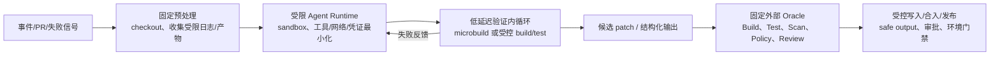

# 大模型软件工程 Agent 时代的 CI 与构建基础设施变化

> [!abstract] 可证实的结论
> 2025--2026 年可观察到的变化，不是“Agent 取代 CI”，而是 CI/构建系统开始增加三个基础设施层：**受限的 Agent 执行与副作用隔离**、**低延迟且可反复反馈的验证环境**、以及**按变更规模/任务图动态分配的计算与缓存**。GitHub、Harness、Buildkite 和 CircleCI 都有前两类的已发布实现或预览；Nx 的任务分发/远程缓存与 Bazel 的远程执行/缓存则主要是先于 Agent 存在、现在被复用为规模化验证底座的能力。模型的根因判断或修复提案不构成通过门禁的证据；Build/Test/Scan/Policy/Review 仍是外部 Oracle。

## 1. 研究问题与检索范围

### 研究问题

1. 软件工程 Agent 进入交付流程后，哪些 CI/构建基础设施组件已有可核验的产品变化？
2. 哪些是平台原生新增能力，哪些只是 Agent 接入已有 CI 能力，哪些又是既有构建能力在 Agent 高并发情境下被重新使用？
3. “失败诊断/修复闭环”“动态编排”“沙箱”“验证基础设施”“日志/可观测性”“缓存和成本”各自已有何种证据与控制边界？

### 范围与方法

- **时间窗口：**重点核验 2025-09-23 至 2026-07-28 的公开变更；Bazel/Nx 的基础能力只用于判断“既有能力被重新利用”，不将其起源误归因于 Agent。
- **对象：**GitHub Actions / GitHub Agentic Workflows、Buildkite、CircleCI、Harness、Nx Cloud/Nx Agents、Bazel remote cache / remote execution。
- **来源口径：**仅使用供应商官方 Docs、官方 Changelog、官方产品/工程博客与 Bazel 官方文档；访问时间均为 2026-07-28。厂商自述的性能或效果不作为行业平均值。
- **排除：**未把 MCP/CLI 可调用视为写入授权；未把营销中的“autonomous”视为自动合并/发布；未检索到独立的跨厂商采用率或因果成效，因此不作行业量化结论。

## 2. 主张—证据表

| ID | 可支持的主张 | 分类 | 关键一手证据 | 产品状态 / 置信度 |
|---|---|---|---|---|
| C1 | GitHub 已把 Agent 工作流做成 **Markdown 源文件 → 编译后的标准 Actions YAML**；它复用现有 runner group 和 policy，而非另起一套 CI 执行器。 | 平台原生变化 | GitHub 2026-06-11 Changelog 明确称 Agentic Workflows 在 GitHub Actions 内运行、由 Markdown 编译为标准 Actions YAML，并复用 runner group/policy。 | **Public preview**；高 |
| C2 | GitHub 的 Agent 运行时新增了独立安全边界：默认只读、沙箱容器与 Agent Workflow Firewall；候选输出经 safe outputs 和专门 threat-detection job 后才可应用。 | 平台原生变化 | 同一 GitHub 发布公告列出上述分层保护；这意味着 Agent 推理结果被当作需审查的输入，而非直接拥有 CI/CD 写权限。 | **Public preview**；高 |
| C3 | GitHub 已将 Agent 工作负载显式纳入成本面：Agentic Workflow 既消耗 Actions minutes，也消耗/可管理 AI Credits；2026-06 还支持以组织的 `GITHUB_TOKEN` 结算并设每次运行 token 上限。 | 平台原生变化 | GitHub 的 Agentic Workflows docs 与 2026-06-11 Changelog 分别说明 Actions minutes + inference 的双重成本、组织结算与 run-level token caps。 | **Public preview**；高 |
| C4 | CircleCI 正在把“验证”从最终 CI 检查拆成 Agent 内循环和 CI 外循环：Chunk sidecar 用已配置快照、增量 Git patch 同步和 microbuild 将结果直接反馈给 Agent；正式 CI 保留系统级/共享环境验证。 | 平台原生变化（验证运行时） | CircleCI 2026-05-22 发布 sidecars，称其可在 Agent 工作时验证变更；2026-06-05 工程文章说明 snapshot、microbuild、agent-stop hook 与 programmatic sidecar sharding。 | Sidecars **available to all CircleCI plans**；实现细节为官方工程自述；中高 |
| C5 | CircleCI 把失败诊断与修复从“读取完整 CI 日志”转为可循环的、较小粒度的验证反馈；但其 3× token 效率、10--20× core-cost 效率仅是 CircleCI 对自身用法的测量，不能外推。 | 平台原生变化（验证运行时） | CircleCI 工程文章报告 microbuild 输出相对 CI 日志的 token 效率、以及预热 sidecar 的核心成本测量；同文说明该模式不是完全 hermetic reproducibility。 | 官方工程测量，非独立基准；中 |
| C6 | Harness 已发布 Autonomous Worker Agents：Agent 可作为 Pipeline Step 运行，支持顺序、并行、条件和 matrix 编排；CI Autofix 的官方定义包含“读取失败 PR build 日志→根因→提交修复→重触发 build→到通过或 max-turns”。 | 平台原生变化 | Harness 2026-06-30 发布文档列出了 Pipeline Step、pipeline expression 输出传递与 CI Autofix 闭环。 | **Available today for all Harness customers**（厂商声明）；中高 |
| C7 | Harness 给 Agent 新增的基础设施控制是容器化非 root、工作区外只读文件系统、可配置网络、短期 scoped token、OPA/RBAC/审批/审计；Agent 的权限取触发者 RBAC 与 Agent 权限的交集。 | 平台原生变化 | Harness 2026-06-30 发布文档逐项说明 sandbox、网络选择、ephemeral token、OPA/RBAC/approval/audit；工作负载在客户 Kubernetes/VPC 的 Delegate 上运行。 | **Available today**（厂商声明）；中高 |
| C8 | Buildkite 已把 Agent 接入两个面：MCP 可读实时 build state/log、触发 run 和迭代配置；model provider 可把 LLM 作为 pipeline step，并传入 log/artifact/policy/实时 pipeline data。插件也可按 `on-failure` 做失败分析。 | 平台原生变化 + Agent 叠加层 | Buildkite 官方 docs 说明 MCP 的可达能力、model provider 的 token 模式、当前仅支持 Anthropic，以及 failure-summary plugin 的触发/作用域。 | Docs 已发布；model provider 当前 **Anthropic-only**；中高 |
| C9 | Nx 已将动态资源分配和任务图调度产品化：Nx Agents 按历史耗时和依赖分发任务，可按 PR affected projects 比例选择不同数量/类型的 Agent；remote cache 负责跨机器传递依赖任务产物。 | **既有构建/CI能力被重新利用**，不是 Agentic coding 专属 | Nx docs 说明 distributed task execution、PR-size dynamic allocation，以及 remote cache 的跨机器任务 replay 与 task-artifact transport。 | 已发布 Docs；高 |
| C10 | Bazel 的 remote execution/cache 提供多机并行、统一执行环境和团队级产物复用；它是 Agent 大规模验证的可复用底座，但不是为 LLM Agent 新增。其 docs 也警告远程缓存写入权、环境变量与工作区外工具会影响正确性/污染风险。 | **既有构建能力被重新利用** | Bazel 官方 RBE docs 说明默认本地、远程多机执行及三项收益；remote caching docs 提醒仅让 CI 写缓存，并列出非工作区工具/环境造成错误 cache hit 的限制。 | 已发布、并非 Agent 特性；高 |

## 3. 变化前后对照：不是单一“智能流水线”

| 基础设施面 | 传统/已有 CI 与构建做法 | Agent 到来后的可核验变化 | 正确的架构判断 |
|---|---|---|---|
| **工作流定义与编排** | YAML 固定 Job DAG、条件、矩阵和 runner。 | GitHub Agentic Workflows 用 Markdown 指令编译为标准 Actions YAML；Harness 把 Agent 模板纳入顺序/并行/条件/matrix step。 | 执行计划和权限边界仍应固定；动态的是受限 Agent job 内的理解、工具使用与候选输出。 |
| **Agent 执行沙箱** | CI runner 已有容器/VM、token 与 network/secrets 分离需求。 | GitHub 公布 Agent container + Firewall + safe output/threat detection；Harness 公布 non-root container、workspace write-only、网络策略和短期 token。 | 这是明确新增或显式产品化的 Agent runtime 边界；不应由 prompt 替代 RBAC、Policy 或网络隔离。 |
| **验证循环** | 提交/推送后在干净 runner 运行完整 CI，结果以 Job 日志返回。 | CircleCI sidecar/microbuild 将 Agent 工作时的增量验证直接回传；Harness CI Autofix 已将失败日志→候选修复→再触发 build 组织成受 max-turns 限制的循环。 | 验证从单一“最终门”增加内循环；最终 CI 的集成、扫描、共享环境与审批门不应删除。 |
| **失败诊断与日志** | 人或脚本在 CI UI/日志中定位失败。 | Buildkite 可通过 MCP 读取 build state/log、触发 run；其 model-provider/plugin 在 pipeline step 中分析失败。CircleCI 试图以 microbuild 的精简输出替代 Agent 轮询大段 CI 日志。 | 日志成为可给 Agent 调用的上下文/反馈接口；诊断是候选结论，不等于测试通过或根因已证实。 |
| **并发、缓存与成本** | 固定 runner 数/矩阵、remote cache、RBE 主要为人类提交和大仓库提速。 | Nx 根据 affected-project 比例动态选 Agent 数量；CircleCI 以预热快照与增量同步压低内循环启动成本；GitHub 将 AI Credits 与 Actions minutes 并列计量/封顶。 | 机器生成变更会提高尝试频率，但本研究没有跨平台数据证明实际提交量或缓存命中率；“更高并发/成本压力”只能作为设计假设，需本地遥测验证。 |
| **缓存完整性与信任** | Bazel/Nx 已以 action/task inputs、outputs、hash 和 cache ACL 来复用结果。 | Agent 大规模重试会更放大错误 cache hit/poisoning 的影响，因此现有的 cache-write 边界重新关键。Nx 允许限制 CI 写、开发者读；Bazel 建议谨慎决定写缓存身份。 | 这是既有控制被强化，而非 Agent 自动解决的能力；必须测 task input/output 声明、工具链与 secret/branch 信任边界。 |

## 4. 可形成的基础设施模式（基于上述事实的分析推断）

### 4.1 “确定性外壳 + 动态决策岛 + 外部 Oracle”

这不是任一厂商的完整架构图，而是对 GitHub 的 safe-output 分层、Harness 的 pipeline governance、CircleCI 的 inner/outer loop 和 Buildkite 的 pipeline step/MCP 接入所做的共同抽象。其关键是：**循环可由 Agent 发起，成功只能由流程外的可重复校验给出。**

### 4.2 需要新增或明确拥有的“验证基础设施”接口

- **Environment lifecycle：**可创建、快照、恢复、丢弃和横向扩展的验证环境（CircleCI sidecar 是已发布例子）。
- **Feedback contract：**测试/构建失败的最小、结构化、可定位反馈；保留原始日志和 artifact 用于审计，避免只相信模型摘要。
- **Execution allocation：**按影响范围、任务图、历史耗时和预算选取并发，而不是让 Agent 任意 fan-out（Nx 提供已有的 affected/DTE 基础）。
- **Cost contract：**分别记录 runner/time、cache egress/storage、模型 token/credit、重试次数和成功率；GitHub 的双计量证明这已是产品级成本面，但没有证明所有平台都有统一计价。
- **Write contract：**candidate patch 与真正的 git/API/部署写入必须跨越独立的 permission/policy/approval boundary。

## 5. 边界、反例与尚待验证项

1. **不是“Agent 已替代 CI”。**GitHub 明确复用 Actions runner 与 policy；CircleCI 明确把 CI 留给最终系统级验证；Harness 的审批、失败策略、重试和回滚仍按普通 pipeline step 规则运行。
2. **产品状态并不一致。**GitHub Agentic Workflows 仍是 public preview；Buildkite model providers 当前官方称只支持 Anthropic；Harness 的“available today”和 CircleCI 的效果指标均来自厂商自身材料。
3. **不能把修复循环表述为自动安全交付。**Harness 的 CI Autofix 截止条件是 build pass 或 max turns；GitHub safe outputs/threat detection 处理写入前风险；两者都不能证明修复满足业务语义、SLO、合规或人工评审要求。
4. **低延迟内循环不是完全可复现替代品。**CircleCI 官方明确称 snapshot sidecar 不是 full hermetic reproducibility；Bazel 也指出 Docker 中的增量内存状态丢失，以及工作区外工具可能导致错误共享 cache hit。
5. **“Agent 导致并发/缓存/成本需求增长”仍是合理但未量化的假设。**CircleCI 说明多个长时间 Agent 会碰到本机资源冲突，GitHub 引入 model + Actions 双成本，二者支持需要容量治理；但本研究未找到可归因的跨行业工作负载统计，故不得写成行业事实。
6. **MCP 是上下文/操作面，不是授权面。**Buildkite MCP 能读取日志和触发 run；实际允许的副作用仍取决于 token、平台权限和管控策略。对 GitHub/Harness 同样不能以“Agent 可调用工具”推导“可合入或可发布”。

## 6. 对后续 Deep Dive / Presentation 的可用判断

- 可用主张：**“CI 的基础设施重心正从一次性、最终态流水线，扩展为可受控的 Agent 内循环验证、外循环交付门禁和动态计算分配三层。”**置信度为中高；需保留“平台进度不一”的限定。
- 不可用主张：**“AI 让传统 CI/CD 失效”**、**“远程缓存/远程执行是 Agent 时代的新发明”**、**“自动修复闭环等于无人值守合入/发布”**。
- 企业试点的审计指标（建议，不是来源事实）：每 agent task 的内循环次数、从候选 patch 到 required checks 的 time-to-green、cache hit/miss 与 cache-write 身份、并发 queue time、模型 token/credit、失败分类、人工拒绝/回滚率，以及因环境/工具链差异导致的假阳性。

## 7. 来源清单（均为一手来源，访问于 2026-07-28）

| 编号 | 来源 | 发布/更新日 | 支持范围 | 状态说明 |
|---|---|---|---|---|
| S1 | [GitHub Changelog: Agentic Workflows is now in public preview](https://github.blog/changelog/2026-06-11-github-agentic-workflows-is-now-in-public-preview/) | 2026-06-11 | C1, C2 | Public preview；Actions 编译/复用与安全层 |
| S2 | [GitHub Docs: About GitHub Agentic Workflows](https://docs.github.com/en/enterprise-cloud@latest/copilot/concepts/agents/about-github-agentic-workflows) | 未标明发布日（页面现行版本） | C1, C2, C3 | Public preview；流程、guardrail、billing |
| S3 | [GitHub Changelog: Agentic workflows no longer need a PAT](https://github.blog/changelog/2026-06-11-agentic-workflows-no-longer-need-a-personal-access-token/) | 2026-06-11 | C3 | Public preview；组织结算、token cap |
| S4 | [CircleCI: Introducing Chunk sidecars](https://circleci.com/blog/chunk-sidecars/) | 2026-05-22（页面 Last Updated） | C4 | 官方产品博客；所有 CircleCI plan 可用 |
| S5 | [CircleCI Engineering: Agentic validation needs different infrastructure](https://circleci.com/blog/agentic-validation-needs-different-infrastructure/) | 2026-06-05 | C4, C5 | 官方工程博客；对自身实现/测量的说明 |
| S6 | [CircleCI: Introducing Chunk](https://circleci.com/blog/introducing-chunk/) | 2025-09-23 | C5 | 官方产品博客；性能/成功率均为厂商自述 |
| S7 | [Harness: Autonomous Worker Agents: AI Agents in Your Pipelines](https://www.harness.io/blog/introducing-autonomous-worker-agents) | 2026-06-30 | C6, C7 | 官方发布页；available-today 为厂商声明 |
| S8 | [Buildkite Docs: AI agents in Pipelines](https://buildkite.com/docs/platform/ai-agents) | 未标明发布日（页面现行版本） | C8 | 官方 Docs；当前 model provider 仅 Anthropic |
| S9 | [Nx Docs: Distribute Task Execution (Nx Agents)](https://nx.dev/docs/features/ci-features/distribute-task-execution) | 未标明发布日（Docs v23） | C9 | 已发布 Docs；非 Agentic coding 专属 |
| S10 | [Nx Docs: Dynamically Allocate Agents](https://nx.dev/docs/features/ci-features/dynamic-agents) | 未标明发布日（Docs v23） | C9 | 已发布 Docs；按 affected 项目比例分配 |
| S11 | [Nx Docs: Remote Caching (Nx Replay)](https://nx.dev/docs/features/ci-features/remote-cache) | 未标明发布日（Docs v23） | C9, 缓存边界 | 已发布 Docs；含 read/write 权限、inputs/outputs 限制 |
| S12 | [Bazel Docs: Remote Execution Overview](https://bazel.build/remote/rbe) | 2026-07-14（页面更新） | C10 | 官方 Docs；既有能力而非 Agent 特性 |
| S13 | [Bazel Docs: Remote Caching](https://bazel.build/remote/caching) | 2026-07-14（页面更新） | C10, 缓存边界 | 官方 Docs；cache writer 与正确性限制 |

> [!note] 证据使用边界
> 本文将 S4--S8 中关于“效果”“客户可用性”或“安全性”的表述限定为各厂商自述；将 S9--S13 的构建机制用作可复用能力证据。要形成跨厂商成熟度排名或 ROI 结论，还需要统一工作负载、独立遥测或可复现实验，当前保持 `unverified`。
