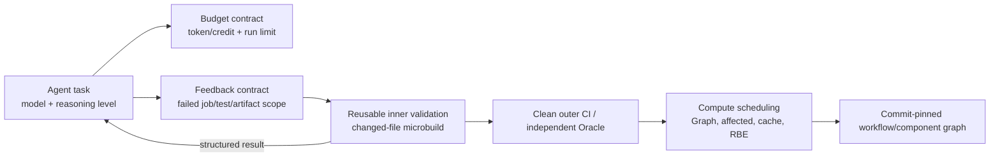

# 构建系统与底层执行资源管理：相对 2026-07-28 的刷新

> [!abstract] 刷新结论
> 截至 2026-08-04，尚未发现一手证据表明主流 CI/构建平台已经推出一个把 **Agent 推理 token/credit、Runner/RBE 容量、Cache 和验证优先级统一联合调度** 的新控制器。可确认的更近变化是：GitHub 开始将单次 Cloud Agent 的**推理深度**直接暴露为消耗 credits 的运行参数；Buildkite 正把 Job、失败测试、日志和制品收敛为可按需、分页、限流、低 token 消耗读取的 Agent 接口，并在 8 月 4 日加入有超时和停止条件的构建等待工具；其 MCP Server 也已适配 2026-07-28 的无会话、可横向扩展协议核心。GitHub 还把同仓 Action/可复用 Workflow 的引用固定到正在执行的 exact commit。它们共同支持的是“**资源与异步反馈契约正在产品化**”，而不是“Agent 已接管构建调度”。

## 1. 范围、对照基线与方法

- **对照基线：**[[50_deepdives/llm-era-cicd-infrastructure/research-pipeline-build-2026-07-28|2026-07-28 流水线/构建研究]]。其中已将 Graph/Affected、Remote Cache、RBE、Nx 动态 Agent、CircleCI Sidecar/Microbuild 归为既有能力的升值或已发布的 Agent 验证运行时。
- **刷新窗口：**重点检查 2026-07-29--2026-08-04，同时补记基线未纳入、但在 2026-07-28 前已公开且直接影响判断的官方更新。
- **来源与访问：**仅查官方 Changelog、官方产品页和官方文档；所有链接访问于 **2026-08-04**。未用搜索摘要或模型记忆作事实来源。
- **问题边界：**本页讨论代码执行后的构建、测试、日志、制品和 Runner/Agent 资源；Repository 任务入口、制品仓动作授权另由相应研究页覆盖。

## 2. 结论分层：旧能力升值 vs. 新增接口

| 能力面 | 相对基线的判断 | 一手信号 | 产品状态 / 置信度 |
|---|---|---|---|
| Graph / Affected / Cache / RBE / 动态 Worker | **仍是既有能力升值，不是 Agent workload scheduler 的新发明。**基线中 Nx、Bazel、CircleCI 已足以证明其作为高频验证的经济底座。刷新未发现把模型任务图和构建任务图统一优化的官方发布。 | 本次没有新的、可证实的跨平台产品机制。 | “已出现统一调度器”为 **unverified**；高。 |
| 推理预算 | **新增且时间上晚于基线的控制旋钮。**GitHub Cloud Agent 允许任务发起时选择 reasoning level；更高层级会消耗更多 tokens/credits。 | GitHub 2026-08-03 发布。 | 可用于付费 Copilot Cloud Agent 计划；高。 |
| 推理 + 计算联合预算 | **尚未形成可证实的新能力。**GitHub 既有 Agentic Workflows 的 Actions minutes + AI credits 双计量，和 8 月的 reasoning level，证明两个成本面都可见；但未证明系统会以两者共同决定 Runner、RBE、Cache 或验证队列分配。 | GitHub 的两个相邻控制面，不能补全为联合优化。 | **unverified**；高。 |
| 验证反馈与上下文摄取 | **新增的产品化方向是“按需、结构化、限量”而非再给 Agent 更多原始日志。**Buildkite 把失败 Job、测试执行、制品和日志拆成可筛选/分页/延迟获取的 MCP 工具；后续又加入按需 Skill guide 和更少的重复日志返回。 | Buildkite 2026-07-13、2026-07-23 Changelog。 | 已发布更新；页面未标 GA/Preview；中高。 |
| 异步反馈协议 | **从“Agent 自己轮询”走向有界等待和终态摘要。**Buildkite 的 `wait_for_build` 每次最多等待 45 秒，返回终态或当前状态，并要求连续约十次仍未结束时停止；新版 MCP 的无会话核心允许请求落到任意实例。 | MCP 规范 2026-07-28；Buildkite 2026-07-31、2026-08-04。 | 规范已发布，Buildkite 已实现；中高。 |
| 验证环境复用 | **已有模式继续成立，但没有发现 7 月 29 日后独立的新调度语义。**CircleCI 当前产品页仍把 Sidecar 定义为与 coding agent 并行的环境，并在 Agent pause 时触发 changed-file microbuild；这确认内环/外环分层，而非证明“环境池由 Agent 自主扩缩”。 | CircleCI 当前产品页；其页面未给发布日期。 | 产品页称可试用；性能数值为厂商自述；中。 |
| 构建组件/供应链完整性 | **新增、但不是算力调度。**GitHub 允许同仓 action/reusable workflow 用 `$/` 指向正在运行的 exact commit，免 checkout 且与全长 SHA pinning 兼容。高频 Agent 触发下，它减少了“自引用漂移”这一构建图/组件供应链风险。 | GitHub 2026-07-30 发布。 | github.com 可用；Runner >= 2.336.0；高。 |

## 3. 可核验的新增或补充信号

### S1 — 推理量开始成为一次 Agent run 的显式资源选择，而不是隐藏模型参数

GitHub 于 **2026-08-03** 发布 Cloud Agent reasoning-level 选择：任务发起人可对支持的模型选择 reasoning level；官方明确说明更高 level 可能改善复杂问题回答，但会用掉更多 token 和 credits，且该选择用于该次 run。该功能对含 Cloud Agent 的付费 Copilot 计划可用。

- **支持的判断：**Agent workload 的预算开始细化到“同一模型、不同推理量”的 run 参数。这使一个未来的资源合同至少可记录 `model + reasoning_level + token/credit + runner_minutes`。
- **不能推出：**该公告没有说 reasoning level 会驱动 Runner size、RBE placement、缓存配额、并发数或测试选择；也没有成本—质量最优策略。因此不能把它写成“推理与构建计算已联合调度”。
- **证据：**[GitHub Changelog: Customize the reasoning level for Copilot cloud agent](https://github.blog/changelog/2026-08-03-customize-the-reasoning-level-for-copilot-cloud-agent)（发布 2026-08-03；访问 2026-08-04；付费计划可用）。

### S2 — Agent 的 CI 反馈接口从“整页日志”转向按对象、按失败、按大小取数

Buildkite 在 **2026-07-13** 将 MCP Server 的 Job 查询拆为 `list_jobs` / `get_job`，支持按状态（如 failed）筛选；失败测试执行可分页；制品列表不再承载逐项下载 URL，而是通过 `get_artifact` 按需取小文本或临时链接；日志解析、搜索和 tail 也针对大/杂乱输出改进。它在 **2026-07-23** 又增加可按关键词发现并读取的 usage guide，并报告在其测试中通过删减重复日志把响应规模压低约 40%。

- **支持的判断：**“失败证据”开始被当作 Agent 的受约束输入接口：先缩小 Job/测试/制品范围，再取必要内容；这直接减少上下文与 API 负载，也使自动诊断更容易区分可重试的任务。
- **不能推出：**40% 是 Buildkite 自测，不能外推到任意日志、模型或客户；这些接口并未提供跨厂商通用 failure schema，也不等于 Agent 的根因判断正确。MCP 的可调用性更不构成 rerun、修改流水线或合入权限。
- **证据：**[Buildkite Changelog](https://buildkite.com/resources/changelog/)（条目发布 2026-07-13、2026-07-23；访问 2026-08-04；官方未对这两个更新标注 GA/Preview）。

### S3 — 验证环境“随 Agent 停止触发微构建”的模式获得产品页确认，但仍是局部内环

CircleCI 当前 Chunk 产品页说明，Sidecar 是和 coding agent 并行的计算环境；Agent pause 时自动运行按变更范围的 microbuild，并在数秒内返回结果。页面把 outer-loop CI 与此 inner loop 并列，并声称 microbuild 自动检测技术栈、运行 format/lint/test；“平均 27 秒、最高 30 倍效率”是其产品自述。

- **支持的判断：**验证环境复用的实际产品形态不是“每轮都启动完整 CI”，而是保持一个旁路环境，在 Agent 仍保有上下文时运行范围受限的检查。
- **不能推出：**产品页未说明快照寿命、池化/扩缩算法、跨任务隔离或结果的 hermetic 性；它不支持“动态 worker 已成为通用 Agent scheduler”的表述。
- **证据：**[CircleCI: Chunk](https://circleci.com/product/chunk/)（页面无发布日期；访问 2026-08-04；商业产品页，性能/效率均为厂商自述）。

### S4 — Agent 高频调用下，构建图内部的引用完整性也被显式产品化

GitHub 于 **2026-07-30** 发布 `$/` self-repository syntax：同一仓库中的 action 或 reusable workflow 可解析到**正在运行的 exact commit**，无需 checkout；官方称其可避免内部引用硬编码版本或因 `./` checkout 带来的维护负担，并支持要求 full-length commit SHA pinning 的企业策略。

- **支持的判断：**Agent 加速的不是只有 code patch，也包括 workflow/action 的组合与执行频率；因此“组件引用不可漂移”成为 build resource/supply-chain 合同的一部分。
- **不能推出：**这没有改变外部 action 的供应链风险、不会自动校验 action 行为，也不是 Agent 专属特性。
- **证据：**[GitHub Changelog: Reference same-repository actions with self-repository syntax](https://github.blog/changelog/2026-07-30-reference-same-repository-actions-with-self-repository-syntax)（发布 2026-07-30；访问 2026-08-04；github.com 可用，Runner >= 2.336.0）。

### S5 — 构建等待从无界轮询变为可停止、可组合的异步反馈协议

Buildkite 于 **2026-08-04** 为 MCP Server 增加 `wait_for_build`：单次调用最多等待 45 秒；若构建进入终态，返回最终状态；若仍在运行，则返回当前状态和已运行时长。官方还明确要求 Agent 在连续约十次调用后停止等待并报告构建仍在进行，而不是无限轮询。该工具可与 7 月 29 日发布的 `get_build_failure_summary` 组合，先等待终态，再按需取得失败 Job、日志尾部、annotation 和失败测试的有界摘要。

- **支持的判断：**Agent 长程任务需要的不是更长的同步调用，而是显式的等待预算、终态集合、停止条件与后续证据查询。这使 CI 反馈从 UI/轮询习惯演进为可被 Agent 编排的异步协议。
- **不能推出：**`wait_for_build` 不保证构建会完成，不替代队列超时、取消策略或人工升级，也不证明失败摘要的根因判断正确。
- **证据：**[Buildkite Changelog](https://buildkite.com/resources/changelog/)（条目发布 2026-07-29、2026-08-04；访问 2026-08-04）。

### S6 — Agent-facing CI 接口开始按无会话、可路由、可缓存的基础设施形态扩展

MCP **2026-07-28** 规范将协议核心从有会话的双向连接改为无会话的请求/响应：每个请求自描述，任意实例都可处理；method/tool 名进入 HTTP header，便于网关路由、计量和授权；列表响应带缓存提示。Buildkite 于 **2026-07-31** 宣布其开源与 Remote MCP Server 已兼容该版本。

- **支持的判断：**当构建平台要服务大量并行 Agent，会话亲和与长连接不再是默认前提；Agent-facing CI API 正变得像标准 Web 基础设施一样可横向扩展、路由和缓存。
- **不能推出：**协议无会话不等于应用无状态；跨调用状态仍需显式 handle。它也不自动解决 tool 授权、幂等、构建隔离或高风险动作审批。
- **证据：**[MCP 2026-07-28 specification announcement](https://blog.modelcontextprotocol.io/posts/2026-07-28/)（发布 2026-07-28）；[Buildkite Changelog](https://buildkite.com/resources/changelog/)（实现条目发布 2026-07-31）；均访问于 2026-08-04。

## 4. 跨厂商的共同抽象与严格边界

这是对 GitHub、Buildkite 与 CircleCI 的产品事实所作的**分析抽象**，不是任一家完整架构。其重要区分是：

1. **已新产品化：**推理量可选、按需失败证据、内部 workflow 的 exact-commit 解析；
2. **既有能力升值：**Graph/Affected/Cache/RBE/Worker autoscaling 负责执行经济性与稳定性；
3. **仍缺证据：**让调度器基于 Agent 任务价值、置信度、推理预算和验证风险，自动统一配置 RBE、缓存和 Worker 数量。

CircleCI 的内/外环和 Buildkite 的查询接口共同说明“结构化反馈”方向；GitHub 的 reasoning-level 则让推理消耗首次以明确的运行选择出现。它们还没有构成跨厂商的统一协议或成熟的自治调度层。

## 5. 页面升级候选（供主报告选择，不直接改写正式页面）

1. **高优先级｜把“成本合同”升级为“决策—计算双预算，但暂不声称联合优化”。**
   - 页面主张：*Agent 运行已开始把推理深度设为显式预算旋钮；平台应将 reasoning level/token/credit 与 runner-minutes、cache、验证轮次共同记录，但目前没有证据表明厂商已把它们统一调度。*
   - 证据：GitHub 2026-08-03 + 基线中 GitHub Agentic Workflows 的 Actions minutes/AI credits。
   - 版面形式：双轴预算卡片（Inference / Verification Compute）+ 中间的 `unverified: joint scheduler` 边界。

2. **高优先级｜将“日志给 Agent”升级为“异步、有界、可查询的失败证据契约”。**
   - 页面主张：*Agent 需要的不是完整 CI 页面或无限轮询，而是带等待预算、终态、停止条件，并可按失败 Job、测试、制品和范围获取的结构化证据；原始日志仍保留为审计证据。*
   - 证据：Buildkite 2026-07-13、2026-07-23、2026-07-29、2026-08-04；MCP 2026-07-28 与 Buildkite 2026-07-31 说明接口可按无会话模式扩展；CircleCI 的 changed-file microbuild 作独立厂商佐证。
   - 版面形式：`wait budget → terminal state → scoped failure query → agent context → independent oracle` 流程；标明“根因判断不是 pass”。

3. **中优先级｜将“动态 Worker”明确降回基础层，避免夸张命名。**
   - 页面主张：*Graph/Affected/Cache/RBE/Worker autoscaling 是 Agent 验证经济性的执行底座，不是已被证明的 Agent workload scheduler。*
   - 证据：基线 Nx/Bazel/CircleCI；本次刷新未找到反证。
   - 版面形式：两层架构：上层受限 Agent 决策，下层确定性 task graph / cache / RBE；中间标注预算与最大 fan-out。

4. **中优先级｜补一个“高频执行的组件完整性”脚注或小卡。**
   - 页面主张：*当 Agent 频繁组合/触发 workflow 时，内部 action 也应解析到 exact commit；可组合性不能牺牲 SHA pinning。*
   - 证据：GitHub 2026-07-30。
   - 版面形式：`workflow commit → $/ action → same commit` 的小型完整性链；不把它包装为算力调度趋势。

## 6. 本轮否定性发现与待验证项

- 未发现截至观察日的新一手发布，能够证明 **Agent 任务图 + Build Graph + RBE/Worker 容量 + Cache + token/credit** 已由同一优化器联合排程。
- 未发现新的跨平台标准，规定失败测试、日志定位、artifact、环境指纹和修复建议必须以何种结构返回给 Agent。
- 未发现独立、可比较的证据证明 Agent 已导致普遍的 RBE 压力、缓存命中率变化或每次成功交付的总成本下降。
- CircleCI 当前产品页的 27 秒/30 倍效率是厂商表述，不能替代对快照隔离、全量复验或客户 ROI 的验证。

> [!note] 对正式报告的写作限制
> 可以写“CI 反馈正从 UI/整段日志转向 Agent 可按需消费的资源接口”，以及“推理预算开始成为任务参数”。不得写“行业已拥有统一 Agent 调度器”“更高 reasoning 自动值得更多计算”“microbuild 等于完整 CI”或“动态 Worker 是 LLM 新发明”。

## 7. 来源清单（均为一手来源，访问于 2026-08-04）

| ID | 来源 | 发布/页面日期 | 支持范围 | 状态与使用边界 |
|---|---|---|---|---|
| S1 | [GitHub: Customize the reasoning level for Copilot cloud agent](https://github.blog/changelog/2026-08-03-customize-the-reasoning-level-for-copilot-cloud-agent) | 2026-08-03 | S1、预算边界 | 付费 Cloud Agent 计划可用；未宣称联合计算调度。 |
| S2 | [Buildkite Changelog](https://buildkite.com/resources/changelog/) | 2026-07-13 | S2：Job/Test/Artifact/Log 的 MCP 检索和分页 | 官方 Changelog；未标 GA/Preview；约 40% 仅其测试。 |
| S3 | [Buildkite Changelog](https://buildkite.com/resources/changelog/) | 2026-07-23 | S2：按需 guide、去重日志、持续刷新会话与 token endpoint rate limit | 官方 Changelog；未标 GA/Preview。 |
| S4 | [CircleCI: Chunk](https://circleci.com/product/chunk/) | 页面未标发布日期 | S3：Sidecar、pause-triggered microbuild、inner/outer loop | 当前产品页；27 秒/30 倍为厂商自述。 |
| S5 | [GitHub: Reference same-repository actions with self-repository syntax](https://github.blog/changelog/2026-07-30-reference-same-repository-actions-with-self-repository-syntax) | 2026-07-30 | S4：exact-commit self reference 和 SHA pinning 兼容性 | github.com；Runner >= 2.336.0。 |
| S6 | [MCP: The 2026-07-28 Specification](https://blog.modelcontextprotocol.io/posts/2026-07-28/) | 2026-07-28 | S6：无会话核心、header 路由、缓存提示与授权更新 | 已发布规范；无会话不等于应用无状态。 |
| S7 | [Buildkite Changelog](https://buildkite.com/resources/changelog/) | 2026-07-29、2026-07-31、2026-08-04 | S5/S6：失败摘要、无会话 MCP、`wait_for_build` | 开源与 Remote MCP Server 已实现；等待工具有 45 秒单次上限和连续调用停止建议。 |
