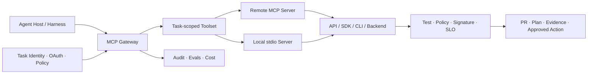

# MCP 在 Agentic CI/CD 中的能力、边界与趋势

## 执行摘要

MCP 解决的是 Agent Host 与外部能力之间的互操作：统一发现和调用 Tool、读取 Resource、使用 Prompt，并在客户端与 Server 之间协商能力。它降低了每个 Agent 产品分别适配每个服务的 N×M 成本，也为远程授权、Registry、Allowlist 和集中运营提供共同协议面。

MCP 不执行 CI/CD 业务本身。一个 Server 最终仍要调用 API、SDK、CLI 或应用逻辑；MCP 的 OAuth 也不能替代仓库、制品、环境和动作级授权；Tool 返回成功更不能替代 Test、Scan、Policy、Signature、SLO 与回滚。企业采用的正确问题不是“是否支持 MCP”，而是“哪些能力值得跨多少客户端复用、在哪个信任域运行、由什么身份调用、结果由谁验证”。

截至 2026-07-15，生产判断应基于 2025-11-25 正式规范。官方已经发布 2026-07-28 Release Candidate，方向是无状态协议核心、标准 HTTP 基础设施、扩展机制和更强的生命周期治理；但最终发布日期仍在观察日之后，不能把候选内容写成当前稳定事实。

## 一、当前稳定规范的能力模型

### 1. Host—Client—Server

[当前架构](https://modelcontextprotocol.io/specification/2025-11-25/architecture) 中，Host 管理用户交互、同意、安全策略和上下文聚合；Host 为每个 Server 建立一个 MCP Client；Client 与 Server 维持有状态会话，通过 JSON-RPC 和能力协商通信。这个分工意味着安全决策不能只落在 Server，Host 也必须控制哪些上下文和动作对模型开放。

### 2. 三类 Server Primitive

| Primitive | 主要用途 | 控制倾向 | CI/CD 例子 |
|---|---|---|---|
| [Tools](https://modelcontextprotocol.io/specification/2025-11-25/server/tools) | 执行查询或动作，输入/输出可带 JSON Schema | 模型可选择调用，客户端应允许人拒绝 | 查询 Pipeline、触发测试、创建 PR、生成 Plan |
| [Resources](https://modelcontextprotocol.io/specification/2025-11-25/server/resources) | 暴露可读取的上下文与内容 | 应用控制 | 构建日志、制品元数据、Runbook、环境拓扑 |
| [Prompts](https://modelcontextprotocol.io/specification/2025-11-25/server/prompts) | 暴露可复用的交互模板 | 用户控制 | 发布就绪评审、事故调查模板 |

客户端侧还可支持 Roots、Sampling 和 Elicitation：Server 可以获知允许访问的根目录、请求 Host 使用模型生成内容或向用户收集结构化信息。它们扩大了 Server 的能力，也扩大了信任边界和上下文外发风险。

### 3. Transport

[2025-11-25 Transport](https://modelcontextprotocol.io/specification/2025-11-25/basic/transports) 定义 stdio 和 Streamable HTTP。stdio 适合本地子进程；Streamable HTTP 支持远程服务并取代旧 HTTP+SSE。远程部署必须校验 Origin，避免 DNS Rebinding，并为本地服务优先绑定 localhost、为共享服务增加认证。

### 4. Authorization

[Authorization 规范](https://modelcontextprotocol.io/specification/2025-11-25/basic/authorization) 面向 HTTP 传输，建立在 OAuth 2.1、Protected Resource Metadata 和 Resource Indicators 等机制上；stdio 通常从环境获取凭据。规范禁止 Token Passthrough，并要求 Token 绑定目标 Resource Audience。

这解决“客户端怎样获得访问 Server 的 Token”，但不自动解决“该 Agent 是否可部署到生产”。Server 仍需按照仓库、组织、环境、制品和命令做对象级策略，并记录人类委托链。

企业身份仍存在重要状态差异：面向企业集中 SSO、开通/回收与审计的 Enterprise-Managed Authorization Extension 已于 [2026-06 宣布 Stable](https://blog.modelcontextprotocol.io/posts/enterprise-managed-auth/)；面向无人 Pipeline/Daemon 的 [OAuth Client Credentials Extension](https://modelcontextprotocol.io/extensions/auth/oauth-client-credentials) 截至观察日仍是 Draft。也就是说，交互式企业 Agent 的统一授权正在成熟，但无人 CI/CD Workload Identity 仍不能假定已形成稳定、普遍兼容的 MCP 标准。

### 5. 长任务

[Tasks](https://modelcontextprotocol.io/specification/2025-11-25/basic/utilities/tasks) 在当前规范中仍标记为 Experimental。对构建、扫描和部署这类长任务，不应假定所有客户端都具备一致的恢复、取消和进度语义。

### 6. Extensions 与 Conformance

[MCP Apps](https://blog.modelcontextprotocol.io/posts/2026-01-26-mcp-apps/) 已成为稳定 Extension，可让 Tool 返回在沙箱 Iframe 中呈现的交互 UI；Enterprise-Managed Authorization 也是独立扩展。扩展只有在 Host 与 Server 都支持相应版本时才生效，因此企业需要维护“协议 × Extension × Host × Server × SDK”兼容矩阵。

2026 年出现的 [Conformance Framework](https://github.com/modelcontextprotocol/conformance) 和 [SDK Tiering](https://modelcontextprotocol.io/community/sdk-tiers) 提高了协议实现一致性，但只证明消息和规范行为，不证明 Tool 业务正确、Server 无恶意代码、OAuth 配置安全或 CI/CD 任务成功。

## 二、MCP 的真实价值

### 降低跨客户端适配成本

同一 Server 可被不同 Agent Host 发现，Tool Schema 和结果结构可复用。对 GitHub、制品仓、云平台、可观测系统等共享服务，这比每个 Harness 分别维护 CLI 解析和 OAuth 流程更可运营。

### 独立升级与远程运营

Remote Server 可以集中更新、修复和撤回能力，客户端不必在每个开发环境安装完整依赖。[GitHub Remote MCP Server](https://github.blog/changelog/2025-09-04-remote-github-mcp-server-is-now-generally-available/) 于 2025-09 GA，采用 OAuth 2.1+PKCE、短期 Token 和集中策略，是远程模式成熟化的代表。

### 同时连接行动与上下文

Tools、Resources 和 Prompts 使 Server 不只暴露 RPC，也能提供日志、文档、模板和更新通知。这是 MCP 相对“只调用一个命令”更完整的地方。

### 形成治理挂点

Registry、Allowlist、Gateway 和 Toolset 配置使平台团队能统一回答：Server 来自哪里、谁拥有、哪些 Agent 可见、如何升级/撤回、哪些 Tool 对哪些任务开放。协议不完成治理，但提供共同控制面。

## 三、MCP 不能提供的能力

| 非能力 | 仍需什么 |
|---|---|
| 真实业务实现 | API、SDK、CLI、数据库或应用后端 |
| Agent 推理与规划 | Harness、模型、上下文管理和循环 |
| 业务对象授权 | 服务端 Policy、仓库/环境/制品 Scope、委托链 |
| 代码和命令隔离 | Runner、Sandbox、网络与文件系统控制 |
| 成功判定 | Test、Scan、Policy、Signature、SLO 等外部 Oracle |
| 高风险批准 | PR、Plan、Change、Runbook 与职责分离 |
| 端到端审计 | Host、Gateway、Server、执行层和业务系统联合事件 |

因此“Tool 可调用”既不等于“动作被授权”，也不等于“动作成功”。

## 四、与 CLI 的替代边界

### MCP 可以替代的部分

- 每个 Agent 客户端分别解析 `--help`、JSON 和错误；
- 为同一远程服务分别实现登录、发现和连接；
- 用长 Prompt 手工描述工具参数；
- 在客户端内硬编码共享服务 Tool Catalog。

### MCP 通常不能替代的部分

- Server 背后的真实 CLI/API/SDK 和业务逻辑；
- 本地二进制的版本锁定、进程隔离和产物验证；
- 无 MCP 客户端环境中的人工调试与 CI 脚本；
- 高风险操作的业务审批、签名和回滚。

### 何时不值得引入 MCP

如果只有一个 Harness、工具只在 Runner 内运行、现有 CLI 机器契约稳定、身份可由环境安全注入，且无需 Resource/Prompt/远程多租户/集中目录，直接 CLI 更简单。Thoughtworks 2026-04 的 [“MCP by default” Caution](https://www.thoughtworks.com/en-us/radar/techniques/mcp-by-default) 也指出协议会带来抽象成本和能力保真损失；这是架构经验，不是对 MCP 本身的否定。

## 五、MCP 在八个 CI/CD 阶段的用法

| 阶段 | 推荐 Tool/Resource | 风险控制 |
|---|---|---|
| 代码评审 | Diff/PR Resource，评论和 Draft PR Tool | 仓库 Scope、禁止自动合并 |
| 静态与安全 | Findings Resource，修复/复验 Tool | Toolset 与例外审批分离 |
| 测试与门禁 | 日志、测试历史、运行/取消 Tool | Server 不得修改 Gate 后自证成功 |
| 构建出包 | Build Resource，重跑与产物查询 | Runner 身份、超时、成本与网络 |
| 制品与版本 | SBOM/签名 Resource，候选包 Tool | 上传、签名、晋级分权 |
| IaC 与部署 | Plan Resource，Validate/Apply Tool | Plan 哈希、环境 Scope、逐次批准 |
| 发布与审批 | Evidence Resource，Release Plan Tool | 批准在 MCP 外部强制执行 |
| 发布后 | Telemetry/Topology Resource，Runbook Tool | 只读优先、低风险预批准动作 |

Resources 特别适合持续提供构建日志、制品和拓扑，Tools 适合明确动作；不要把所有数据访问都建成 Tool，也不要把所有高风险动作都暴露给默认 Toolset。

## 六、2025H2—2026 的业界趋势

### 趋势 1：从本地连接走向远程服务

GitHub Remote MCP GA、OAuth 与企业策略说明市场正在把 MCP 从个人开发环境推向共享服务。Google 也在 2025-12 发布 [Fully-managed Remote MCP Servers](https://cloud.google.com/blog/products/ai-machine-learning/announcing-official-mcp-support-for-google-services)，并与 Cloud IAM、Audit、Model Armor 和 Registry 组合。远程模式带来集中升级与治理，也带来多租户隔离、Audience、速率、SLO 和数据外发的新责任。

### 趋势 2：从 Server 数量竞争转向 Toolset 质量

GitHub 在 2025-12 增加 Tool-specific configuration，并在 2026-01 合并 Projects Tool；官方更新称后者将 Tool-list context 减少约 23k tokens、约 50%。[原始更新](https://github.blog/changelog/2026-01-28-github-mcp-server-new-projects-tools-oauth-scope-filtering-and-new-features/) 是厂商自报的特定结果，但足以证明 Tool 爆炸已成为真实工程问题。

### 趋势 3：Registry 与 Agent Control Plane 上升

[官方 MCP Registry](https://github.com/modelcontextprotocol/registry) 仍处 Preview；GitHub 的 [internal registry/allowlist](https://github.blog/changelog/2025-11-18-internal-mcp-registry-and-allowlist-controls-for-vs-code-stable-in-public-preview/) 也显示企业需要批准目录。值得注意的是，本地 Server 如果只按名称匹配，仍可能被同名配置绕过；因此目录必须与签名、启动命令、部署位置和任务身份绑定。

### 趋势 4：生态开始收敛到 MCP，但不走“全 MCP”

GitHub 在 2025-09 [弃用 Copilot Extensions 的 GitHub Apps 路线](https://github.blog/changelog/2025-09-24-deprecate-github-copilot-extensions-github-apps/) 并引导 MCP；同时 Copilot CLI 又把 MCP、Skills、Plugins 放在同一产品内。这显示 MCP 成为主流互操作协议之一，但不是唯一扩展机制。

### 趋势 5：规范向无状态核心和扩展框架演进

[2026-07-28 RC](https://blog.modelcontextprotocol.io/posts/2026-07-28-release-candidate/) 提出取消协议核心握手/会话、使用普通 HTTP 基础设施和方法 Header 路由、增加一等扩展框架，并把 Apps/Tasks 作为扩展；同时拟弃用 Roots、Sampling、Logging，Tool Schema 对齐完整 JSON Schema 2020-12，并加强安全和生命周期规范。

这是 Breaking 方向，正式版本计划晚于观察日。企业当前应评估客户端/Server 是否把会话、握手和这些 Capability 写死，而不是提前宣称已完成迁移。

### 趋势 6：无人 CI/CD 身份落后于交互式 Agent

企业集中授权扩展已经 Stable，而 OAuth Client Credentials 仍为 Draft；当前 Stable Core 的 stdio 仍主要从环境获得凭据。这意味着在无人流水线中，OIDC/Workload Identity、短期 Token、委托链和 Tool Policy 仍需由云/IAM/Gateway 方案补齐，不能仅凭“支持 MCP Authorization”判断生产就绪。

## 七、安全与治理

[官方安全最佳实践](https://modelcontextprotocol.io/docs/tutorials/security/security_best_practices) 覆盖 Confused Deputy、Token Passthrough、OAuth Metadata SSRF、Session Hijacking、本地 Server 任意代码执行和 DNS Rebinding。把这些风险翻译为企业控制：

- 本地一键安装必须展示精确命令、来源和权限，并在沙箱运行；
- 远程 Server 验证 Origin/Audience，不接受非目标 Token；
- Host 不盲信 Tool Description、Annotations 或返回内容；
- Gateway 按任务裁剪 Toolset，记录 Schema 版本与调用 ID；
- Server 做输入/输出校验、访问控制、速率和超时；
- 高风险调用展示具体对象与影响，允许人拒绝；
- Registry 发现与企业批准分离，发现不等于信任。

## 八、推荐参考架构

Gateway 不是强制组件，但当 Server 和 Agent 数量扩大后，它是实现身份映射、Tool 过滤、速率、审计和 Kill Switch 的自然位置。

## 九、企业落地顺序

1. 从一个高价值共享服务和两种 Agent 客户端开始，不以 Server 数量为目标；
2. 只开放读 Tool/Resource 和 Draft PR/Plan，建立任务成功与误调用基线；
3. 给每个 Server 建 Owner、版本、风险、数据、权限、SLO、签名和撤回记录；
4. 按 Scenario 动态裁剪 Toolset，测量 Token、选择错误和授权面；
5. 引入任务身份和对象级 Policy，再试非生产写动作；
6. 将 Test、Scan、Policy、Signature 和审批留在 MCP 外部强制执行；
7. 正式 2026-07-28 规范发布后运行兼容测试，再决定迁移时间。

## 十、最终判断

MCP 已经是重要的 Agent 工具互操作层，尤其适合远程共享、跨客户端和集中治理。它不是所有工具的默认包装，也不是生产自治的充分条件。企业最应投资的是小而清晰的 Toolset、任务身份、对象授权、Server 供应链、外部 Oracle 和可撤回运营，而不是连接最多的 Server。

CLI 与 MCP 的逐项选择见 [[50_deepdives/cli-vs-mcp-decision-guide|决策指南]]。
