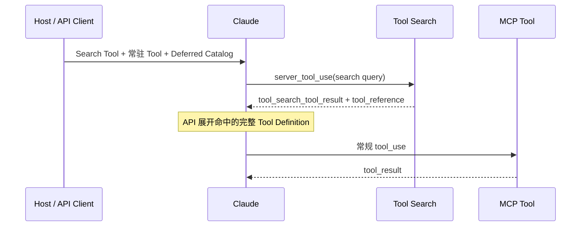

# Anthropic MCP Tool 渐进式加载证据底稿

> [!important] 术语校正
> “MCP 渐进式加载”不是 MCP 2025-11-25 核心规范中的标准能力。`defer_loading`、`tool_reference`、`server_tool_use` 和 Tool Search 属于 Anthropic Claude API / Claude Code 的上层实现。更准确的称呼是：**基于 MCP Tool Catalog 的 Anthropic 渐进式披露**。

本底稿为 [[50_deepdives/mcp-protocol/90_report#三、Anthropic MCP 渐进式加载：Tool Search 与 Progressive Disclosure|专题报告中的渐进式加载分析]] 提供一手证据、事实边界和待验证问题。

## 一、事实边界

| 问题 | 当前结论 | 证据强度 |
|---|---|---|
| MCP Core 是否定义 `defer_loading`？ | 否。稳定规范定义 `tools/list`、分页、`tools/call` 和 `notifications/tools/list_changed`，没有 Anthropic 字段 | high |
| Tool Search 是否能用于 MCP Tool？ | 能。Anthropic MCP Connector 可通过 `mcp_toolset` 将整个 Server 或单个 Tool 延迟加载 | high |
| 是否减少请求 Payload？ | 否。请求仍携带 Deferred Tool 的完整定义；减少的是它们进入模型初始上下文的 Token | high |
| 是否等于权限控制？ | 否。`enabled` 决定 Tool 是否可用，`defer_loading` 只决定定义何时进入上下文 | high |
| 是否覆盖整个 MCP 能力面？ | 否。Anthropic MCP Connector 当前只支持 MCP Tool Call，不支持 Resources 和 Prompts | high |
| 是否解决 Tool Result 膨胀？ | 否。它优化 Tool Definition，不自动裁剪日志、测试结果、SBOM 等返回数据 | high |

## 二、MCP Core 提供了什么

[MCP 2025-11-25 Tools 规范](https://modelcontextprotocol.io/specification/2025-11-25/server/tools) 定义的目录与调用能力包括：

1. Client 通过 `tools/list` 获取 Server 暴露的 Tool；
2. 目录可分页；
3. Server 可声明 `listChanged` 并发送 `notifications/tools/list_changed`；
4. Client 通过 `tools/call` 调用具体 Tool；
5. Tool Definition 包含 Name、Description、Input Schema，并可包含 Output Schema 和 Annotation。

这些能力解决的是 Catalog 获取与协议调用。当前 Core 没有规定语义检索、Top-K Tool Reference、Deferred Schema 展开或模型上下文编排。因此：

- `tools/list` 分页不等于模型按语义搜索 Tool；
- Client 可以自行决定不把所有 Schema 放进 Prompt，但这是 Host 实现策略；
- Anthropic 的实现可以消费 MCP Catalog，却不能反向成为 MCP Core 的标准语义。

## 三、Anthropic Tool Search 的工作机制

[Anthropic Tool Search 文档](https://platform.claude.com/docs/en/agents-and-tools/tool-use/tool-search-tool) 定义了两种服务端搜索工具：

| Variant | Query 形式 | 更适合 |
|---|---|---|
| `tool_search_tool_regex_20251119` | Regex Pattern | 名称、前缀、关键字明确的 Tool Catalog |
| `tool_search_tool_bm25_20251119` | 自然语言 | 使用意图描述寻找相关 Tool |

调用链为：

关键事实：

- 至少一个 Tool，通常是 Tool Search，本身不能 Deferred；
- 初始上下文只包含 Search Tool 和未 Deferred 的 Tool Definition；
- 一次搜索最多返回 5 个 `tool_reference`；
- API 展开引用后，模型仍通过正常 `tool_use` 调用目标 Tool；
- 也可自建搜索工具，用 Embedding、业务标签或企业策略检索，并在普通 `tool_result` 中返回 `tool_reference`；
- 一个请求最多可包含 10,000 个 Deferred Tool；
- Tool Search 本身不单独按 Server Tool 计费，实际展开的定义仍计入输入 Token；
- 搜索会增加额外延迟，是否值得取决于 Toolset 规模和复用频率。

Anthropic 建议在以下场景优先使用：Tool 数量约 10 个以上、定义超过约 10K Token、连接多个 MCP Server，或 Catalog 预计持续增长。若 Tool 少于 10 个、定义短且几乎每个都高频，全量前置通常更简单。常用的 3—5 个 Tool 可保留为非 Deferred。

## 四、三种实现面的差异

### 1. Claude API 普通 Tool

Host 在 Tool Definition 上设置 `defer_loading: true`。所有定义仍存在于 API Request 中，但不会全部进入 Claude 初始上下文。命中后返回的 `tool_reference` 触发定义展开。

### 2. Anthropic MCP Connector

[MCP Connector 文档](https://platform.claude.com/docs/en/agents-and-tools/mcp-connector) 允许通过：

- `mcp_toolset.default_config.defer_loading` 对一个 Server 默认延迟；
- `mcp_toolset.configs` 对单个 Tool 覆盖；
- `enabled` 独立决定 Tool 是否可用。

Tool Search 本身已经 GA，但 MCP Connector 当前仍使用 Beta Header。两者的成熟度不应混写。Connector 当前只支持 MCP Tool 调用，不能把这一配置理解为 Resources 或 Prompts 的延迟加载。

### 3. Claude Code

[Claude Code MCP Tool Search 文档](https://code.claude.com/docs/en/mcp#scale-with-mcp-tool-search) 显示 `ToolSearch` 默认启用：会话开始时先加载 Tool Name 和 Server Instructions，完整 Tool Schema 按需进入上下文。

| `ENABLE_TOOL_SEARCH` | 行为 |
|---|---|
| 未设置 | 默认按需加载，并根据模型/环境能力回退 |
| `true` | 强制对 MCP Tool 做延迟加载 |
| `auto` | Tool Schema 不超过 Context Window 10% 时前置，否则延迟 |
| `auto:N` | 使用自定义百分比阈值 |
| `false` | 关闭延迟加载，前置完整 Tool Schema |

小而高频的 Server 可设置 `alwaysLoad: true`。Tool Description 与 Server Instructions 的检索文本存在截断，因此关键任务词、对象和读写属性应放在前部。非第一方代理、Cloud 环境或不支持 `tool_reference` 的模型可能回退到全量加载。

## 五、Prompt Cache 与上下文成本

[Tool Use with Prompt Caching](https://platform.claude.com/docs/en/agents-and-tools/tool-use/tool-use-with-prompt-caching) 说明，Deferred Tool Definition 不进入稳定的 System Prompt Prefix，而在搜索命中后以内联形式展开。这降低了 Catalog 变化对 Prompt Cache Prefix 的扰动。

但要区分三种成本：

| 成本 | 是否被 Tool Search 降低 | 原因 |
|---|---|---|
| 模型初始上下文 Token | 是 | 未命中的 Definition 不进入初始模型上下文 |
| API 请求体 / Catalog 传输 | 否 | Client 仍提交所有完整 Tool Definition |
| Tool Result Token | 否 | Tool 返回结果是另一条数据路径 |

因此大量日志、测试明细、SBOM 和制品元数据仍需分页、字段投影、聚合、Resource Link、外部制品存储或执行环境内过滤。[Code Execution with MCP](https://www.anthropic.com/engineering/code-execution-with-mcp) 展示了“先按需发现 Tool，再在代码执行环境处理大结果”的组合模式，但这仍是架构模式，不是 MCP Core。

## 六、效果证据应怎样解读

[Anthropic Advanced Tool Use](https://www.anthropic.com/engineering/advanced-tool-use) 给出的案例与内部评测包括：

- 五个 MCP Server、58 个 Tool 的定义约占 55K Token；
- Tool Search 通常可减少 85% 以上的 Tool Definition Token；
- 内部 MCP Eval 中，Opus 4 从 49% 提升至 74%，Opus 4.5 从 79.5% 提升至 88.1%。

这些数字是 Anthropic 厂商自报结果，可以证明其产品方向和内部实现收益，不能直接外推为：

- 任意模型上的固定提升；
- 任意 MCP Server 的固定 Token 节省；
- CI/CD 任务成功率或生产安全性提升；
- Tool Search 能替代权限、审批或外部 Oracle。

企业需要在自身 Catalog、模型和任务集上复验，实验设计见 [[50_deepdives/mcp-protocol/40_labs/README|MCP 实验计划]]。

## 七、CI/CD 采用模型

| 暴露层 | 典型能力 | 推荐策略 |
|---|---|---|
| Tier 0 常驻发现 | 变更上下文、流水线状态、Tool Search、只读目录 | 3—5 个高频低风险 Tool 前置 |
| Tier 1 按需查询 | Lint/Test、Build Log、SBOM、Artifact、Telemetry | Enabled + Deferred，按 `stage.service.verb` 命名 |
| Tier 2 受控动作 | Draft PR、Retry Build、Upload Candidate、Nonprod Apply | 任务身份、Allowlist、对象 Policy，可再 Deferred |
| Tier 3 高风险动作 | Production Deploy、Sign/Promote/Delete、修改 Gate | 默认 Disabled，批准和环境条件满足后临时启用 |

优先级必须是：

1. 先按任务身份和环境裁剪 Enabled Toolset；
2. 再对已授权 Toolset 中的低频长尾能力做延迟加载；
3. 最后优化返回体、缓存和搜索延迟。

## 八、新风险与控制

### Search Poisoning

Tool Name、Description、参数名、参数说明和 Server Instructions 会成为检索索引。恶意或质量差的元数据可能抢占相关 Tool 的排名，诱导模型选择错误或高风险能力。

最低控制包括：稳定命名空间、来源准入、Owner、Schema Hash、Description Review、恶意 Query 回归、搜索结果审计和高风险 Tool 的独立 Policy。

### Discoverability 不等于 Authorization

Deferred 只让 Tool 暂时不在模型上下文中；一旦搜索命中，模型仍可调用。生产部署、制品签名/晋级/删除、修改门禁和恢复动作必须默认 `enabled=false`，不能把“难以被发现”当成控制。

### Catalog 与行为漂移

MCP `list_changed` 能通知目录变化，但不能证明新 Schema 或新行为是可信升级。企业仍需固定 Server/Tool 版本、Schema Hash、Contract Test、灰度、回退和 Kill Switch。

## 九、建议实验

对比三种方案：全量前置、Anthropic Tool Search、Gateway 任务级过滤；Tool 规模采用 10/50/200/1000。

核心指标：

- Tool Definition Token 与 API Payload；
- Recall@5、正确 Tool 选择率、参数正确率；
- 搜索与调用的 P50/P95 延迟；
- Prompt Cache Hit；
- 高风险 Tool 暴露数、误命中数与 Policy 拒绝率；
- 端到端任务成功率、人工介入率和单位成功成本。

Trace 至少保存：搜索 Query、候选 Tool、`tool_reference`、展开后的 Schema/版本、身份与 Policy 决策、最终 Tool Call、返回结果和外部 Oracle。

## 十、结论

Anthropic 的渐进式加载证明 Tool Catalog 可以从“全部进入 Prompt”转向“能力地图 + 按需检索”。它适合 Tool 多、定义大、跨多个 MCP Server 的 Agent Host，但不是 MCP Core、不是权限控制，也不处理整个 MCP 能力面或 Tool Result 膨胀。

对 Agentic CI/CD，正确路径不是先把所有部署 Tool 设为 Deferred，而是先缩小任务级 Enabled Toolset，再搜索低风险长尾能力，并把部署、制品晋级、签名、门禁和恢复继续留在身份、Policy、Approval 和外部 Oracle 的强制边界内。

## 官方来源

1. [MCP 2025-11-25 Tools Specification](https://modelcontextprotocol.io/specification/2025-11-25/server/tools)
2. [Anthropic Tool Search Tool](https://platform.claude.com/docs/en/agents-and-tools/tool-use/tool-search-tool)
3. [Anthropic Tool Reference](https://platform.claude.com/docs/en/agents-and-tools/tool-use/tool-reference)
4. [Anthropic MCP Connector](https://platform.claude.com/docs/en/agents-and-tools/mcp-connector)
5. [Tool Use with Prompt Caching](https://platform.claude.com/docs/en/agents-and-tools/tool-use/tool-use-with-prompt-caching)
6. [Claude Code: Scale with MCP Tool Search](https://code.claude.com/docs/en/mcp#scale-with-mcp-tool-search)
7. [Anthropic Advanced Tool Use](https://www.anthropic.com/engineering/advanced-tool-use)
8. [Anthropic Code Execution with MCP](https://www.anthropic.com/engineering/code-execution-with-mcp)
