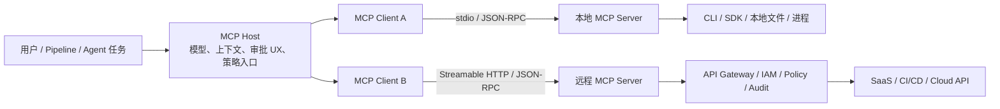
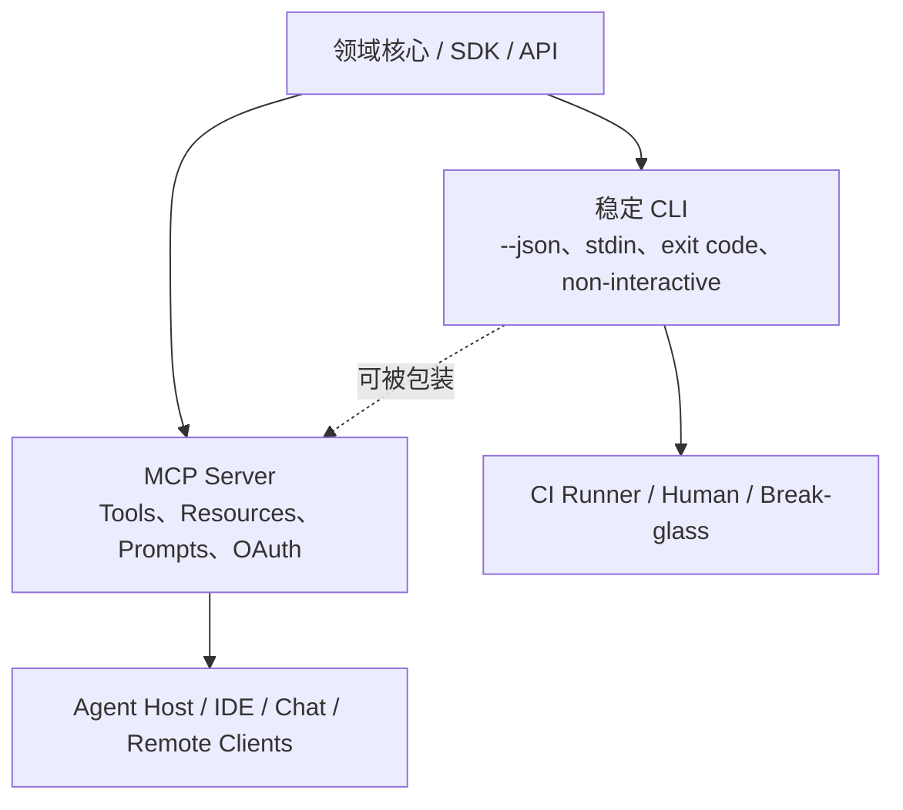

# MCP 协议深度研究证据

> [!abstract] 截至 2026-07-15 的结论
> MCP 是 Host/Client 与工具、上下文和工作流提供方之间的**协议与适配层**，不是 Agent、执行引擎、权限系统或 CI/CD 平台。它的核心价值是统一运行时发现、JSON Schema 工具契约、双向交互及本地/远程连接；其核心短板是业务授权、制品可信、审批、事务、幂等、策略执行和结果正确性仍由 Host、Server、Gateway 与后端系统承担。
>
> MCP 与 CLI 不是全面替代关系。对于本机、无状态、一次性、可由 Shell 确定性编排的动作，两者高度可互换；对于跨 Host 发现、能力协商、Resources/Prompts、订阅、Elicitation、标准远程 OAuth 和多客户端服务，CLI 不能等价替代 MCP；对于无需 Agent Host 的 Pipeline Step、管道/重定向、退出码门禁、离线恢复和人类应急操作，MCP 也不能等价替代 CLI。生产上更合理的形态通常是**同一领域核心 + CLI 接口 + MCP 适配器**。
>
> 版本状态必须严格区分：当前稳定规范是 `2025-11-25`；`2026-07-28` 仅是 2026-05-21 锁定的 Release Candidate，计划于 2026-07-28 发布。因此，无握手/无协议会话、`server/discover`、请求路由 Header、缓存 TTL、新 Tasks Extension 等都只能作为 **RC / 即将到来的方向**，不能写成现行稳定能力。[稳定版 Release](https://github.com/modelcontextprotocol/modelcontextprotocol/releases/tag/2025-11-25)；[2026-07-28 RC 公告](https://blog.modelcontextprotocol.io/posts/2026-07-28-release-candidate/)

## 1. 研究边界与证据规则

- 研究对象：MCP 协议、官方扩展、官方 Registry、官方 SDK/Conformance，以及能证明业界方向的厂商正式实现。
- 来源优先级：协议规范/标准与源码 > 官方产品文档/Release > 第一方生产架构 > 第一方产品公告。未用二手媒体证明协议事实。
- 状态词：
  - **Stable**：MCP 项目已发布的稳定规范或稳定扩展。
  - **GA**：厂商明确宣称产品 Generally Available。
  - **Preview / Draft / Experimental / RC**：不得外推为生产稳定能力。
  - **事实**：来源直接陈述或规范直接要求。
  - **推断**：基于多个事实形成的工程/趋势判断，均显式标注。
- 仓库排重：已有 CI/CD 厂商案例只在本文件做索引和横向归纳，不复制完整案例。见 [[#13. 与仓库既有 Source Brief 的排重与校正]]。
- 证据局限：官方规范可证明“应如何实现”，不能证明实现合规；官方产品文档可证明“提供了什么”，不能证明 Agent 成功率、业务收益或跨企业规模。

## 2. MCP 到底是哪一层

### 2.1 架构角色

MCP 采用 Host—Client—Server 架构：AI 应用是 Host；Host 内为每个 Server 建立一个 MCP Client；Server 提供上下文与能力。本地 Server 通常由 Client 作为子进程启动，远程 Server 是独立服务。[官方架构说明](https://modelcontextprotocol.io/docs/learn/architecture)

协议分两层：[官方架构说明](https://modelcontextprotocol.io/docs/learn/architecture)

| 层 | MCP 负责 | MCP 不负责 |
|---|---|---|
| Data layer | JSON-RPC 2.0 消息、版本/能力协商、Tools/Resources/Prompts、Roots/Sampling/Elicitation、通知与进度 | 模型推理质量、工具业务语义、任务规划、结果真假 |
| Transport layer | stdio、Streamable HTTP、消息 framing、HTTP 授权框架 | 后端 API 的可靠性、企业网络拓扑、业务事务、生产变更策略 |

> [!important] 维度判断
> CLI 是人或程序启动“可执行程序”的交互界面；MCP 是 Host 与 Server 交换“能力、上下文和调用”的协议。MCP Server 可以用 CLI 实现，CLI 也可以作为 MCP Client 调用 Server。两者存在交叉，但不是同一分类维度。

### 2.2 当前稳定版生命周期

在 `2025-11-25` 中，连接先执行 `initialize`：双方协商协议版本、能力并交换实现信息；Client 再发送 `notifications/initialized`，之后只能使用协商成功的能力。HTTP 后续请求携带 `MCP-Protocol-Version`。超时、取消、进度和关闭由规范分别约束。[Lifecycle](https://modelcontextprotocol.io/specification/2025-11-25/basic/lifecycle)

这带来三个实际含义：

1. **兼容不是“都叫 MCP”就成立。** Client 与 Server 支持的规范版本、可选能力及扩展必须有交集。
2. **Server 暴露能力不等于 Host 一定呈现。** 例如 Server 可支持 Resources，Host 仍可不把 Resources 暴露给用户或模型。
3. **协议版本不等于 SDK/产品版本。** 官方 Go SDK 的 Release 也曾只“部分支持”`2025-11-25`，所以部署清单必须记录 Host、SDK、Server 和协议版本，而非只记录 `MCP=true`。[Go SDK Releases](https://github.com/modelcontextprotocol/go-sdk/releases)

## 3. 能力面：Tools、Resources、Prompts 及 Client Features

### 3.1 三个 Server 原语不是同义词

| 原语 | 控制模型 | 核心方法 | 数据契约 | 最适合 | 不应误解为 |
|---|---|---|---|---|---|
| Tools | 设计上 model-controlled | `tools/list`、`tools/call`、`notifications/tools/list_changed` | 名称、描述、`inputSchema`、可选 `outputSchema`、结构化/非结构化结果 | 查询 API、创建/修改对象、计算、运行受控动作 | “模型自动调用即获授权”或“工具声明可信” |
| Resources | 设计上 application-driven | `resources/list`、`resources/read`、模板、订阅、变化通知 | URI、MIME、文本/二进制、受众/优先级/更新时间注解 | 文件、Schema、日志、文档、部署状态等可选上下文 | 通用对象存储、强一致事件总线或权限边界 |
| Prompts | 设计上 user-controlled | `prompts/list`、`prompts/get`、变化通知 | 带参数的 user/assistant 多模态消息模板 | 显式 Slash Command、标准诊断/评审流程入口 | System Prompt 强制策略或不可绕过审批 |

证据：[Tools](https://modelcontextprotocol.io/specification/2025-11-25/server/tools)、[Resources](https://modelcontextprotocol.io/specification/2025-11-25/server/resources)、[Prompts](https://modelcontextprotocol.io/specification/2025-11-25/server/prompts)。规范明确说这三者的交互模型是设计意图，具体 UI 由实现决定。

### 3.2 Tools 的真实能力与边界

**稳定事实：**

- Tool 以名字唯一标识，参数用 JSON Schema；结果可以是文本、图片、音频、Resource Link、嵌入 Resource，也可以用 `structuredContent` 返回 JSON；提供 `outputSchema` 时 Server 必须按 Schema 返回，Client 应验证。[Tools 数据类型与结构化输出](https://modelcontextprotocol.io/specification/2025-11-25/server/tools)
- `listChanged` 让 Server 通知工具集合变化；分页用于大工具集。[Tools 列表](https://modelcontextprotocol.io/specification/2025-11-25/server/tools)
- 业务/输入错误应以 `isError: true` 的 Tool Execution Error 返回，便于模型修正参数；协议结构错误才用 JSON-RPC Error。[Tools 错误处理](https://modelcontextprotocol.io/specification/2025-11-25/server/tools#error-handling)
- Tool Annotation 与描述来自 Server，Client 必须将其视为不可信，除非 Server 本身可信。规范建议敏感操作展示入参并请求确认。[Tools 安全要求](https://modelcontextprotocol.io/specification/2025-11-25/server/tools#security-considerations)

**边界：**

- JSON Schema 验证的是形状，不验证语义正确性、调用者意图、环境适配、幂等性或副作用安全。
- `readOnlyHint`、破坏性提示等 Annotation 只能帮助 Host 呈现，不能替代 Server 端权限与策略。
- `tools/list` 是会话内发现，不是软件供应链证明；工具可能在升级、身份或 Scope 变化后改变。
- 规范建议 Human-in-the-loop，但没有定义统一审批协议、四眼原则、Change Window 或生产发布签字流程。

### 3.3 Resources 的真实能力与边界

**稳定事实：**

- Resource 用 URI 唯一标识，可列举、读取；Resource Template 用 URI Template 表示参数化资源，可配合 Completion。[Resources](https://modelcontextprotocol.io/specification/2025-11-25/server/resources)
- Server 可声明 `subscribe` 与 `listChanged`；Client 可订阅某个 URI 的变化。[Resource Subscriptions](https://modelcontextprotocol.io/specification/2025-11-25/server/resources#subscriptions)
- Resource 可包含文本或 Base64 二进制，并用 `audience`、`priority`、`lastModified` 注解帮助 Host 选择上下文。[Resource Annotations](https://modelcontextprotocol.io/specification/2025-11-25/server/resources#annotations)

**边界：**

- URI 是标识符，不自动带来 ACL、租户隔离或真实性。Server 必须校验 URI 与权限。
- 订阅和变化通知不等于消息至少一次/恰好一次投递；Streamable HTTP 的重放与恢复本身也是可选能力。
- Host 决定是否把 Resource 放入模型上下文，因此同一 Server 在不同 Host 上可能产生明显不同结果。

### 3.4 Prompts 的真实能力与边界

Prompt 是 Server 发布的参数化消息模板，可包含文本、图片、音频和嵌入 Resource；设计上由用户显式选择。[Prompts](https://modelcontextprotocol.io/specification/2025-11-25/server/prompts)

其价值是让领域 Owner 发布可发现的“推荐交互入口”，例如 `/investigate-build` 或 `/review-release`；但它仍是输入内容：规范要求校验 Prompt 输入/输出以防注入，却没有赋予 Prompt 高于 Host System Policy 的权限，也不能让 Prompt 成为审计或批准凭证。[Prompts Security](https://modelcontextprotocol.io/specification/2025-11-25/server/prompts#security)

### 3.5 Client Features：Server 也能向 Host 请求能力

| 能力 | 当前稳定版作用 | 风险/限制 | 状态变化 |
|---|---|---|---|
| Roots | Client 告知 Server 可操作的 `file://` 工作区边界；可通知列表变化 | 必须防路径穿越；Root 是“声明边界”，不是 OS 沙箱 | Stable `2025-11-25`；`2026-07-28` RC 标记 Deprecated |
| Sampling | Server 请求 Host 使用其模型生成内容；Server 无需持有模型 API Key；`2025-11-25` 支持在 Sampling 内调用工具 | 可能形成嵌套 Agent 循环；规范建议用户审批、限速与迭代上限 | Stable `2025-11-25`；RC 标记 Deprecated，建议直接接模型 API |
| Elicitation | Server 通过 Client 请求额外用户输入；Form 模式收结构化非敏感信息，URL 模式把凭据/支付等敏感交互放在 Client 外 | Form 模式禁止请求密码、API Key、Token；URL 必须防钓鱼与危险 Scheme | Stable；URL 模式是 `2025-11-25` 新能力，规范提示未来可能变化 |
| Tasks | 用持久状态机包装长耗时请求，支持轮询、延期取结果与取消 | TTL、重试与保留语义仍有缺口 | `2025-11-25` **Experimental**；RC 重构为独立 Extension，旧实现需迁移 |

证据：[Roots](https://modelcontextprotocol.io/specification/2025-11-25/client/roots)、[Sampling](https://modelcontextprotocol.io/specification/2025-11-25/client/sampling)、[Elicitation](https://modelcontextprotocol.io/specification/2025-11-25/client/elicitation)、[Tasks](https://modelcontextprotocol.io/specification/2025-11-25/basic/utilities/tasks)、[RC deprecation 与 Tasks 变化](https://blog.modelcontextprotocol.io/posts/2026-07-28-release-candidate/)。

> [!warning] 不要把 Experimental Tasks 当成成熟作业系统
> 当前稳定版 Tasks 能表达延期结果，却没有替代 CI Runner、队列、重试策略、Artifact Store、并发配额、人工批准和灾难恢复。2026 Roadmap 仍把失败重试与结果过期列为待补缺口。[2026 Roadmap](https://blog.modelcontextprotocol.io/posts/2026-mcp-roadmap/)

## 4. Transport、本地/远程形态与运行代价

### 4.1 当前两个标准 Transport

`2025-11-25` 只定义两个标准 Transport；自定义 Transport 可以存在，但必须保留 JSON-RPC 消息和 MCP 生命周期，跨客户端支持不能假定。[Transports](https://modelcontextprotocol.io/specification/2025-11-25/basic/transports)

| 维度 | stdio | Streamable HTTP |
|---|---|---|
| 典型形态 | Client 启动本地子进程 | 独立远程/内网服务，可服务多个 Client |
| framing | UTF-8、逐行 JSON-RPC；stdout 只能输出合法 MCP 消息，日志走 stderr | 单一 MCP Endpoint；POST 发送；响应可为 JSON 或 SSE；GET 可开 SSE |
| 安装/升级 | 每台开发机或 Runner 管理运行时、包与配置 | Server Owner 集中部署、升级、扩缩容 |
| 凭据 | 规范建议从环境获取，不套用 HTTP OAuth 规范 | 可使用 MCP OAuth 授权；每个 HTTP 请求带 Bearer Token |
| 隔离 | 默认继承 Client 进程的用户权限、文件与网络能力 | 可放在服务网格/Gateway 后，但需治理租户、身份与网络边界 |
| 可靠性 | 进程生命周期直观，网络依赖少 | 可流式、断线恢复、会话；负载均衡和状态管理更复杂 |
| 最适场景 | 本地文件、已有 CLI、单用户 IDE、隔离 Runner | SaaS/企业平台、多客户端、集中治理、自动更新 |

### 4.2 Streamable HTTP 不是“普通 REST API 换个名字”

当前稳定 Transport 的关键语义包括：

- 每个 Client 消息是新 POST；Server 可直接回 JSON，也可回 SSE 并在最终响应前发送相关请求/通知。
- Server 可允许 Client 用 GET 打开 SSE；SSE Event ID 与 `Last-Event-ID` 可用于可选恢复/重放。
- Server 可在初始化时发 `MCP-Session-Id`；Client 后续必须携带；Session 过期后重新初始化。
- 断线不代表取消；Client 应显式发送 Cancellation。
- Server 必须校验 `Origin` 防 DNS Rebinding；本地 HTTP 应只绑定 Loopback 并使用认证。

证据：[Streamable HTTP](https://modelcontextprotocol.io/specification/2025-11-25/basic/transports#streamable-http)。

这些语义使 MCP 适合双向 Agent 交互，也导致生产部署需要处理 Session Affinity、共享状态、SSE、重放与网关 Body Inspection。MCP 2026 Roadmap 将“无状态横向扩展、`.well-known` 元数据发现”列为首要问题，并明确本周期不增加新的官方 Transport。[2026 Roadmap](https://blog.modelcontextprotocol.io/posts/2026-mcp-roadmap/)

### 4.3 `2026-07-28` RC 的 Transport 重构（不是当前 Stable）

**RC 事实：**

- 删除 `initialize`/`initialized` 与协议级 Session；版本、Client 信息和能力随每次请求的 `_meta` 传输。
- 新增 `server/discover` 以按需获取 Server 能力。
- `Mcp-Method` / `Mcp-Name` Header 使负载均衡、限速和策略无需解析 Body 即可路由。
- List/Resource Read 结果增加 `ttlMs`、`cacheScope`；W3C Trace Context Key 被固定。
- Server→Client 请求只允许发生在处理 Client 请求期间，并通过可重试的多轮请求传递输入。

[RC 公告与迁移说明](https://blog.modelcontextprotocol.io/posts/2026-07-28-release-candidate/)

**推断：**这是 MCP 从“桌面连接协议”转向“普通 HTTP 基础设施上的企业远程服务”的结构性修正；同时它是 Breaking Change，证明 2025H2—2026 的协议仍在快速演进，企业不应将 SDK 一次接入视为长期零维护。

### 4.4 Custom Transport 的边界

规范允许 Custom Transport，但“允许”不等于生态互操作。Google 2026-01 公开表示正在探索 gRPC Custom Transport，并称内部支持为 Experimental；MCP 2026 Roadmap随后明确当前周期不新增官方 Transport。[Google gRPC 方案](https://cloud.google.com/blog/products/networking/grpc-as-a-native-transport-for-mcp/)；[MCP Roadmap](https://blog.modelcontextprotocol.io/posts/2026-mcp-roadmap/)

因此：组织内部可以为性能、mTLS、流控使用 gRPC 适配，但对外仍应保留 stdio 或 Streamable HTTP，否则“兼容 MCP”只剩消息层兼容，不能保证通用 Host 可连接。

## 5. 授权、身份与凭据：核心规范能做什么

### 5.1 `2025-11-25` 核心授权

MCP 授权是 **HTTP Transport 的可选能力**。HTTP 实现支持授权时应遵循规范；stdio 不应套用该 OAuth 流程，而应从环境获取凭据。[Authorization Purpose and Scope](https://modelcontextprotocol.io/specification/2025-11-25/basic/authorization)

核心角色与流程：

1. MCP Server 是 OAuth Resource Server；MCP Client 是代表 Resource Owner 的 OAuth Client；Authorization Server 可与 Server 同域或独立。
2. Server 必须发布 RFC 9728 Protected Resource Metadata；Client 用它发现一个或多个 Authorization Server，并支持 RFC 8414 与 OIDC Discovery。
3. Client ID Metadata Documents 是推荐注册机制；RFC 7591 Dynamic Client Registration 是可选补充。
4. Client 必须使用 Authorization Code + PKCE，并在授权与 Token 请求带 RFC 8707 `resource` 参数。
5. Token 必须绑定目标 MCP Server；Server 必须校验 Audience；客户端收到 `insufficient_scope` 后可做增量 Step-up，而非一开始申请全部权限。
6. MCP Server 调下游 API 时必须使用独立下游 Token；**禁止 Token Passthrough**。

证据：[MCP Authorization 2025-11-25](https://modelcontextprotocol.io/specification/2025-11-25/basic/authorization)。

### 5.2 授权规范没有自动解决的事情

| 问题 | 核心 MCP 是否解决 | 说明 |
|---|---|---|
| “这个人可否连接这个 Server” | 部分 | OAuth Scope/Audience 能表达访问范围，最终策略由 Authorization Server/后端决定 |
| “这个 Agent 代表谁、经谁委托、为哪项任务行动” | 否 | 核心规范没有完整人→Agent→Agent→Tool 委托链 |
| 无人 CI Job 的 M2M 身份 | 否（核心） | Core 是交互式用户授权；OAuth Client Credentials 是官方扩展且截至本日仍为 Draft |
| 企业统一 SSO 与集中开通/回收 | 否（核心） | Enterprise-Managed Authorization Extension 于 2026-06 Stable |
| Tool 级 ABAC、环境、时间窗、变更单、双人审批 | 否 | 必须在 Gateway、Server、Policy Engine 和目标系统执行 |
| Server 调下游系统的 Token Exchange | 仅规定边界 | 规范禁止透传，但不替企业选 STS、WIF、SPIFFE 或 Vault |
| 审计不可否认性 | 否 | 规范建议日志；证据保留、Actor Chain、签名由平台实现 |

### 5.3 官方授权扩展的状态

| 扩展 | 用途 | 截至 2026-07-15 状态 | 采用结论 |
|---|---|---|---|
| Enterprise-Managed Authorization | IdP 作为权威策略点，Client 取得 ID-JAG 后向 Server Authorization Server 换 Token；集中开通、回收、审计 | **Stable**，2026-06-18 宣布；Anthropic、VS Code、Okta 及多家 Server 是第一方披露的早期采用者 | 可纳入企业方案，但仍需逐 Client/Server 核验支持矩阵 |
| OAuth Client Credentials | 无人 Pipeline、Daemon、Server-to-Server；支持 Client Secret 或推荐的 JWT Bearer Assertion | **Draft**；官方页面已有 SDK 示例，但 `ext-auth` 仓库明确列在 Draft | 可实验或在受控环境落地，不应宣称为稳定、全生态互操作的 CI 身份标准 |

证据：[EMA Stable 公告](https://blog.modelcontextprotocol.io/posts/enterprise-managed-auth/)、[EMA 规范说明](https://modelcontextprotocol.io/extensions/auth/enterprise-managed-authorization)、[Client Credentials 说明](https://modelcontextprotocol.io/extensions/auth/oauth-client-credentials)、[`ext-auth` 状态](https://github.com/modelcontextprotocol/ext-auth)。

> [!warning] CI/CD 的关键成熟度缺口
> 官方文档明确把 CI/CD Pipeline 列为 Client Credentials 场景，但扩展仍是 Draft。这意味着 2026-07-15 的无人流水线不能只写“按 MCP OAuth 标准做”：必须记录实际 Host/SDK/Server 是否支持、使用何种工作负载身份、Token 如何轮换、如何做 Audience/Scope 与审计。

## 6. 发现、Registry 与供应链信任

### 6.1 三层“发现”应分开

| 层 | 问题 | 机制 | 状态 |
|---|---|---|---|
| 连接内能力发现 | 已连上的 Server 有什么 | 初始化能力协商，`tools/list`、`resources/list`、`prompts/list` | Stable |
| Server 分发/安装发现 | 到哪里找 Server，怎么安装或连接 | Official MCP Registry 的 `server.json`、REST API、包/远程 URL 元数据 | Registry Preview |
| 企业批准发现 | 员工/Agent 允许用哪些 Server/Tool | 私有 Registry、Allowlist、Gateway、组织策略 | 非 MCP Core；厂商能力状态不一 |

### 6.2 Official MCP Registry 的能力

Official Registry 是公开 MCP Server 的集中**元数据仓**，提供：反向域名式 Namespace、GitHub/DNS/HTTP 所有权验证、标准 `server.json`、REST API、包位置或 Remote URL、启动参数和环境变量说明。它支持公开包/公开远程 Server，不支持企业私有 Server；企业应建私有 Subregistry。[Registry About](https://modelcontextprotocol.io/registry/about)

它与 npm/PyPI/Docker Hub 的关系是“索引，不托管 Artifact”；Host 也不应直接消费官方 Registry，而应经 Marketplace/Subregistry 获取策展与额外元数据。[Registry About](https://modelcontextprotocol.io/registry/about)

### 6.3 Registry 不是信任商店

截至本日，Registry 仍为 **Preview**，可能 Breaking Change 或数据重置，不提供 Uptime/Data Durability 保证。[Registry Terms](https://modelcontextprotocol.io/registry/terms-of-service)、[Aggregator Guide](https://modelcontextprotocol.io/registry/registry-aggregators)

更重要的是：

- Namespace 验证证明“发布者控制该 GitHub 账户或域名”，不证明代码安全、工具语义诚实或维护质量。
- Official Registry 明确把代码/包扫描委托给底层 Package Registry 和下游 Aggregator，自身聚焦 Namespace 与元数据。
- 元数据是开发者自报；下游 Marketplace 可补评分、下载量、扫描结果，企业私有 Registry 可做签名、Allowlist 与生命周期审批。
- `deleted`/`deprecated` 状态有助于下游移除问题 Server，但不是安装前的强制安全认证。

[Registry Trust and Security](https://modelcontextprotocol.io/registry/about#trust-and-security)、[Aggregator Status](https://modelcontextprotocol.io/registry/registry-aggregators#server-status)。

**推断：**企业应把 Registry 当作“发现与分发目录”，而不是“可信执行许可”。可信链至少还要覆盖固定版本/摘要、SBOM、签名、恶意代码扫描、Owner、数据分级、权限模板、Host 兼容性、评测结果、撤销和强制 Allowlist。

## 7. 安全：协议控制、实现控制与剩余风险

### 7.1 主要威胁与控制归属

| 威胁 | 官方证据 | 最低控制 | 不能只靠什么 |
|---|---|---|---|
| 恶意/被攻陷本地 Server | 本地 Server 是在用户机执行的 Binary，可按 Client 权限读写；一键配置可能嵌入恶意启动命令 | 显示完整命令并显式同意；Sandbox；限制文件/网络；优先 stdio；固定包版本和来源 | Registry 上“可发现”或用户一次点击信任 |
| DNS Rebinding / 暴露本地 HTTP | Streamable HTTP 要求校验 Origin，本地只绑 Loopback并认证 | Origin Allowlist、Loopback、Token、Unix Socket/IPC | “只在 localhost”这一假设 |
| Token Passthrough / Confused Deputy | 核心授权禁止透传；Proxy 必须逐 Client 同意 | Audience Binding、分离下游 Token、精确 Redirect URI、PKCE/State、逐 Client Consent | 把上游 PAT/Bearer 原样转发 |
| OAuth Metadata SSRF | Client 会抓取 Server/AS 提供的多个 URL | HTTPS、阻止内网/Metadata IP、DNS Rebinding 防护、限制 Redirect | URL 语法校验 |
| Session Hijacking | Session ID 可能被窃取并冒充 | 每请求验证 Authorization；Session 不得作为认证；安全随机 ID | 只检查 `MCP-Session-Id` |
| Prompt Injection / 数据外泄 | Tool/Resource/Prompt 内容都可能不可信；GitHub 已增加内容 Sanitization、Lockdown 与 Secret Scan | 内容来源标签、最小 Tool 集、入参展示、敏感写确认、DLP/Secret Scan、输出净化 | Tool Description、Prompt 或模型自律 |
| 过度权限 / Excessive Agency | 规范要求 Server Access Control、Rate Limit，Client 对敏感动作确认 | Read/Write 分离、环境隔离、短期 Scope、审批、策略外置、审计 | 一个全能 Token + Prompt 中“不要误操作” |
| Registry/包供应链 | Registry 不扫描实际代码，安装信息可执行包/命令 | 私有 Allowlist、签名/摘要、SBOM、扫描、版本冻结、撤销 | Namespace 所有权验证 |

证据：[MCP Security Best Practices](https://modelcontextprotocol.io/docs/tutorials/security/security_best_practices)、[Transport Security](https://modelcontextprotocol.io/specification/2025-11-25/basic/transports#security-warning)、[Tools Security](https://modelcontextprotocol.io/specification/2025-11-25/server/tools#security-considerations)、[Registry Trust](https://modelcontextprotocol.io/registry/about#trust-and-security)。

### 7.2 Prompt Injection 的产品级信号

GitHub 的正式实现说明核心协议不够：

- 2025-08，Remote GitHub MCP 对公开仓 Tool Call 输入做 Secret Scanning/Push Protection；GitHub明确说明它不能阻止非 Secret 数据泄露、模型外行为或未扫描通道。[GitHub Secret Protection](https://github.blog/changelog/2025-08-13-github-mcp-server-secret-scanning-push-protection-and-more/)
- 2025-12，GitHub加入 Tool-specific Allowlist、默认内容 Sanitization 和 Lockdown，仅向模型暴露可信协作者内容；其目的同时是减少 Context 与 Prompt Injection 面。[GitHub MCP Hardening](https://github.blog/changelog/2025-12-10-the-github-mcp-server-adds-support-for-tool-specific-configuration-and-more/)

**推断：**Prompt Injection 防护正在从 Host 侧通用提示词下沉到 Server/Gateway 的数据源身份、内容净化、Tool 选择和出站 DLP；这类控制是领域相关的，难由 MCP Core 一次定义。

### 7.3 推荐的企业治理分层（推断）

| 层 | 必须记录/执行的控制 |
|---|---|
| Catalog / Registry | Owner、用途、版本/摘要、来源、SBOM/签名、数据级别、允许 Host、状态/撤销、兼容协议版本 |
| Identity | Human/Workload/Agent 身份、委托主体、任务 ID、短期 Token、Audience、Scope、下游 Token 分离 |
| Gateway | Server/Tool Allowlist、Schema 校验、Rate Limit、Egress、DLP、内容来源标签、策略决策、Trace/Audit |
| Host | 最小 Tool 装载、上下文隔离、敏感参数展示、确认 UX、模型与预算、会话记录 |
| Server | 业务权限、输入/URI 校验、幂等键、Read/Write/Destructive 分层、输出净化、后端 Token 管理 |
| Target System | 原生 RBAC、Branch/Environment Protection、Policy-as-Code、Change Window、审批与审计作为最终权威 |
| Evaluation | 协议 Conformance、Tool Contract Test、攻击测试、任务成功率、误写/越权、回滚演练、版本回归 |

该分层与仓库既有 [[00_sources/briefs/2025-samos-securing-mcp-workflows|SAMOS MCP Gateway]]、[[00_sources/briefs/2026-nist-agent-identity-authorization|NIST Agent 身份概念稿]]、[[00_sources/briefs/2026-uber-agent-identity|Uber 委托链]]互补：MCP Core 提供连接与部分 OAuth 基线，外部控制面负责确定性政策。

## 8. 企业成熟度：Conformance、SDK 与 Extensions

### 8.1 Conformance 与 SDK Tier 是进步，但不是业务认证

官方在 2026-01 提供 Conformance Tests，2026-02 发布 SDK Tiering：Tier 1 要求对适用的非实验规范测试 100% 通过并有维护/修复承诺；Tier 2 要求 80% 并承诺补齐；Experimental Tasks 和 Extensions 不是任何 Tier 的必需项。[SDK Tiering](https://modelcontextprotocol.io/community/sdk-tiers)、[Conformance Framework](https://github.com/modelcontextprotocol/conformance)

它能证明消息交互与规范行为，不证明：

- Tool 业务语义正确、无副作用或可回滚；
- OAuth/下游 Token 配置安全；
- Server 包无恶意代码或供应链风险；
- Host 对批准、UI、Context、Prompt Injection 的处理可靠；
- 端到端 Agent 能完成 CI/CD 长任务。

### 8.2 Extensions 正成为“保持 Core 轻量”的演进机制

MCP Apps 于 2026-01 作为首个官方稳定 Extension，让 Tool 返回可在沙箱 Iframe 中呈现的交互 UI；EMA 于 2026-06 Stable；Client Credentials 仍 Draft。Extension 是可选、可组合、独立版本化能力，只有 Client 与 Server 同时声明支持才生效。[Extensions Overview](https://modelcontextprotocol.io/extensions/overview)、[MCP Apps Announcement](https://blog.modelcontextprotocol.io/posts/2026-01-26-mcp-apps/)、[`ext-auth`](https://github.com/modelcontextprotocol/ext-auth)

**推断：**企业不能只维护“协议版本兼容矩阵”，还要维护“Extension 版本 × Host × Server × SDK”的支持矩阵。

## 9. MCP 在 CI/CD 的适用场景

### 9.1 场景矩阵

| 阶段/任务 | MCP 合适的能力 | 推荐自治边界 | CLI 是否可替代 | 主要证据/案例 |
|---|---|---|---|---|
| 需求/代码上下文 | Resources/Tools 读取 Issue、PR、Repo、Wiki；Prompt 提供标准评审入口 | L0-L1，只读优先 | 高：`gh`/`az` 等 CLI 可输出相同数据；MCP 胜在跨 Host 发现与 Schema | [[00_sources/briefs/2025-github-remote-mcp-server-ga]]、[[00_sources/briefs/2026-azure-devops-mcp-open-source]] |
| PR/代码评审 | Tool 读取 Diff/评论、创建 Review/PR；Server Instructions 组织多工具流程 | 写操作经 Branch Protection/Review；不直接合并高风险变更 | 高到中：CLI 更适合脚本；MCP 更适合交互 Agent 多轮调用 | [GitHub MCP GA](https://github.blog/changelog/2025-09-04-remote-github-mcp-server-is-now-generally-available/) |
| Build/Test 诊断 | 读 Build 状态、日志和 Artifact；触发/监控 Workflow | 允许重跑与 Draft PR；生产发布仍外部批准 | 高：Runner 内 CLI 通常更简单；跨 IDE/Agent 则 MCP 更通用 | [GitHub Actions Toolset](https://github.blog/changelog/2025-08-13-github-mcp-server-secret-scanning-push-protection-and-more/)、[[00_sources/briefs/2026-buildkite-ai-agents-in-pipelines]] |
| 安全/依赖 | 查询漏洞、许可证、可信版本；调用扫描；生成修复 PR | 扫描与建议可自动，Waiver/Policy Override 不交给模型 | 中：CLI 是确定性 Scanner 入口；MCP 让多个 Host 统一消费结果 | [[00_sources/briefs/2025-sonatype-guide-supply-chain]]、[[00_sources/briefs/2026-jfrog-skills-and-mcp]] |
| 制品管理 | 查询版本、漏洞、包元数据；有限上传/删除/标记 | Read 与 Write Tool 分开；签名、晋级、删除需策略/审批 | 高：制品 CLI 常是 MCP Server 后端；直接 Pipeline 更适合 CLI | [[00_sources/briefs/2026-cloudsmith-mcp-artifact-management]] |
| IaC Plan/Apply | Schema 化模块/Workspace/Plan；解释 Policy；受控发起 Run | Plan 默认；Apply 绑定批准；Auto-approve/Destroy 显式扩大权限 | 中：CLI 仍是底层权威执行；MCP改善发现与 Agent 交互 | [[00_sources/briefs/2026-terraform-mcp-server]] |
| 部署/发布/Runbook | 查询 Release/Environment；触发受限 Runbook/部署；返回进度 | 生产 Environment Protection、Change Window、审批是硬边界 | 中：CLI 更适合 Break-glass；MCP适合跨系统诊断与编排 | [[00_sources/briefs/2026-octopus-agentic-deployment]] |
| 无人 Pipeline 调 MCP | Remote Tool/Resource 作为一个 Step | 工作负载身份、短期 Token、幂等与超时；高风险动作仍需 Gate | 通常 CLI/API 更成熟；MCP Client Credentials 仍 Draft | [Client Credentials](https://modelcontextprotocol.io/extensions/auth/oauth-client-credentials) |

### 9.2 适合 MCP 的判据（推断）

满足越多，MCP 越有价值：

- 同一能力要被多个 Agent Host/IDE/Chat 产品复用；
- 运行时需要发现 Tool Schema，而不是预先写死命令；
- 除动作外，还要统一暴露 Resource、Prompt、用户 Elicitation 或变化通知；
- 远程多租户服务希望集中更新、OAuth、Scope 和审计；
- Server 需要把 Tool Execution Error 反馈给模型自修正；
- 需要模型在交互会话中动态选择少量工具。

### 9.3 不应优先 MCP 的判据（推断）

- Pipeline 已有稳定 CLI/API，一条确定性命令即可完成；
- 需要严格 Exit Code、Shell Pipe、离线/Break-glass、最小依赖；
- 没有 MCP Host，或 Host 不支持所需协议/Extension；
- 任务依赖成熟队列、矩阵、Artifact、Retry、Lock、Approval，而不是对话式 Tool Call；
- 业务动作必须有强类型 SDK、事务、批量吞吐或低延迟；
- 引入本地 MCP Server 等于在 Runner 上增加一个未经治理的包执行入口。

## 10. MCP 与 CLI 的可替代性边界

### 10.1 能力对照

| 维度 | CLI | MCP | 结论 |
|---|---|---|---|
| 基本调用 | `program args`，一次进程/命令 | `tools/call` JSON-RPC | 简单动作可互相包装 |
| 参数契约 | 各 CLI 自定义 Flag/Operand；Help 通常为文本 | 运行时 `tools/list` + JSON Schema | MCP 在跨工具机器发现上不可由“普通 CLI”统一替代 |
| 返回与失败 | stdout/stderr、Exit Status；格式由工具决定 | JSON-RPC Error、Tool Execution Error、结构化/多模态结果 | CLI 更适合 Shell Gate；MCP 更适合模型自修正和富内容 |
| 组合 | Pipe、重定向、`&&`、Shell 变量、文件 | Host/模型选择多 Tool；Server 可发请求/通知 | 两种组合语义不同，不能等价迁移 |
| 上下文 | 通过文件/stdin/Flag 主动读取 | Resources、URI Template、订阅、Annotations | MCP 有标准上下文面；CLI 需每工具自定义 |
| 工作流提示 | Help/Docs/脚本 | Prompts、Server Instructions | CLI 可表达但无跨 Host 统一发现/呈现 |
| 用户回合 | TTY Prompt，各工具自定义 | Elicitation Form/URL，Host 保持交互控制 | 远程跨 Host 时 MCP 更强 |
| 本地运行 | 原生优势；人和 CI 可直接运行 | stdio 也在本地启动进程，但需 MCP Host | CLI 更低依赖、更适合应急 |
| 远程服务 | 常通过 CLI 内嵌 HTTP/gRPC Client | Streamable HTTP + 标准 OAuth/发现 | MCP 降低多 Host 连接适配；CLI 仍可封装同一 API |
| 授权 | 各工具自行做 PAT/OIDC/SSO/Profile | HTTP 有统一 OAuth Resource Discovery、PKCE、Audience、Step-up | MCP 统一连接授权，但业务权限仍相同 |
| 生命周期 | 命令退出即结束；Daemon 另设计 | 协议生命周期、能力变化、通知；Tasks 尚实验/迁移中 | 长交互 MCP 更合适；作业系统两者都不替代 |
| 可观察性 | Shell Log/Exit Code，工具自定义 Trace | 结构化 Logging/Progress；RC 加 W3C Trace Context | 当前两者都需平台补全端到端审计 |
| 安全暴露 | Shell 注入、环境 Secret、PATH/包供应链 | 同时有本地代码执行、Prompt Injection、Token/Session/Registry 风险 | MCP 不是“比 CLI 天生安全” |

CLI 的可移植语义来自 Shell/POSIX：标准输入输出、管道、重定向和 Exit Status 可直接参与确定性流程，但具体工具输出格式往往未统一；MCP 则统一 JSON-RPC 与 Schema，而必须依赖 Host。[POSIX Shell Command Language](https://pubs.opengroup.org/onlinepubs/9799919799/utilities/V3_chap02.html)、[POSIX Utility Conventions](https://pubs.opengroup.org/onlinepubs/9799919799/basedefs/V1_chap12.html)、[MCP Tools](https://modelcontextprotocol.io/specification/2025-11-25/server/tools)。

### 10.2 可高度替代的区域

1. **单一 Tool ↔ 单一 CLI Command。** MCP Server 可把 JSON 参数映射为 CLI Flag，再把 JSON/stdout 和 Exit Code映射为 Tool Result；也可让 CLI 作为 MCP Client 调远程 Tool。
2. **只读查询。** `list/get/search/status/logs` 若 CLI 有稳定 `--json`，在单一 Runner 中通常无需 MCP；若要跨 Host 动态发现，MCP 更经济。
3. **本地开发工具。** Formatter、Scanner、Build、Test 等已有 CLI 是稳固执行面，MCP 适配器主要为 Agent 提供 Schema 与发现。
4. **远程 API 的薄封装。** CLI 与 MCP Server 都可调用同一 SDK/API，差异在消费者和治理面，不在领域能力本身。

仓库已有一手案例直接证明共生：Cloudsmith 是“CLI 把 API 暴露为 MCP Tool”，而不是 MCP 替换 CLI。见 [[00_sources/briefs/2026-cloudsmith-mcp-artifact-management]]。

### 10.3 CLI 不能等价替代 MCP 的区域

- 通用 Host 在运行时列举 Tool、Schema、Resources、Prompts 与能力变化；
- Server 向 Host 请求 Sampling/Elicitation、发送通知/进度；
- Resource Template、订阅和多模态内容的标准交换；
- 一个 Remote Server 以标准 OAuth Discovery/PKCE/Audience/Step-up 服务多种 Host；
- Registry/Subregistry 以标准 `server.json` 描述安装与远程入口；
- Extension 协商及 MCP Apps 的跨支持 Host 交互 UI。

可以为这些能力各写一个专用 CLI，但一旦每家都自定义 Help、JSON、Auth、回调和发现，就失去 MCP 的协议互操作价值。

### 10.4 MCP 不能等价替代 CLI 的区域

- 无 Agent Host 的确定性 Pipeline、Cron、救火终端和最小化容器；
- Shell Pipe/重定向/文件描述符/Exit Status 原生组合；
- 可复制、可审查、可离线执行的一行命令和 Runbook；
- 对构建工具、Compiler、Package Manager 等高吞吐/低延迟本地执行；
- 当 Remote MCP/Host/OAuth 不可用时的 Break-glass 路径；
- 需要直接锁定 Binary/Container Digest 并由 Runner 执行的供应链门禁。

### 10.5 推荐接口策略（推断）

- 不把领域逻辑复制进 CLI 与 MCP Server；两者共享 SDK/Core。
- MCP Tool 名称与 CLI Command 不必机械一一对应：Tool 应按模型可理解、最小副作用设计；CLI 可保留批量和高级 Flag。
- 对写/破坏操作，CLI 和 MCP 都必须落到同一后端 RBAC/Policy/Approval；不能只在某一接口做限制。
- 每个 MCP Tool 保留对应的可测试 Contract；关键动作保留 CLI/API Break-glass。

## 11. 2025H2—2026 业界趋势

| 时间 | 可核验事实与状态 | 趋势判断 | 证据局限 | 一手来源 |
|---|---|---|---|---|
| 2025-07 | VS Code MCP 支持 GA，可在生产使用；管理员策略默认关闭，需显式启用 | MCP 从实验插件进入主流 IDE 的生产接口 | 只证明 VS Code Host 成熟度，不代表所有 Server 安全 | [GitHub/VS Code GA](https://github.blog/changelog/2025-07-14-model-context-protocol-mcp-support-in-vs-code-is-generally-available/) |
| 2025-09 | Remote GitHub MCP Server GA，支持 OAuth 2.1+PKCE、短期凭据、工具收窄；Official Registry 同月 Preview | 形态从“开发者本地起进程”转向厂商托管 Remote + 中央发现 | Registry 仍无耐久保证；GitHub 是单厂商证据 | [GitHub Remote GA](https://github.blog/changelog/2025-09-04-remote-github-mcp-server-is-now-generally-available/)、[Registry Preview](https://blog.modelcontextprotocol.io/posts/2025-09-08-mcp-registry-preview/) |
| 2025-09 | GitHub 停用 Copilot Extension 专用路线，明确建议迁移 MCP | MCP 开始替代部分厂商私有 Agent 插件协议，而非替代 CLI/API | 只代表 GitHub 的产品决策 | [Copilot Extensions Sunset](https://github.blog/changelog/2025-09-24-deprecate-github-copilot-extensions-github-apps/) |
| 2025-11 | `2025-11-25` Stable：增量 Scope、URL Elicitation、Sampling Tool、Experimental Tasks、治理/SDK Tier 机制 | 协议从基础 Tool Calling 扩展为更完整双向 Agent 交互 | 新特性在 SDK/Host 中支持速度不一 | [Changelog](https://modelcontextprotocol.io/specification/2025-11-25/changelog) |
| 2025-11 | VS Code/企业内部 Registry 与 Allowlist 进入 Public Preview | 企业关心点从“能不能连”转为“谁批准了哪些 Server、能否运行时阻断” | 本地 Server 当时只按名称校验，严格治理更偏 Remote | [GitHub Registry/Allowlist Preview](https://github.blog/changelog/2025-11-18-internal-mcp-registry-and-allowlist-controls-for-vs-code-stable-in-public-preview/) |
| 2025-12 | Anthropic 将 MCP 捐给 Linux Foundation AAIF；OpenAI、Block 联合发起，多家云/平台支持 | 标准治理趋向厂商中立，降低由单一模型厂商控制的顾虑 | 采纳数、下载量由 Anthropic 第一方披露，不能等同活跃生产部署 | [Anthropic Donation](https://www.anthropic.com/news/donating-the-model-context-protocol-and-establishing-of-the-agentic-ai-foundation)、[Linux Foundation](https://www.linuxfoundation.org/blog/linux-foundation-newsletter-december-2025) |
| 2025-12 | Google 发布 Fully-managed Remote MCP Servers，并结合 Cloud IAM、Audit、Model Armor 与 Registry；GitHub 加 Tool 级收窄、Sanitization、Lockdown | Remote MCP 与 API Management/IAM/Security 平台融合，Server 不再只是开发者插件 | 厂商声明不证明所有服务都完成覆盖，也无跨企业效果数据 | [Google Managed MCP](https://cloud.google.com/blog/products/ai-machine-learning/announcing-official-mcp-support-for-google-services)、[GitHub Hardening](https://github.blog/changelog/2025-12-10-the-github-mcp-server-adds-support-for-tool-specific-configuration-and-more/) |
| 2026-01—02 | MCP Apps Stable；Conformance 与 SDK Tier 正式化 | 生态开始同时补 UI 扩展和实现一致性 | Conformance 不验证业务安全；Apps 需要 Host 支持 | [MCP Apps](https://blog.modelcontextprotocol.io/posts/2026-01-26-mcp-apps/)、[SDK Tier](https://modelcontextprotocol.io/community/sdk-tiers) |
| 2026-03 | 官方 Roadmap 把 Transport 扩展、Agent 通信、治理成熟、企业就绪列为四大优先；公开承认 Audit、SSO、Gateway、配置可移植仍是问题 | 2026 主旋律是“生产化补课”，不是继续堆核心原语 | Roadmap 是方向，不是交付承诺 | [2026 Roadmap](https://blog.modelcontextprotocol.io/posts/2026-mcp-roadmap/) |
| 2026-05—06 | `2026-07-28` RC 锁定，重构为 Stateless Core；EMA Extension Stable | 横向扩展、可路由/缓存/追踪、企业 SSO 进入协议主线/正式扩展 | RC 仍可能与最终版有差异；EMA 支持矩阵不完整 | [RC](https://blog.modelcontextprotocol.io/posts/2026-07-28-release-candidate/)、[EMA](https://blog.modelcontextprotocol.io/posts/enterprise-managed-auth/) |
| 2026-07-15 | Stable 仍为 `2025-11-25`；Registry Preview；Client Credentials Draft；RC 计划 7 月 28 Final | 企业落地应“双轨”：稳定版生产 + RC 迁移验证，不提前宣称新能力 GA | 7 月 28 后需立即刷新本研究 | 上述官方状态页 |

### 11.1 趋势总判断

1. **MCP 正从本地开发者连接器转向 Remote、Managed、Gateway 化的企业工具面。** 证据是 GitHub Remote GA、Google Managed MCP、Azure DevOps Remote Preview 与 2026 Stateless RC，而非单纯 Star 数。
2. **Registry/Allowlist/Identity/Conformance 成为第二竞争层。** “有多少 Tool”不再足够；企业要求来源、版本、权限、审计、Host 兼容和可撤销。
3. **安全控制向领域 Server 与 Gateway 下沉。** Secret Scanning、Content Sanitization、Lockdown、Tool-specific Allowlist 都不是 Core 自动提供。
4. **MCP 正替换部分专用 Agent 插件协议，但没有替换底层 API/SDK/CLI。** GitHub Sunset 是前者证据；Google、Cloudsmith 等实现仍建立在既有 API/CLI 上，是后者证据。
5. **协议仍处于显著 Breaking 演进期。** `2026-07-28` RC 删除 Stable 版握手/Session 并重构 Tasks；“已经标准化”应理解为生态共识增强，不是接口冻结。
6. **无人 CI/CD 身份仍落后于交互式 Agent 身份。** EMA 已 Stable，而面向 Pipeline 的 Client Credentials 仍 Draft；Workload Identity、委托链和 Tool Policy 多由厂商/企业自行补齐。

## 12. Claim—Evidence—Gap Matrix

| Claim ID | 论点 | 一手证据 | 反例 / 限制 | 置信度 |
|---|---|---|---|---|
| M01 | MCP 是 Agent 工具/上下文协议，不是 Agent 或执行平台 | [Architecture](https://modelcontextprotocol.io/docs/learn/architecture)、[Spec](https://modelcontextprotocol.io/specification/2025-11-25) | 厂商可在 MCP Server 内嵌 Agent，但那是实现，不是协议本身 | high |
| M02 | Tools/Resources/Prompts 是三种不同控制与交互语义 | [Tools](https://modelcontextprotocol.io/specification/2025-11-25/server/tools)、[Resources](https://modelcontextprotocol.io/specification/2025-11-25/server/resources)、[Prompts](https://modelcontextprotocol.io/specification/2025-11-25/server/prompts) | Host UI 可改变呈现，设计模型不是强制 UX | high |
| M03 | 当前标准 Transport 是 stdio 和 Streamable HTTP | [Transports](https://modelcontextprotocol.io/specification/2025-11-25/basic/transports) | Custom Transport 允许存在，但不保证通用 Client 支持 | high |
| M04 | Core HTTP OAuth 提供 Discovery、PKCE、Audience、Step-up 并禁止透传 | [Authorization](https://modelcontextprotocol.io/specification/2025-11-25/basic/authorization) | 授权可选；stdio 不使用该流；业务 ABAC/审批不在 Core | high |
| M05 | Official Registry 是 Preview 元数据目录，不是代码安全认证 | [Registry About](https://modelcontextprotocol.io/registry/about)、[Terms](https://modelcontextprotocol.io/registry/terms-of-service) | 下游 Registry/Marketplace 可增加扫描与策展 | high |
| M06 | 本地 MCP 与 CLI 一样具有本地代码执行供应链风险 | [Security Best Practices](https://modelcontextprotocol.io/docs/tutorials/security/security_best_practices#local-mcp-server-compromise) | stdio 减少网络暴露，但不限制子进程自身权限 | high |
| M07 | MCP 与 CLI 在简单 Tool 调用上可替代，但在发现/双向交互与 Shell 编排上不可全面替代 | [MCP Spec](https://modelcontextprotocol.io/specification/2025-11-25)、[POSIX Shell](https://pubs.opengroup.org/onlinepubs/9799919799/utilities/V3_chap02.html) | 缺统一跨项目 Benchmark；结论是接口语义分析 | medium-high |
| M08 | Remote/Managed、Registry/Gateway、企业身份是 2025H2—2026 主趋势 | [GitHub Remote GA](https://github.blog/changelog/2025-09-04-remote-github-mcp-server-is-now-generally-available/)、[Google Managed MCP](https://cloud.google.com/blog/products/ai-machine-learning/announcing-official-mcp-support-for-google-services)、[Roadmap](https://blog.modelcontextprotocol.io/posts/2026-mcp-roadmap/) | 一手厂商发布存在选择性披露，缺独立采用/ROI 数据 | high for direction; low for ROI |
| M09 | `2026-07-28` Stateless 能力截至本日不能当 Stable | [Release Page](https://github.com/modelcontextprotocol/modelcontextprotocol/releases)、[RC](https://blog.modelcontextprotocol.io/posts/2026-07-28-release-candidate/) | 计划 2026-07-28 Final，状态很快变化 | high |
| M10 | 企业生产安全必须在 MCP Core 外增加 Registry、Identity、Gateway、Policy 与评测 | [Security Best Practices](https://modelcontextprotocol.io/docs/tutorials/security/security_best_practices)、[Registry Trust](https://modelcontextprotocol.io/registry/about#trust-and-security)、[Roadmap](https://blog.modelcontextprotocol.io/posts/2026-mcp-roadmap/) | 具体参考架构是本研究推断，不是单一官方标准 | high |

## 13. 与仓库既有 Source Brief 的排重与校正

### 13.1 直接复用，不重复展开

| 已有 Brief | 本研究复用点 |
|---|---|
| [[00_sources/briefs/2025-github-remote-mcp-server-ga]] | Remote GA、OAuth、工具收窄、CI/CD Tool 面 |
| [[00_sources/briefs/2025-samos-securing-mcp-workflows]] | 模型外 Gateway/信息流策略研究证据 |
| [[00_sources/briefs/2026-nist-agent-identity-authorization]] | Agent 身份、授权、审计问题定义；注意它是 Initial Public Draft |
| [[00_sources/briefs/2026-uber-agent-identity]] | SPIFFE/STS/Actor Chain/MCP Gateway 第一方生产架构 |
| [[00_sources/briefs/2026-cloudsmith-mcp-artifact-management]] | CLI 作为 MCP Server 能力底座、制品管理场景 |
| [[00_sources/briefs/2026-terraform-mcp-server]] | Plan/Apply/Destroy 的显式自治分层 |
| [[00_sources/briefs/2026-octopus-agentic-deployment]] | Release/Runbook/Agent Service Account 场景 |
| [[00_sources/briefs/2026-jfrog-skills-and-mcp]] | Agent 组件与制品供应链上下文 |
| [[00_sources/briefs/2026-buildkite-ai-agents-in-pipelines]] | MCP 与 Agent Step/Runner 共存 |
| [[00_sources/briefs/2026-openid-authzen-agent-authorization]] | Tool Policy、Approval 前置条件的标准化方向；非 MCP Core |

### 13.2 发现的状态冲突

> [!warning] Azure DevOps 状态需在后续汇总中修正
> [[00_sources/briefs/2026-azure-devops-mcp-open-source]] 将 “Azure DevOps MCP Server”整体标记为 GA。Microsoft 2026-03-31 官方文档给出的细分状态是：**Local MCP Server GA；Remote MCP Server Public Preview**。因此后续报告必须按部署形态表述，不能把 Remote 也写成 GA。[Microsoft Remote vs Local MCP](https://learn.microsoft.com/en-us/azure/devops/mcp-server/remote-mcp-server?view=azure-devops)

## 14. 主要一手来源索引与证据局限

| ID | 一手来源 | 支持内容 | 状态/局限 |
|---|---|---|---|
| P01 | [MCP 2025-11-25 Specification](https://modelcontextprotocol.io/specification/2025-11-25) | 当前稳定协议总入口 | 规范不证明实现合规 |
| P02 | [Lifecycle](https://modelcontextprotocol.io/specification/2025-11-25/basic/lifecycle) | 版本、初始化、能力协商、超时 | `2026-07-28` RC 将重构 |
| P03 | [Transports](https://modelcontextprotocol.io/specification/2025-11-25/basic/transports) | stdio、Streamable HTTP、Session、恢复、安全 | 仅当前 Stable；Custom 不保证生态支持 |
| P04 | [Authorization](https://modelcontextprotocol.io/specification/2025-11-25/basic/authorization) | OAuth Discovery、PKCE、Audience、Step-up、禁止透传 | HTTP 可选授权；非完整企业 IAM |
| P05 | [Tools](https://modelcontextprotocol.io/specification/2025-11-25/server/tools) | Schema、调用、结构化结果、错误、安全 | Tool 描述/Annotation 不可信 |
| P06 | [Resources](https://modelcontextprotocol.io/specification/2025-11-25/server/resources) | URI、模板、订阅、注解 | Host 决定是否使用；非强一致事件系统 |
| P07 | [Prompts](https://modelcontextprotocol.io/specification/2025-11-25/server/prompts) | 参数化多模态 Prompt | 不是 Policy/System Prompt |
| P08 | [Roots](https://modelcontextprotocol.io/specification/2025-11-25/client/roots)、[Sampling](https://modelcontextprotocol.io/specification/2025-11-25/client/sampling)、[Elicitation](https://modelcontextprotocol.io/specification/2025-11-25/client/elicitation) | Client Features | Roots/Sampling 在 RC 标为 Deprecated；Host 支持不一 |
| P09 | [Tasks](https://modelcontextprotocol.io/specification/2025-11-25/basic/utilities/tasks) | 长任务/延期结果 | Experimental；RC 结构不兼容 |
| P10 | [2026 Roadmap](https://blog.modelcontextprotocol.io/posts/2026-mcp-roadmap/) | 横向扩展、治理、企业缺口 | Roadmap，不是完成承诺 |
| P11 | [2026-07-28 RC](https://blog.modelcontextprotocol.io/posts/2026-07-28-release-candidate/) | Stateless、路由/缓存/Trace、Extension/Tasks 重构 | RC，计划发布日期晚于本研究日期 |
| P12 | [Official Registry](https://modelcontextprotocol.io/registry/about) | Server Metadata、Namespace、Subregistry、信任边界 | Preview；不扫描实际代码、不保耐久 |
| P13 | [Security Best Practices](https://modelcontextprotocol.io/docs/tutorials/security/security_best_practices) | Confused Deputy、Token、SSRF、Session、本地代码执行 | 指导与规范要求并存，非认证方案 |
| P14 | [SDK Tiers](https://modelcontextprotocol.io/community/sdk-tiers)、[Conformance](https://github.com/modelcontextprotocol/conformance) | 实现一致性与维护承诺 | 不测业务正确性/安全/ROI |
| P15 | [`ext-auth`](https://github.com/modelcontextprotocol/ext-auth) | EMA Stable、Client Credentials Draft 的权威状态 | Extension 支持矩阵仍不完整 |
| P16 | [AAIF Donation](https://www.anthropic.com/news/donating-the-model-context-protocol-and-establishing-of-the-agentic-ai-foundation) | 中立治理与第一方采用量声明 | 采用量为 Anthropic 自报，不能独立复核 |
| P17 | [OpenAI Remote MCP](https://openai.com/index/new-tools-and-features-in-the-responses-api/) | 主流模型 API 支持 Remote MCP 的早期基线 | 2025-05，早于本趋势窗口；产品支持不等于全规范支持 |
| P18 | [GitHub Remote MCP GA](https://github.blog/changelog/2025-09-04-remote-github-mcp-server-is-now-generally-available/) | Remote 产品、OAuth、工具与企业策略 | GitHub 产品证据，不可外推全部 Server |
| P19 | [Google Managed MCP](https://cloud.google.com/blog/products/ai-machine-learning/announcing-official-mcp-support-for-google-services) | Managed Remote、IAM/Audit/Model Armor/Registry | 分阶段 Rollout；无独立效果数据 |
| P20 | [Microsoft Azure DevOps Remote](https://learn.microsoft.com/en-us/azure/devops/mcp-server/remote-mcp-server?view=azure-devops) | Local GA、Remote Public Preview、Entra/OAuth、Toolset | 支持 Client 范围有限且文档会变 |
| P21 | [POSIX.1-2024 Shell](https://pubs.opengroup.org/onlinepubs/9799919799/utilities/V3_chap02.html) | CLI 的 Pipe/Redirection/Exit Status 基线 | 只覆盖 POSIX Shell，不覆盖 Windows/每个 CLI 的 JSON 契约 |

## 15. 仍需补证或 Lab 验证的问题

1. `2026-07-28` Final 发布后，逐条比较 RC 与 Final Changelog，并核验 Tier 1 SDK 实际支持日期。
2. 对目标 Host 做兼容矩阵：Tools/Resources/Prompts、Structured Output、Elicitation URL、Tasks、MCP Apps、EMA、Client Credentials。
3. 用同一领域核心实现 CLI 与 MCP 两个 Adapter，测量冷启动、P50/P95、Token/Schema Context、错误自修正、并发和恢复差异。
4. 验证 Registry 安装链：版本固定、包摘要、Namespace、签名/SBOM、撤销后 Host 行为；不要只测“能安装”。
5. 安全 Lab：恶意 Tool Description、隐藏 Prompt、Tool Output Exfiltration、OAuth Metadata SSRF、Session Hijack、本地启动命令、Scope Step-up。
6. CI/CD Lab：Headless Remote MCP 使用 Draft Client Credentials 与现有 OIDC/WIF 的兼容性、Token 生命周期、Audience、重试和审计 Actor。
7. 业务正确性：MCP Conformance 通过后，仍对每个 Tool 做 Contract、Idempotency、Policy、Approval、Rollback 和故障注入测试。

## 16. 可直接进入主报告的判断

- MCP 应定位为 Agent 的标准化 Tool/Context Protocol，不应被描述为 Agent Harness、CI Runner 或权限系统。
- CLI 与 MCP 的竞争只发生在“单个能力如何被调用”这一小块；在企业架构中，更常见且更稳健的是共享 Core、同时提供 CLI 与 MCP。
- 2025H2—2026 的主趋势不是 Tool 数量继续增长，而是 Remote Managed、Registry/Allowlist、OAuth/企业身份、Gateway/内容安全、Conformance 与无状态扩展。
- Official Registry 解决 Namespace 与元数据发现，不解决代码信任；企业私有 Registry 必须叠加签名、扫描、批准和撤销。
- 生产 MCP 的安全边界必须落在模型外：Server/Target System 业务授权、Gateway Policy、短期任务身份、明确审批和完整审计。
- 截至 2026-07-15，面向无人 CI/CD 的 OAuth Client Credentials 仍 Draft；不能把交互式 MCP OAuth 直接等同于成熟的 Pipeline Workload Identity。
- `2026-07-28` Stateless MCP 是强趋势但仍是 RC；当前生产与文档应以 `2025-11-25` 为基线，并单列迁移验证。
