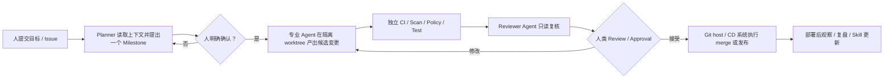

# Multica 企业试点 Playbook

> [!important] 原则
> 首轮试点只授权 Multica 生成**候选产物**，不授权其决定合并、发布或业务验收。Planner、Agent、Task 的自我判断不能代替测试、扫描、policy、签名、SLO 或人工 Oracle。

## 一、首个试点建议

选择一个满足以下条件的 backlog：

- 需求能在一个 Issue 中写清；
- 改动范围小于一个仓库或一个明确子域；
- 有现成测试、lint、build 或静态检查；
- 错误方向的恢复成本低；
- 产出可以是 draft PR 或只读 Review 评论；
- 不需要生产凭据、客户数据、外部承诺或物理履约。

推荐优先级：

1. 文档、测试、feature flag 清理、重复重构；
2. 只读 PR Review 与周期性代码健康检查；
3. 有完整失败日志和可重跑测试的 CI 分诊；
4. 多 Agent Dev→Review→Test；
5. 大规模迁移、跨仓协作与事件驱动自动修复。

## 二、推荐控制流

### Planner 的首轮边界

- 先输出 Goal、Current State、Gap、Priority、一个 Milestone、验收标准、风险和未知；
- 在人明确确认 Milestone 前，不拆正式交付任务；
- 初期只提出 Collaboration Request，不直接 `@mention`、assign 或触发其他 Agent；
- 证据不足时创建探索任务候选，不伪造交付计划；
- 只有当手工交接稳定且每一步都有外部 Gate 时，才考虑让 Squad leader 自动路由。

## 三、运行与权限基线

| 控制点 | 最低要求 | 失败条件 |
|---|---|---|
| daemon 身份 | 专用 Unix 用户、容器或 VM；只挂载试点仓库 | 以个人用户运行且能读 SSH、文档、浏览器/云凭据 |
| Git 权限 | 只能创建候选分支/PR；main 受 branch protection | Agent token 可直接 push main、approve 或 merge |
| 生产权限 | daemon 不持有 production deploy、kube-admin、云管理员凭据 | 任何 Agent Task 可直接发布或回滚 |
| Task 隔离 | 每 Task 独立 worktree；并发上限明确 | 多 Task 写同一 working copy 或用户未提交变更 |
| Skill | 来源固定、人工审阅、版本/哈希可追溯 | 直接导入未审查第三方脚本或指令 |
| 外部入口 | webhook 有签名/幂等；Slack/Lark 只允许显式 mention/命令 | 任意外部消息可触发高权限 Agent |
| 数据 | Issue、日志和附件经过数据分类 | 把 secrets、客户数据或受监管信息写入 prompt/history |

## 四、分阶段试点

### Phase 0：只读可观测（1–2 周）

- 连接一个非生产 Runtime；
- 建一个只读 Reviewer Agent；
- 对选定 PR 生成评论但不自动发布，可先输出草稿；
- 记录 transcript、时长、成本、发现、误报与漏报。

**退出门：** 连续 20 个样本无越权；所有结论可回链；团队确认 Reviewer 输出值得读。

### Phase 1：有界 Issue→draft PR（2–4 周）

- 只选低风险 maintenance；
- 人工写验收标准后 assign；
- Agent 只能开 draft PR；
- CI/Scan 全部独立运行；
- 人审决定接受、修改或关闭。

**退出门：** ≥30 个任务；无越权；可接受候选比例、返工时长与缺陷率达到团队预设阈值。

### Phase 2：Planner + 专业 Agent

- Planner 只提出一个 Milestone；
- 人确认后再拆任务；
- Coding、Review、Test Agent 权限分离；
- 先人工 `@mention` 交接，验证每一步输入/输出合同。

**退出门：** handoff 无循环/丢任务；每个阶段有独立完成证据；失败可恢复。

### Phase 3：Squad 与 Autopilot

- 只对已稳定的交接使用 Squad；
- 只读周期审计可先 Autopilot；
- webhook 事件先规则过滤、去重；
- 确定性步骤用脚本，歧义才触发 Agent。

**退出门：** 触发正确率、重复率、失败恢复和人工介入率稳定；任何自动化仍不能越过 merge/release Gate。

### Phase 4：大规模迁移 / CI 修复

- Project 拆成可独立 review 的 Issue；
- worktree 并行和批量上限；
- 失败任务分批重试；
- 建 golden cases、历史事故 replay 或故障注入；
- 生产启用先 darkship/observe，再扩大权限。

## 五、度量

| 维度 | 指标 | 不应单独使用的代理指标 |
|---|---|---|
| 任务适配 | accepted / iterated / closed 比例；首次产物可评审率 | Task `completed` 数 |
| 质量 | CI 通过、Review 缺陷、返工、合并后回滚/事故 | Agent 自报“tests passed” |
| 速度 | 从 Issue ready 到可评审 PR、从失败到定位/修绿 | 生成代码行数 |
| 人类负担 | steering 次数、review 分钟、上下文搬运时间 | Agent run 时长本身 |
| 稳定性 | queue/timeout/quota/trigger/loop 失败率 | 发布频率 |
| 治理 | 越权尝试、secret 暴露、未审批外部动作、审计缺口 | “有人最后看过” |
| 经济性 | 每 accepted 任务成本、失败重试成本、Runtime 运维 | token 总量 |

## 六、立即停止条件

- Agent 读取或使用未授权凭据；
- 直接 push main、merge、deploy 或发送对外消息；
- Task/Issue 状态与真实产物冲突且无法从 transcript 解释；
- 自动 handoff 产生循环、重复任务或丢失人工反馈；
- CI/Scan 被 Agent 修改或绕过以获得通过；
- 连续两周 accepted 任务价值低于 review/运维成本；
- 出现不可重放、不可追溯或无法归属的外部副作用。

## 七、试点完成后再决定什么

试点不是为了证明“要不要所有项目都用 Multica”，而是为了得到三类证据：

1. 哪些任务稳定地从清晰 Issue 变成可评审产物；
2. 哪些风险必须由外部系统强制；
3. 哪些 handoff 已稳定到可以从人工触发升级为 Squad/Autopilot。

只有这三项都有数据，才讨论把 Multica 从选择性协调层扩大为团队标准入口。
