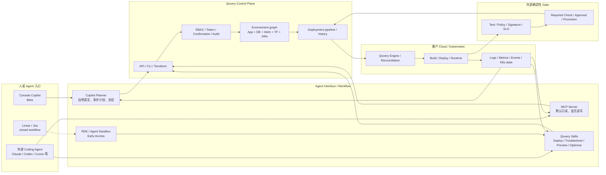

# Qovery：让 LLM 操作环境，而不是重写流水线

## 执行摘要

Qovery 在 CI/CD 中新增的 LLM 能力，不能用“AI Copilot”一个词概括。它实际上形成了四层产品：

1. **Qovery AI Copilot：**平台内的自然语言计划、查询、排程和部署故障诊断；
2. **Qovery MCP Server：**让外部 Agent 读取实时环境状态并调用受权限约束的 Qovery 动作；
3. **Qovery Skills：**把从代码分析到部署、Preview、诊断、加速、优化和 Terraform 回流封装成 Coding Agent 可加载的作业资产；
4. **RDE / Agentic Workflow：**把 Coding Agent 放进隔离环境，并尝试形成 Ticket → Code → Deploy → Test → PR/Preview 的完整闭环。

最值得关注的变化不是 LLM 会不会生成 YAML，而是它开始基于真实 Environment graph 和运行证据工作：应用、数据库、Terraform、Helm、变量和阶段仍由 Qovery Control Plane/Engine 管理；Agent 通过 Copilot、MCP 或 Skills 读取 Deployment history、Logs、Metrics、Kubernetes state，再形成配置、部署或修复候选。

这比纯聊天问答更接近交付系统，但也远未等于自治 CI/CD。截至 2026-08-03，Copilot 仍为 Beta；MCP 和 Skills 已发布但未标 GA；完整 Ticket-driven Workflow 仍是 closed access / coming next。Qovery 已增加 Default read-only、Dedicated Role、显式读写开关、每次写确认、Audit、Secret path 和只读 Kubernetes 凭证等控制，但公开 Skills 又包含隐式 usage tracking、局部自动修复和最多三次重试等默认规则。Tool 可调用、RBAC 允许和用户确认仍不能替代 Test、Policy、Signature、SLO 与发布审批。

因此最准确的判断是：

> **Qovery 正把既有 Kubernetes 交付控制面改造成 Agent 的受治理行动面。LLM 负责理解意图、编排上下文和生成候选动作；Environment state、执行、证据和最终发布权威仍属于平台与外部 Gate。**

## 一、产品状态：不要把四层能力写成一个 GA 产品

| 能力层 | 当前作用 | 截至 2026-08-03 的状态 | 证据边界 |
|---|---|---|---|
| AI Copilot | Console/MCP 中的自然语言查询、计划、排程、诊断和受控动作 | **Beta** | 可证明存在与书面流程；无准确率/成功率 |
| MCP Server | 外部 Agent 对 Qovery 实时状态与工具面的接口 | **Live；未标 GA** | 默认只读；写入需显式多重开关与 RBAC |
| Qovery Skills | Coding Agent 的部署/诊断/优化/Preview/IaC 作业包 | **已发布；未标 GA/Beta** | 开源内容可审计；行为依赖 Agent、Token、Skill 版本和环境 |
| RDE / Agent Sandbox | 隔离的 Agent/开发运行环境 | **Early Access** | 控制能力多来自产品页/Changelog，需账户实测 |
| Linear/Jira Agentic Workflow | Ticket 触发 Sandbox，返回经部署/测试的 PR | **Closed access / coming next** | 目标流程清楚，不能写成普遍可用 |

时间线显示 Qovery 的重点快速从 Copilot 扩展到 Agent 接口：

```text
2025-05  Copilot Alpha
  → 2025-11 Closed Beta
  → 2026-01 Self-service Beta / Read-only
  → 2026-02 MCP live
  → 2026-03 Deployment troubleshooting Beta
  → 2026-04 Open-source Skills
  → 2026-06 Role / Write confirmation / Secret path
  → 2026-07 Skill audit / Cluster state / KRR / Agentic Platform positioning
```

2024 年官方博客曾提出 Insights AI、Troubleshooting Assistant、Dockerfile Generation、ADR 和 Migration Helper 等路线图名称，但缺少逐项发布证据。本报告不把 Roadmap 补全为已发生事实。

## 二、四层架构：LLM、接口、控制面与执行面



该图是对官方分散机制的分析归纳，不是 Qovery 公布的内部实现图。它揭示了三个不能混写的层次：

- **LLM 计划层：**理解 Prompt、选择 Tool、聚合上下文、产生候选动作；
- **平台执行层：**维护 Environment 期望状态、调用 Engine、运行 Build/Deploy、记录状态与 Audit；
- **发布权威层：**由 Required Test、Policy、Signature、SLO、Approval 和 Promotion 决定能否进入下一环境。

如果缺少第三层，Agent 即使能成功调用 API，也只证明动作被执行，不证明发布是正确的。

## 三、Copilot：从问答到部署作业，但仍是 Beta

### 3.1 可确认的功能

Qovery 当前材料支持 Copilot 执行以下类别：

- 查询 Environment、Service、Deployment status 和历史；
- 解释 Qovery 配置和平台概念；
- 计划一次性或周期性 Deploy、Start/Stop、Scale 和 Cleanup；
- 分析 Deployment/Application/Build log、Health check、Connectivity、Resource 和 Runtime error；
- 给出 Root cause 候选与 Remediation step；
- 在已启用 Read-write 时触发 Deploy、Configuration update、Restart/Stop 等动作。

其中最明确的新功能是 2026-03 上线的 Deployment Troubleshooting：它从失败视图进入，汇集部署日志、应用日志和历史，形成根因与建议。2026-07 的 Kubernetes state tool 又提供 Pod、Network、Certificate、Node 等结构化输入。

### 3.2 不能确认的能力

官方 Advanced Workflows 页面列出 Progressive deployment、Blue/Green、Multi-region failover、DB migration、Backup/Restore 等复杂示例。这些示例没有稳定状态矩阵、工具合同、失败/回滚语义或客户验证，不能按“当前完整支持”写入正式结论。

同样，“Root cause”“Self-remediation”不能直接升级为 Self-healing：

- Capability Matrix 将 Fix deployment problem 和 Identify root cause 标为 Partial；
- 没有 Ground truth、准确率、误报率和回归数据；
- 没有证明 Copilot 能独立判断业务成功；
- 写入还受 Read-write、RBAC、确认和外部 Gate 限制。

### 3.3 文档冲突本身是成熟度信号

当前文档对 Console 是否可写互相矛盾，对底层模型也分别写 Sonnet 4.5 与 Sonnet 5；Capability Matrix 的 `Last Validated 2025-01-15` 又早于 2025-05 Alpha。它们不一定说明功能不可用，但说明状态元数据和文档发布过程尚未达到可直接作为企业控制合同的稳定度。

## 四、MCP：把实时状态与操作面交给外部 Agent

MCP 的价值不在协议本身，而在它把 Qovery 内的 Environment、Deployment、Service、Log 和 Kubernetes state 变成外部 Agent 的结构化 Tool surface。

当前最清楚的控制路径是：

```text
MCP Client 连接
  → 默认 Read-only
  → OAuth 或 API Token 身份
  → 可选 read_write=true
  → 组织管理员启用 Write
  → Qovery RBAC/Token 检查
  → 写动作确认
  → API Audit
```

这比直接给 Agent `kubectl` 或 Cloud admin credential 更容易形成 Blast radius，但仍有四个风险：

1. **读权限也可能敏感。** Log、Environment variable metadata、Database/config endpoint 可能包含 PII 或 Credential；“GET”不天然安全。
2. **Token 继承 Role。** 过宽 Role 会把 Tool surface 变成过宽行动面。
3. **MCP 不验证业务正确。** 它只把调用变成结构化接口。
4. **External Client 自身仍需治理。** Prompt、Model、Skill 和 Tool-selection 不由 MCP 自动保证。

2026-07 Cluster-state tool 是重要增量：Agent 不必只从非结构化 Log 推断，而可以读取对象状态。它提高输入质量，不等于 Root cause 已验证。

## 五、Skills：Qovery 最像“Agent-native CI/CD”的部分

官方仓库当前列出八个 Skills：

| Skill | 在交付链中的作用 | 新增价值 |
|---|---|---|
| `qovery` | Router + status/log/stop/restart/scale 等快速操作 | 统一意图入口 |
| `qovery-onboard` | Cloud/Cluster/Project/Environment/RBAC 初始设置 | 将平台建模知识封装为 Agent Playbook |
| `qovery-deploy` | 代码分析、Dockerfile、Database、Variable、Stage、Deploy/Watch | 从 Code 直达可运行 Environment |
| `qovery-troubleshoot` | 八层诊断、Error pattern、Playbook、Fix/Redeploy/Verify | 将故障调查结构化 |
| `qovery-optimize` | 资源/成本分析、Right-sizing、报告和变更 | 把历史使用与业务约束放进决策 |
| `qovery-speedup` | Pipeline timing、Build usage、Docker/Health/Stage 优化 | 从主观“慢”转为时间线与 Owner |
| `qovery-preview` | Blueprint、PR clone、Auto-shutdown、Deploy/URL/Cleanup | 把 Preview 生命周期纳入 Agent 会话 |
| `qovery-terraform` | 从现有 Qovery setup 生成 Terraform/Import/Validate | 让点击式状态回流为可审查 IaC |

### 5.1 为什么这比“聊天”更深

每个 Skill 都定义了 Phase、输入、默认选择、命令、确认和验证。这实际上把平台团队的操作知识变成可加载、可版本化的 Agent 资产。Agent 不必把整个 Qovery 文档塞进上下文，而是按意图加载局部作业流。

### 5.2 为什么它也带来新风险

Skills 当前有两个值得单独审计的行为：

- 每个 SKILL.md 要求运行前向 `/skill-tracking` POST 使用事件；这是隐式外部写/遥测；
- Deploy Skill 在初始计划确认后，允许自动修改 Qovery Config 和 Skill 自建 Dockerfile，并最多重试三次。

这证明 Skill 不只是“知识”，也是带副作用默认值的供应链资产。企业需要：

```text
Pin Commit / Vendor review
  → 删除或批准 Telemetry
  → 收紧 Tool/API allowlist
  → 所有 Material diff 可见
  → 限定 Retry budget
  → Non-prod first
  → External tests and approvals
```

不能因为仓库开源就自动认为默认行为满足企业授权规则。

## 六、作业流变化：LLM 真正新增的环节

| CI/CD 阶段 | 传统 Qovery 原语 | LLM/Agent 新增能力 | 仍由外部系统持有 |
|---|---|---|---|
| Plan | Environment、Service、Stage 配置 | 从自然语言/代码库生成部署计划、依赖和候选配置 | Architecture/Policy owner 的批准 |
| Build | Dockerfile、Builder、Build log/usage | 生成 Dockerfile、解释 Build failure、提出 Cache/Layer 优化 | Compiler、Scanner、Unit test、Artifact integrity |
| Preview | PR Environment、Clone、URL、Cleanup | Agent 自动选择 Blueprint、Scope、Branch、生命周期并反馈 URL | PR review、Test oracle、数据隔离规则 |
| Deploy | Pipeline、Engine、Kubernetes rollout | 自然语言触发 Deploy/Scale/Config、条件化多步计划 | Environment protection、Required check、Approval |
| Observe | Logs、Metrics、History、K8s events | 聚合多源上下文、结构化 Cluster state、Root cause 候选 | SLO、Business KPI、Incident commander |
| Fix | 手工 Config/Code/IaC 修改与重部署 | 候选修复、局部自动修改、Retry 和 Runbook 生成 | Diff review、Test、Production write authorization |
| Recover | Rollback/Stop/Restart | 通过 Agent 调用既有 Recovery primitive | 回滚决策、Data compensation、Post-check |

因此 Qovery 的 AI 增量可概括为四个动词：**理解、编排、解释、候选执行**。Build、Deploy、Observe、Rollback 的确定性底座并未消失。

## 七、Agent Sandbox 与 Spec-to-Production：方向正确，状态仍早

RDE 和 Agent Runtime 试图解决一个真实问题：Coding Agent 如果只在代码 Sandbox 内运行，就无法验证数据库、服务依赖、网络和真实部署行为；如果直接运行在开发者电脑或生产凭证域，又会扩大 Blast radius。

Qovery 的目标是为每个 Agent 提供隔离的 Environment、Scoped secret、Network control、Auto-shutdown、Audit 和 Preview URL，再从 Linear/Jira Ticket 触发 Coding Agent 工作并返回 PR。

这个方向比“让 Agent 多跑几个 Unit test”更接近 Agentic CI/CD，因为它把验证目标从文件系统扩展到一个运行中的全栈环境。但截至观察日：

- RDE 为 Early Access；
- Linear/Jira Workflow 为 closed set of customers / coming next；
- 产品页中的 `<30s`、完整 E2E 和治理效果是厂商自述；
- 没有独立客户前后对照和失败数据。

因此它适合作为战略方向和候选试点，不适合作为当前标准化采购结论。

## 八、与 CI/CD、GitOps 和 IaC 的关系

Qovery 并未把 Agentic Layer 写成对 GitHub Actions、GitLab CI、Jenkins、Argo CD 或 Terraform 的全面替代。更准确的分层是：

| 对象 | 主要所有权 | Qovery LLM 层的关系 |
|---|---|---|
| GitHub/GitLab CI | Commit/PR event、Job、Test、Artifact、Required check | Agent 可生成/调用部署，但 CI 仍可持有验证和晋级 |
| Argo CD | Git desired state 与 Kubernetes reconciliation | Qovery 可并行纳管 Environment/Pipeline/Access，不应宣称取代 |
| Terraform/OpenTofu | IaC state、Plan/Apply、Review | Skill 可生成/回流 Terraform；生产应以 Diff/Plan 为 Gate |
| Qovery Control Plane | Environment graph、Deployment、RBAC、Audit | 给 Copilot/MCP/Skills 提供统一事实与动作面 |
| Kubernetes | Workload reconciliation 和 Runtime truth | Agent 读取状态；Kubernetes 不判断业务正确性 |

Qovery 最适合成为“Agent 与交付基础设施之间的控制面”，而不是新的 CI Test Runner 或 Source-of-truth 的唯一替代者。

## 九、企业采用判断

### 9.1 值得试点

- 已用 Qovery 管理多个 Environment，希望让 Coding Agent 从 Code 延伸到 Preview/Deploy；
- Deployment failure 需要频繁跨 Logs、History、Kubernetes state 人工排查；
- 有清晰的 Environment、RBAC、Token、Audit 和 Non-prod 隔离；
- 愿意固定/审计 Skills，并把生成 Diff 纳入现有 Review/Gate；
- 能测量 Root cause、Fix、Retry、Lead time 和 Human review，而不是只看 Demo 速度。

### 9.2 暂不优先

- 需要正式 GA/SLA、独立客户 ROI 或严格稳定接口合同；
- Console/MCP/Skill 的权限和数据处理无法通过内部审查；
- CI/CD 没有 Required test、Policy、Artifact、Approval 和 Rollback 基线；
- 期望 Agent 直接替代 GitOps/IaC Source of truth；
- 无法为 Preview/Sandbox 提供脱敏数据、网络隔离和成本上限；
- 希望通过 Prompt 获得无人监管的生产 Self-healing。

### 9.3 推荐试点顺序

```text
阶段 1：Read-only
Deployment/Cluster diagnosis，测 Root cause top-k、Evidence completeness、人工节省

阶段 2：Candidate change
生成 Dockerfile/Config/Terraform diff，不执行；测正确率、Review effort、Policy violation

阶段 3：Non-prod write
逐动作确认，限定 Environment/Token；测 Deploy success、Retry、Rollback、Audit completeness

阶段 4：Preview + Test
Agent 创建 Preview，外部 Test/Gate 判断；测 Escape rate、Environment cost、Cleanup reliability

阶段 5：受限 Day-2 automation
只自动执行低风险、幂等、可回退动作；生产写入另立授权项目
```

### 9.4 最小评测指标

| 维度 | 指标 |
|---|---|
| 诊断质量 | Root cause top-1/top-3、Evidence link completeness、误报/漏报、人工纠正次数 |
| 变更质量 | Generated diff acceptance、Policy violation、Regression escape、Rollback rate |
| 执行可靠性 | Deploy success、Retry count、Duplicate action、Idempotency、Cleanup success |
| 权限 | Unauthorized attempt、Denied action、Confirmation coverage、Token scope、Audit completeness |
| 速度/成本 | Time-to-diagnosis、Time-to-preview、Human review time、Model/Infra/Preview cost |
| 可恢复性 | Rollback success、Data compensation、Post-check pass、Incident caused by Agent |

## 十、最终判断

Qovery 展示了一个比“AI 生成 Pipeline”更具体的方向：

> **CI/CD 的 Agent 化，关键不是让模型接管流水线，而是把交付环境做成一个有结构化状态、可组合工具、明确权限和外部验证的行动域。**

Qovery 已经具备这条路线的多数基础原语：Environment graph、Deployment Engine、Preview、Logs/Metrics/Kubernetes state、RBAC、Audit、MCP 和 Skills。当前最可信的价值是受控的部署诊断、Code-to-environment 作业封装和外部 Agent 接口；最需要克制的部分是自动修复、完整 Spec-to-Production 和效果承诺。

如果企业把 Skills 当代码审、把 Agent 变更当 Candidate、把 MCP 当受限工具面、把 Test/Policy/SLO/Approval 留在外部 Gate，Qovery 可以成为 LLM 时代有价值的交付控制面。若把“Natural language + API”直接当成生产授权，它只会把原有 CI/CD 风险放大到更高频、更难预测的动作流中。
