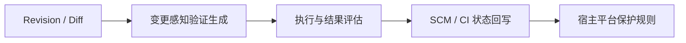

# Agent 生成验证的运行时 Gate 分析发现

## F1：真正的新对象是“本次变更的验证作业”

传统流水线通常从仓库配置中读取固定 Job 和测试集合。AWS 与 Meta 的共同变化是：验证内容开始由本次变更的上下文决定，并在运行时形成计划或临时验证。

对 CI/CD 专家而言，关键问题不再是它生成 UI 测试还是 API 测试，而是这个新对象是否具备流水线可治理的合同：输入范围、执行目标、权限、预算、期望证据和失败语义。

## F2：一手证据支持的最小技术链是五步

- **Revision / Diff：**AWS 接受 PR/MR、branch、commit 或 test intent；Meta 以 Diff intent/risk 驱动验证。
- **生成：**AWS 明确生成 change-specific test plan；Meta 生成针对本次 Diff 的 catching tests。
- **执行与评估：**AWS 在 managed verification environment 或客户提供的已部署应用执行；Meta 做 Diff/parent 对照并用 rule/LLM assessor 过滤信号。
- **状态回写：**AWS 产出 readiness report、execution journal 与 GitHub Check Run；Meta 当前公开链路产出工程师候选报告。
- **宿主 Gate：**AWS readiness 可配置为 GitHub required status check 或 GitLab approval rule；Meta 没有公开同类集成。

这五个名称是本专题对一手事实的压缩，不是 AWS 或 Meta 发布的统一架构或 schema。

## F3：Check Run 只有被设为 Required 才成为 Gate

AWS release testing 会在 GitHub 创建并更新 Check Run，返回 pass/fail 与详细摘要；但 AWS 文档没有说它默认阻断 merge。GitHub 官方规则明确：只有被 branch protection/ruleset 配置为 required 的 check/status 必须成功后才能 merge。

AWS release readiness 的 Gate 证据更直接：GitHub 可配置 required status check，在 blocking findings 存在时阻断；GitLab 可配置 MR approval rule 要求解决 blocking findings。GitLab external status check 也只有启用 `Status checks must succeed` 后才阻断。

因此，事实支持的技术判断是：**Agent 产生 revision 关联状态，宿主平台独立决定该状态是否具有 merge 权限。**

## F4：AWS 证明的是“验证计划可产品化为流水线阶段”

AWS Release Management 把 release readiness review 与 release testing 放入 IDE、PR/MR 和 CI/CD 使用路径。Release testing 针对具体变更生成计划，并在客户提供的已部署应用环境中发起真实请求。

AWS 还公开了两类不同执行路径：

- release readiness 的 automated verification 在 AWS-managed environment 中 clone、build、run、test，可配置 VPC、Runtime IAM role 与网络访问；
- release testing 针对客户提供的已部署 Web/API 目标运行，可能产生 `POST / PUT / DELETE` 等真实副作用。

结果层同样有直接对象：readiness report 包含 `BLOCK / Proceed with Caution / Safe to Release`、severity 与 execution journal；release testing 可回写 GitHub Check Run。

仍需保留三条边界：

- 截至 2026-08-03 仍为 Preview，限 `us-east-1`；
- Web/API 测试会产生真实写请求，环境和数据治理是发布平台责任；
- Check Run 不是默认 Required；Gate 配置与自动发布均属于后续宿主流程。

## F5：Meta 证明的是“验证证据可以按 Diff 临时生产”

Meta JiTTesting 根据选定 Diff 的意图与风险生成临时 catching tests，运行后用规则与 LLM assessor 压缩候选信号，再反馈工程师。这表明测试不必全部作为长期仓库资产存在，也可以是一次变更运行中的短生命周期证据。

但 Meta 当前公开证据更适合作为“证据生成机制”而不是“对外 Gate 产品”：

- 这是内部生产工作流与研究报告；
- 没有公开产品生命周期、接口和可部署实现；
- 论文没有证明所有 PR、语言和仓库均同步阻断；
- 最终公开流程仍包含把候选结果反馈给工程师。

## F6：AWS 与 Meta 不是成熟度横评，而是机制链上的两个锚点

| 机制问题 | AWS Release Management | Meta JiTTesting |
|---|---|---|
| 如何进入流水线 | PR/MR、IDE、聊天、CI/CD stage | 选定 Diff 的内部 production workflow |
| 如何规划 | 变更感知 readiness review 与 release test plan | 从 Diff 意图/风险生成临时验证 |
| 如何执行 | 客户提供的已部署应用环境 | Meta 内部测试基础设施 |
| 如何压缩证据 | readiness findings 与 release test results | 规则 + LLM assessor → candidate report |
| Gate 强度公开证据 | readiness 可配 GitHub required check / GitLab approval rule；release testing 回写 GitHub Check Run | 工程师反馈；没有公开 Required Check 或自动阻断证据 |
| 当前状态 | Preview | 内部生产 + 公开研究 |

这张对照不是为了评选“谁更先进”，而是把从生成验证到 Gate 所需的缺口显性化。

## F7：先复用 SCM/CI 原生状态，不虚构统一证据协议

本次证据可以支持以下真实对象：

| 环节 | 已公开对象或配置 |
|---|---|
| 输入 | PR/MR、branch、commit、Diff、test intent、test profile、AGENTS.md |
| 计划 | AWS change-specific test plan；Meta Diff intent/risk 驱动的验证生成 |
| 执行控制 | AWS-managed verification environment、VPC/private connection、Runtime IAM role、网络 allowlist、客户提供的 target URL |
| 结果 | AWS readiness report、severity、execution journal、GitHub Check Run；Meta assessor signal 与工程师报告 |
| Gate | GitHub required status check、GitLab MR approval rule / external status rule |

AWS/Meta 都没有公开 `VerificationPlan`、`EvidenceBundle` 或 `GatePolicy` 的统一 schema。最小可行技术路径是先把 Agent 结果写成 revision 关联的 SCM/CI 原生状态，再由既有保护规则决定是否阻断。若企业要增加签名、plan hash、fail-open/fail-closed 或例外审批，应另作设计并重新取证。

## F8：AWS 暴露了一个可复用的异步外部检查模式

AWS 官方 Action 源码显示，流水线步骤并不在 GitHub Runner 内执行生成式验证，而是把 `repository`、当前 `headSha`、可选 `prNumber`、`testProfileId` 和本次 `testRequirement` 组成作业上下文，通过 Webhook 提交到 Agent Space。Action 收到 2xx 后结束；Agent Space 创建当前 commit 的 `in_progress` Check Run，Agent 在外部执行，最后把状态更新为 pass/fail。

对 CI/CD 架构最有借鉴价值的是三项解耦：

1. **配置与计划解耦：**测试档案保存相对稳定的执行目标，本次测试要求提供运行时关注点；Pipeline YAML 不必预写完整测试计划。
2. **Runner 与 Agent 执行解耦：**流水线 Action 只提交作业，Agent 的生成和执行不驻留在 Runner 生命周期中。
3. **证据与 Gate 解耦：**Agent Space 负责把执行生命周期映射为 Check Run；是否成为阻断条件，仍由 GitHub 的 required status check 配置决定。

这个模式的技术难点不在测试类型，而在**把一次不可预先枚举、可能异步完成的 Agent 验证，可靠关联到当前 revision，并压缩成 SCM 能消费的状态机**。上述三项“解耦”是基于 AWS 官方实现与 GitHub Gate 机制得出的架构分析，不是 AWS 公布的组件命名。

## F9：页面主张必须通过 Agent 反事实测试

如果删掉 Agent，AWS/Meta 的差异不能只剩“又多跑了一类测试”。Agent 的独特作用是：使用当前变更上下文生成过去没有预先写进 Pipeline 的验证计划或验证工件。

如果删掉 CI/CD 控制面，页面又不能成立为 Gate：计划将缺少稳定触发、执行环境、证据格式和授权规则。因此最完整的结论是：

> Agent 负责扩展“这次应该验证什么”，流水线负责决定“这些证据是否足以继续”。
