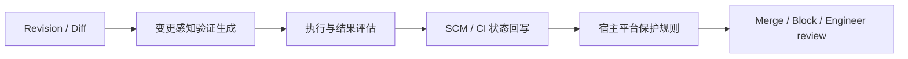

# Agent 生成的验证如何成为流水线 Gate

## 执行摘要

AWS DevOps Agent Release Management 与 Meta JiTTesting 揭示的共同变化，不是测试用例类型变多，而是流水线的验证对象发生变化：固定测试之外，系统可以根据本次变更在运行时生成验证计划、执行临时验证并产出候选证据。

但“生成并运行验证”与“形成 Gate”是两件事。AWS 已给出直接落点：release testing 回写 GitHub Check Run；release readiness 可配置成 GitHub required status check 或 GitLab MR approval rule。GitHub/GitLab 的宿主保护规则决定状态是否阻断 merge，不是 Agent 输出天然拥有 Gate 权力。

AWS 与 Meta 分别支撑这条机制链的不同部分：

- **AWS：**把变更感知的 readiness review 和 release testing 产品化为 Preview 能力，并公开 Check Run、required status check 与 approval rule 接点；
- **Meta：**把针对选定 Diff 的临时 catching tests 放入内部生产工作流，并用规则与 LLM assessor 压缩信号，证明验证证据可以按变更即时生产；
- **共同边界：**没有公开证据证明 Agent 可以自行设定成功标准、覆盖所有变更、自动批准代码或自动发布。

## 一、CI/CD 的关注点：从 Test Asset 转向 Verification Job

测试专家会关心生成了什么 mutant、测试用例是否高质量、属于 UI 还是 API。CI/CD 专家更应关心一个新的运行时作业是否可被调度和治理：

这是对一手事实的跨案例压缩，不是 AWS/Meta 原生架构命名。Agent 的核心增量是按 revision/Diff 生成验证；Pipeline/SCM 的关键职责是把结果关联到同一 revision，并由独立保护规则决定是否阻断。

## 二、AWS：从变更理解到可执行 Release Stage

AWS DevOps Agent Release Management 在 2026-06-17 以 Preview 发布。它包含两条相关能力：

1. **Release readiness review：**检查组织标准偏离、跨仓依赖、访问控制和基础设施权限问题；
2. **Release testing：**针对具体变更生成测试计划，并在客户提供的已部署 Web/API 应用环境中运行。

其 CI/CD 意义是，Agent 不只返回文字建议，而是形成可从 PR/MR 或 Pipeline stage 触发的验证作业。readiness report 直接给出 `BLOCK / Proceed with Caution / Safe to Release`，release testing 可回写 GitHub Check Run；readiness 结果还可配置成 GitHub required check 或 GitLab approval rule。

AWS 官方 Release Testing Action 还公开了更具体的接入机制：GitHub Action 在部署完成后收集当前 repository、head SHA、PR、test profile 和可选 test requirement，通过 Webhook 向 Agent Space 提交作业；Action 收到 2xx 后结束。Agent Space 随后创建当前 commit 的 `in_progress` Check Run，Agent 在外部执行并把状态更新为 pass/fail。它因此形成一个可复用的“revision 绑定异步外部检查”模式：Pipeline 负责提交，Agent 服务负责生成与执行，SCM 原生状态负责承接生命周期。

但正式页面必须保留以下边界：

- Release Management 仍是 Preview，且截至 2026-08-03 限 `us-east-1`；
- 测试会发出真实请求，可能包含写操作，staging、数据和权限由客户治理；
- “autonomous release testing”描述的是测试计划生成与执行，不是自主合并、部署或发布；
- release-testing Check Run 并非默认 Required；自动部署、发布和失败降级策略仍未公开为统一机制。

## 三、Meta：从 Diff 风险到短生命周期验证证据

Meta JiTTesting 的公开流程根据代码 Diff 及其意图/风险生成临时 catching tests，运行后用规则和 LLM assessor 筛选信号，并把候选结果反馈工程师。论文披露两条 diff-aware workflow 自 2025-09 进入内部生产部署。

其 CI/CD 意义不是 mutant 技术本身，而是验证工件的生命周期发生改变：

- 验证针对当前变更生成；
- 验证在本次工作流内运行；
- 验证不必成为长期仓库资产；
- 原始失败被压缩为可供工程师消费的候选证据。

公开证据仍不足以证明它是对外产品、覆盖所有 PR、成为同步 Required Check，或自动批准代码。Meta 因此适合证明“证据可动态生成”，不适合证明“强制 Gate 已全面落地”。

## 四、事实支持的 Gate 转换方式

| 转换点 | 一手事实 | 不能外推 |
|---|---|---|
| Agent → 状态 | AWS release testing 创建/更新 GitHub Check Run；readiness 输出 blocking severity 与推荐动作 | 不能写成 Check Run 默认阻断；没有统一 EvidenceBundle schema |
| 状态 → Merge Gate | GitHub required status checks 必须成功才允许 merge；AWS readiness 可配 required check | 自动部署、自动发布 |
| Review → GitLab Gate | AWS readiness 可配 MR approval rule；GitLab external status 仅在 `Status checks must succeed` 时阻断 | AWS release testing 已使用 GitLab external-status API |
| 候选信号 → 人工处置 | Meta assessor 后联系工程师确认 | Meta 已接 SCM Required Check |

由此得到一条有事实支撑的职责分离：

> **Agent 负责扩展“本次应该验证什么”；宿主 SCM/CI 负责决定“这个 revision 的状态是否允许 merge”。**

## 五、两家公司在页面上的证明分工

| 页面问题 | AWS DevOps Agent Release Management | Meta JiTTesting |
|---|---|---|
| 规划 | 生成 change-specific release test plan，结合标准与依赖做 readiness review | 根据 Diff 意图与风险生成临时验证 |
| 执行 | 客户提供的已部署应用环境；可嵌入 CI/CD stage | Meta 内部 production workflow |
| 证据 | readiness findings 与 release test results | rule + LLM assessors 压缩 candidate catches |
| Gate 位置 | readiness 可配 required check / approval rule；release testing 回写 GitHub Check Run | 工程师反馈明确；没有公开 Required Check 或自动阻断证据 |
| 状态 | Preview | 内部生产 + 公开研究 |
| 页面角色 | 证明“产品化验证阶段” | 证明“动态验证证据” |

## 六、Presentation 建议与禁止外推

### 可安全压缩的页面主张候选

> Agent 把 revision/Diff 转成运行时验证；只有当结果被写成 SCM/CI 原生状态，并被宿主保护规则设为 required，它才真正成为 merge gate。

### 页面应突出

- `Revision/Diff → 生成 → 执行/评估 → 状态回写 → 宿主 Gate` 的技术链；
- AWS 与 Meta 在机制链上的不同证明任务；
- Check Run 与 required rule 的分离，以及执行环境的权限边界；
- AWS Preview 与 Meta 内部生产/研究的成熟度差异。

### 页面不应突出

- mutant 算法、测试用例质量和 UI/API 类型；
- 两家公司谁的测试效果更好；
- 自动发布、所有 PR 阻断或 Agent 自批；
- 未经第三方验证的收益数字。

## 七、结论

生成式验证不会自动成为 Gate。Agent 先把 revision/Diff 转换成可执行验证；结果再写回 Check/Status/Review，最后由 GitHub/GitLab 等宿主规则决定是否阻断 merge。AWS 已公开到这一 Gate 接点，Meta 则公开到 assessor 与工程师确认。对 CI/CD 专家的直接启发不是自创新协议，而是优先复用 revision 关联的原生状态和保护规则。
