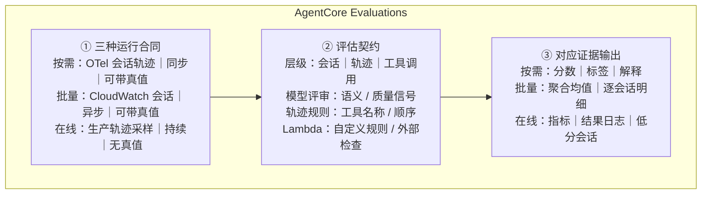
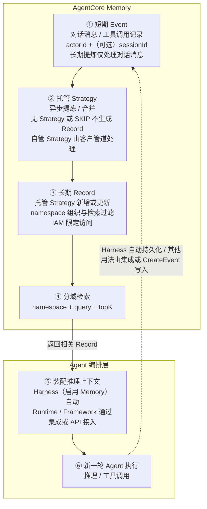

# AWS AgentCore 单页契约（v4 内容已锁定）

> [!info] 当前状态
> AgentCore Deep Dive、Evaluations 与 Memory 补充洞察均已通过受限的 Presentation-ready 门禁。用户已明确批准 v4 PNG 的全部可见文案、50/50 版式与底部两行洞察；当前进入全原生 native review PPTX 制作，视觉锁仍待对渲染结果批准。

## 写作提纲

1. 先确定页面是从行业主张向机制展开，还是从两组证据向上归纳；
2. 再固定单页区域、阅读顺序、比例与容量；
3. 在固定画布内对齐唯一主张、AgentCore Evaluations、AgentCore Memory 与外部发布权边界；
4. 最后生成原生可编辑评审稿，视觉批准后才形成正式 PPTX。

## 证据就绪判断

- [[50_deepdives/amazon-bedrock-agentcore/README|AgentCore Deep Dive]]：`presentation_ready: true`，支持“通用 Agent 生产控制面、行动与质量双闭环、外部业务 Gate 保留最终权威”的受限判断；
- [[50_deepdives/amazon-bedrock-agentcore/56_memory-cicd-insight|AgentCore Memory 补充洞察]]：`presentation_ready: true`，支持“Memory 是 Event → strategy → Record → retrieval / injection 的外部上下文管道，并且不是发布事实源”的受限判断；
- 截止日：`2026-08-04`；阻塞状态：`clear`。

## 当前待决策

- 洞察对齐路径：`top_down / user_selected`，用户原话：`top-down`；
- 页面版式框架：`LF3 / user_approved`，用户原话：`同意，直接讨论图怎么画，内容怎么写吧`；
- 区域内容设计：`user_approved`，用户原话：`同意按 v4 PNG 的全部可见文案与版式制作，底部两行洞察保持不变。`；
- 视觉基线：`proposed / native review 制作中`。

## 页面版式框架提案 LF3

```text
┌──────────────────────────────────────────────────────────────┐
│ 标题（左）＋状态标签（右）                         约 14% │
├────────────────────────────┬─────────────────────────────────┤
│ 左上主图区（左区约 66%）   │                                 │
│ 1 张图：≤6 节点 / 8 关系   │ 右侧详细说明区                  │
│ ─────────────────────────  │ 约 50%，贯穿正文全高           │
│ 左下能力介绍（左区约 34%） │ 最多 3 个内容小节               │
│ 最多 2 节，每节标题＋2 条  │ 每节标题＋3 条短说明     约 70% │
├────────────────────────────┴─────────────────────────────────┤
│ 底部洞察启示：1 条核心洞察＋1 条边界/启示           约 12% │
├──────────────────────────────────────────────────────────────┤
│ 来源与 as_of（右下固定）                              约 4% │
└──────────────────────────────────────────────────────────────┘
```

- 正文整体比例：左 `50%` / 右 `50%`；左区内部上 `66%` / 下 `34%`；
- 阅读顺序：上 → 左上图 → 左下能力 → 右侧详细说明 → 底部洞察；
- 标题最多两行；右上保留状态标签；右区不再分出第三列；
- 后续允许左右宽度 `±5%`、左侧上下比例 `±6%`、整体纵向高度 `±4%` 的内容适配；
- 新增区域、改变阅读顺序或超出比例容差，需要重新批准页面版式框架；
- 用户已明确左上用图、左下做能力介绍、右侧做详细介绍；具体图形结构与可见文案仍在后续区域内容设计中决定。

## 禁止升级的表述

- AgentCore Evaluation 分数与 AWS DevOps Agent 结果已经闭合端到端自主发布；
- Release Management 已 GA 或可跨区域稳定用于强制门禁；
- Online Evaluation 具有 Ground Truth，或 expected response / assertions 都是确定性断言；
- Evaluation、readiness result、Check Run 或 mitigation plan 本身拥有部署与生产恢复授权；
- AWS 已通过独立客户数据证明普遍降低 MTTR、提高缺陷捕获率或 ROI。

## 左侧 50% 机制与三句解释提案 LEFT-S13

### 左侧小标题提案

推荐：**AgentCore Evaluations｜基于执行轨迹评估 Agent 的回答与执行过程**

- “执行轨迹”是评估输入；“回答与执行过程”是被检查的对象；
- 避免把“评估结果”误读为只检查最终业务结果，也没有把 Evaluation 升级成正确性证明或发布门禁；
- 原机制图内的黑色标签建议缩短为“评估机制”，避免与小标题重复。

批准记录：用户回复 `可以，请补充进png中`；本轮只在草图中增加小标题，不改动已确认的机制图与左下三条说明。

更新草图：`/Users/zhujiayi/.codex/visualizations/2026/08/03/019fc76e-5ba0-7cb3-8167-468e752a0fa3/aws-agentcore-50-50-left-evaluation-with-heading.png`；SHA-256：`b3ce6eeb89cb60737f202f5ca6352d2661354d9901f5a2fca03ad6d4bbcafc59`。

### 左侧唯一判断

> **AgentCore Evaluations 用三种运行合同接入不同轨迹来源，再复用同一套评估对象与评估方法，把 Agent 行为转成质量证据；上线前真值回归与上线后生产采样互补，但发布权仍在外部 Gate。**

### 左上图描述什么

左上回答：**AWS AgentCore 如何把不同来源的 Agent 轨迹，通过三种评测运行合同转成质量证据？**



图形规则：

- 用一个明确外框标记 **AgentCore Evaluations 产品能力**；
- 三列分别解释运行合同、评估契约与对应输出，并保持按需/批量/在线的纵向映射；
- 评估契约成为中间视觉焦点，突出 AWS 评测层级和三类评估方法；
- 图下用一条生命周期带连接变更前参考真值回归与生产在线采样；低分轨迹回流明确标注为企业侧编排；
- 主图只使用中文，保留 OTel、CloudWatch、Lambda、CI/CD 等不可替代的产品或技术名词。

### 左下能力介绍写什么

左下不复述图，而是补充“怎样配置成可回归方案”和“怎样形成生命周期闭环”。

**01｜在不同阶段取不同的数据**

- 按需和批量用于发布前测试，检查 Agent 的实际执行是否符合预期；在线评测用于上线后监测真实请求。

**02｜先确定检查对象，再选择检查方式**

- 可以评整个会话、一段轨迹或一次工具调用，再选择模型评审、轨迹规则或**自定义代码检查（Lambda）**。

**03｜AgentCore 给结果，外部流程做决定**

- AgentCore 输出分数、标签、解释、聚合结果与低分会话；CI/CD、测试和审批流程据此决定放行或回滚。

### 左侧证据范围

| Claim | 证明内容 | 可见投影 |
|---|---|---|
| S04-E1 | On-demand / Batch / Online 的 trigger、session source、target 与输出不同 | Data Sources、Execution Surfaces、Evidence Outputs |
| S04-E2 | On-demand / Batch 支持 Ground Truth；Online 无 Ground Truth | Evaluator Contract |
| S04-E3 | LLM、trajectory 与 Lambda evaluator 的确定性强度不同 | Evaluator Contract、配置机制 |
| S04-E4 | Evaluation API 输出不含发布授权语义 | `evidence input` 虚线、Consumer |
| S04-E5 | 可回归发布证据需要把场景、trace、evaluation 与外部 Gate 关联 | 生命周期闭环 |

### 当前边界

- 暂不讨论页面标题、右侧详细内容与底部洞察；
- 暂不展示 Dataset Evaluation Preview、Batch 500-session 限制、成本或 evaluator 数量冲突；这些内容不影响左侧主机制，后续只在有容量时进入右侧或演讲备注；
- 左下三行文字与说明面板已获批准，用户原话：`没啥问题，生成吧`；
- 本轮评审图：`/Users/zhujiayi/.codex/visualizations/2026/08/03/019fc76e-5ba0-7cb3-8167-468e752a0fa3/aws-agentcore-50-50-left-evaluation-three-steps.png`，SHA-256：`035a27f61fa23a3be695d4a3e74c954491eb4c1a3b43be9598c99435ea21fe0c`；
- 左上 L-DIAG9 的精确设计仍待通过 PNG 草图评审；右上 R-MEM3 已批准并生成草图，右下三条启发与底部洞察仍保持 open。

## 右侧 50% Memory 机制与 CI/CD 启发提案 R-MEM3

### 右侧回答什么

**AgentCore Memory 如何把历史交互变成下一轮可用的上下文；为什么 CI/CD 仍要重新核对当前事实？**

推荐小标题：

**AgentCore Memory｜把历史交互提炼成下一轮可用的上下文**

### 上半部机制图



机制图只保留两条边界：

- `actorId / sessionId / namespace` 控制事件与长期记录的组织、检索和访问范围；
- **删除 Event ≠ 删除长期 Record**，原始层与派生层要分别治理；
- 自动检索和注入是 Harness 行为，不能泛化为所有 Runtime / framework 的默认能力。

### 下半部三句说明

**01｜记住经验，但重新核对当前状态**

- 可以复用历史诊断线索；测试、制品、审批和部署健康仍从事实系统查询。

**02｜记忆配置也要随 Agent 版本一起测试**

- 抽取规则、namespace、检索参数和保留期变化，都会改变 Agent 看到的上下文。

**03｜专门测试串线、过期和删除**

- 按项目、环境和租户隔离，并分别验证 Event 与 Record 的删除结果。

### 右侧唯一判断

> **Memory 让 Agent 复用历史经验，但派生 Record 与语义检索结果不是当前发布事实；CI/CD 应把记忆策略纳入版本和回归，同时继续从事实系统核验测试、制品、审批与运行状态。**

### 右侧证据范围

| Claim | 证明内容 | 可见投影 |
|---|---|---|
| S04-M1 | Event、strategy 与 Record 的双层结构 | 短期 Event → 提炼 / 合并 → 长期 Record |
| S04-M2 | namespace、topK 与 Harness / 普通 Memory API 的注入边界 | 分域检索 / 上下文注入 |
| S04-M3 | Event 与 Record 分别删除；保留期前向生效 | 红色删除边界 |
| S04-M4 | Memory 是候选上下文；当前发布事实由外部系统核验 | 三条 CI/CD 启发 |

### 当前状态

- `CD-RT-MEM3` 已获批准，用户原话：`同意，请重新生成`；
- 右上机制图草稿：`/Users/zhujiayi/.codex/visualizations/2026/08/03/019fc76e-5ba0-7cb3-8167-468e752a0fa3/aws-agentcore-memory-right-top-r-mem3.png`；SHA-256：`c2a7da7d67f0873f7afddfee9ea2b433bdf164b9e8ff93eb933910936a5266d1`；
- 右下三条 CI/CD 启发仍为 `CD-RB-MEM1 / proposed`；
- 页面精确标题与底部洞察仍保持 open，待左右两侧内容共同锁定后再讨论。
