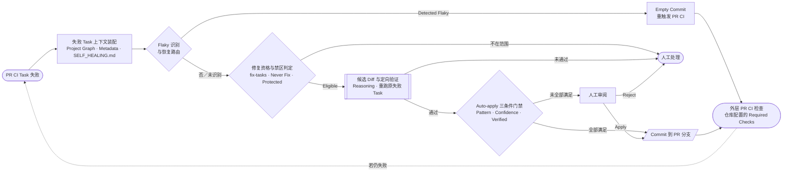

# Nx 将 CI 自愈拆成失败路由、修复约束、验证门禁与有界写回

> [!abstract] 页面任务
> 上半层把 Nx Self-Healing CI 的公开机制压缩为一条受控修复路径；下半层把六个流程阶段映射到五类技术能力，并以“行业机制洞察”比较 Harness、GitLab、CircleCI、GitHub 等公司的不同控制方式，页底给出三条综合判断。

## 上半层：Nx Self-Healing CI 受控修复路径

1. **失败 Task 与上下文装配：** PR CI Task 失败后，由始终执行的 `fix-ci` 进入自愈分析；Project Graph 与 Metadata 提供 Workspace 结构、项目关系和构建配置上下文，`.nx/SELF_HEALING.md` 可补充 CI 专用约束和修复偏好。
2. **Flaky 识别与恢复路由：** 被 Nx Cloud 检测为 Flaky 且开启 Auto-retry 时，通过向 PR Branch 推送 Empty Commit 触发新一轮 PR CI；官方未公开判定算法、样本窗口和阈值。
3. **修复资格与禁区判定：** Workspace Settings 或 `--fix-tasks` Glob 决定哪些失败 Task 可尝试修复；Never Fix Pattern 和 Protected Branch Prefix 排除自动修复范围。
4. **候选 Diff 与定向验证：** Agent 输出修复 Reasoning 和可审阅 Diff，并用候选变更重新执行原失败 Task；这一步验证已观察到的失败，不等于全部 PR CI。
5. **Auto-apply 三条件门禁：** 只有 Task Pattern 匹配、Agent High Confidence、候选修复 Explicitly Verified 三项同时成立，才允许免人工提交。
6. **PR 分支写回与外层 CI 检查：** 自动提交或人工 Apply 后写入 PR Branch，由仓库 CI 执行 Required Checks；用户仍可 Reject、Apply Locally 或 Revert。

### 定稿流程图

### 两层验证的区别

| 动作 | 验证对象 | 能证明什么 | 不能证明什么 |
|---|---|---|---|
| 修复并复跑原失败 Task | 刚才失败的 `lint`、`build`、`test` 等 Task | 候选变更解决了已观察到的失败 | 其他 Required Checks、全仓影响和业务语义均正确 |
| 写回后重新运行 PR CI | 仓库为该 PR 配置的 Required Checks | 新提交通过了现有 PR 门禁 | 长期业务正确、生产安全或根因不会复发 |

> [!note] 术语说明
> 图中的“重新运行 PR CI”指新提交触发仓库既有的 PR 检查，不再使用含义不清的“完整 CI”。Flaky 自动重跑恢复的是流水线执行，不代表偶现失败的根因已经修复。

> [!important] 口径边界
> Nx 是 PR CI Task 场景中较完整的可信自愈参考实现，依赖 Nx Cloud、Project Graph 与 VCS Integration；不能外推为所有技术栈或生产恢复的行业统一标准。

## 下半层：六阶段—五类技术能力映射

| 上图阶段 → 技术维度 | Nx 技术机制 | 行业机制洞察 |
|---|---|---|
| ① 上下文建模 | `Project Graph + Metadata + SELF_HEALING.md`：装配 Task、依赖、配置与修复约束 | **共识：** Harness、GitLab、CircleCI 均组合运行证据与代码上下文；Nx 更强调图结构上下文 |
| ②③ 故障路由与修复边界 | Flaky → Empty Commit 重跑；`fix-tasks` / Never Fix / Protected 划定可修范围 | **分化：** CircleCI 分离 Auto Rerun 与 Fix；GitLab 用停止条件控风险；公开资料无统一分类器 |
| ④ 候选修复生成 | 对 Eligible Task 输出 Reasoning + 可审阅 Diff；支持 Apply / Reject / Apply Locally | **形态：** Harness 用 Agent 分工；GitLab 用 Suggestion / 新 MR；CircleCI 按 Error / Job / Workflow 修复 |
| ④ 验证 Oracle | 候选变更复跑原失败 Task，形成 Explicitly Verified；不替代全部 Required Checks | **共识：** CircleCI、Harness、GitLab 都回到真实 Pipeline / Build / Test 作为外部 Oracle |
| ⑤⑥ 写回控制与恢复：门禁 | Auto-apply = Pattern × High Confidence × Verified；三项缺一即转人工 | **趋势：** Harness、GitHub、GitLab 将写权限放在 RBAC / Policy / Safe Outputs / Push Rule |
| ⑤⑥ 写回控制与恢复：写回 | 仅写 PR Branch；外层 Required Checks 继续校验；保留 Reject / Revert | **趋势：** CircleCI 用 Draft PR 承载候选；Harness 重触发 Build；GitLab 用 Suggestion / MR 隔离写回 |

## 页底三条启示

1. 技术复杂度不在生成 Diff，而在“上下文—路由—Oracle—写回”的受控闭环。
2. Nx 以 Project Graph 定位影响、以 Task 复验收窄正确性、以三条件门禁限制写权。
3. 行业方向是 Agent 做概率性判断，Pipeline、Policy 与权限系统守确定性边界。

## 状态与边界

- Nx Self-Healing CI 面向 Nx Cloud 的 PR CI Task，并要求 VCS Integration。
- GitLab Fix CI/CD Pipeline Flow：GA。
- CircleCI Chunk：Beta。
- GitHub Agentic Workflows：Technical Preview；CI Doctor 是官方参考 Workflow。
- Harness AutoFix/Worker Agents 与 Nx Self-Healing CI 均有官方产品页面；本页不把未明确标注的状态自行推断为 GA。
- 页面覆盖 CI 构建、测试和 PR 修复，不包含自动合并、自动部署或生产恢复。
- 公开证据不支持把厂商能力外推为主干或生产环境的通用无人值守自愈。

## 可编辑评审版

- [ci-self-healing-nx-mechanism-mapping-review.pptx](../../../outputs/ci-self-healing-nx-mechanism-mapping-review.pptx)
- [ci-self-healing-nx-authoritative-flow-table-review.pptx](../../../outputs/ci-self-healing-nx-authoritative-flow-table-review.pptx)
- [ci-self-healing-harness-official-flow-table-review.pptx](../../../outputs/ci-self-healing-harness-official-flow-table-review.pptx)
- [ci-self-healing-harness-loop-review.pptx](../../../outputs/ci-self-healing-harness-loop-review.pptx)
- [上一版：ci-self-healing-trusted-loop-review.pptx](../../../outputs/ci-self-healing-trusted-loop-review.pptx)
- 最新 Nx 评审版已将下表改为“上图阶段 → 技术维度 → 行业机制洞察”，并在 PowerPoint 备注中补充六阶段机制详解、五类技术能力映射、验证边界和官方来源。
- Nx 版包含 40 个原生文本/形状对象；组合、文本编辑和选择锁均为 0。
- 自动渲染、画布溢出、微软雅黑字体、压缩包完整性与对象锁检查均已通过；PowerPoint UI 人工组合/改色测试待用户侧抽检。

## 来源

- [[50_deepdives/cicd-self-healing/90_report|CI/CD 自愈深研]]
- [[50_deepdives/cicd-self-healing/presentation-page-research-2026-07-24|CI 自愈单页汇报研究稿]]
- [[50_deepdives/cicd-self-healing/recent-paper-search-2026-07-25|近期论文检索与权威性边界]]
- [[30_summaries/stages/README#4. 编译、构建与出包|构建阶段总结]]
- [[80_presentations/agentic-cicd-company-workflows/source-map#Source Map|本页 Source Map]]
