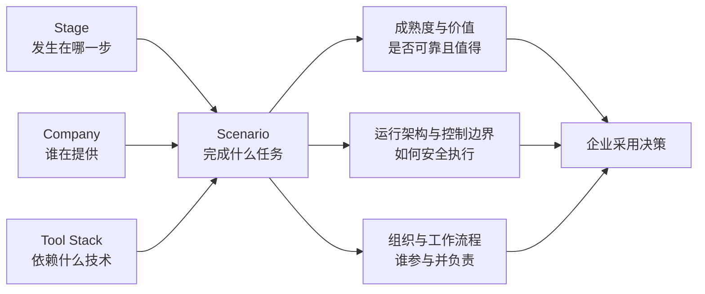
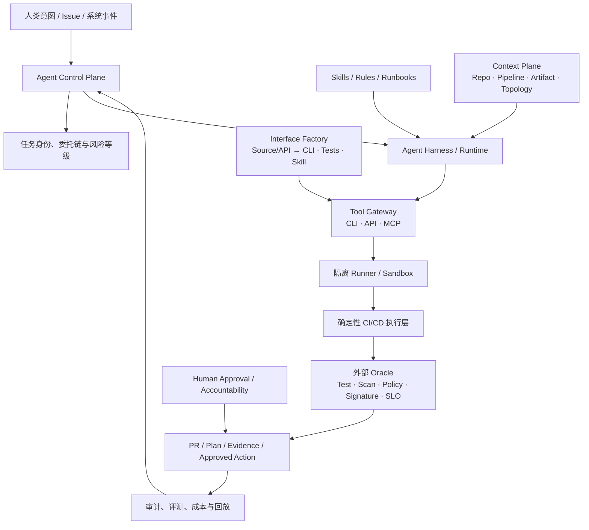

# Agentic CI/CD 七维分析汇总报告

**观察窗口：** 2025-07-01—2026-07-16，重点关注 2026 年
**研究范围：** 编码完成后的代码评审、检查与门禁、构建出包、制品与版本、部署发布、发布后验证与恢复
**证据基础：** [[00_sources/agentic-cicd-source-landscape|81 条核心一手资料]]、[[00_sources/README|68 个深度 Source Brief]]

> [!abstract] 总结论
> 2026 年 Agent 已经进入 CI/CD 的分析、变更生成和受控执行层，但行业成熟单位不是“一个平台”或“一个模型”，而是一个可以被独立评测和授权的**任务场景**。企业应以 Scenario 为连接键，同时判断它处于哪个 Stage、由哪些 Company 提供、依赖什么 Tool Stack、是否具有成熟度和价值证据、在什么运行架构与控制边界中执行，以及人员和流程如何承接责任。

## 一、七维框架

七个维度分成两组：前三个描述市场和技术事实，后四个支持企业决策。

| 类型 | 维度 | 回答的问题 | 本报告的核心判断 |
|---|---|---|---|
| 描述 | Stage | Agent 改变了 CI/CD 的哪个环节？ | 评审、CI 修复和只读事故调查领先，关键发布自治最慢 |
| 描述 | Company | 谁在提供和组合能力？ | 全生命周期平台争夺上下文，专业厂商提供 Oracle，云厂商从运行态向发布延伸 |
| 描述 | Tool Stack | Agent 靠什么理解、扩展和执行？ | Agent Harness、Skills、MCP/CLI、Runner 与控制面是组合关系，不是替代关系 |
| 决策 | Scenario | Agent 实际完成什么端到端任务？ | 场景是落地、评测、授权和核算价值的最小单元 |
| 决策 | 成熟度与价值 | 是否可靠、是否值得规模化？ | 必须联合判断自治、生产证据、质量、风险和单位成功成本 |
| 决策 | 运行架构与控制边界 | 如何连接、在哪里运行、如何授权和验证？ | 动态推理必须运行在确定性执行、外部 Oracle 和可追责边界之内 |
| 决策 | 组织与工作流程 | 谁定义意图、验证证据、批准和担责？ | 人从执行步骤迁移到意图、规则、证据、异常和责任管理 |



这意味着不能直接得出“GitHub 已到 L3”或“采用 MCP 就能自治”之类的结论。自治等级和价值必须落到具体场景，例如“在隔离 Runner 中修复 CI 并生成 Draft PR”可以是 L2，而同一 Agent 的“自动批准生产发布”仍可能只适合实验。

## 二、Stage：Agent 沿 CI/CD 的扩散并不均匀

| 阶段 | 2026 年主要 Agent 任务 | 当前可信自治上限 | 成熟度判断 | 关键限制 |
|---|---|---|---|---|
| 1. 代码评审与质量 | 仓库级评审、规则检查、修复 PR | L2 | 高 | 业务语义、误报、责任归属 |
| 2. 静态/安全/依赖/合规 | 发现解释、修复、扫描复验 | L2，局部 L3 | 中高 | 修复副作用、例外与供应链 |
| 3. 测试/门禁/风险 | 测试生成与选择、Coverage、风险建议 | 沙箱内 L3 | 中高 | Oracle 质量、Flaky Test、成本 |
| 4. 编译/构建/出包 | 失败归因、配置修复、重跑 | L2—L3 | 中 | 可复现性、缓存、Runner 和密钥 |
| 5. 制品/供应链/版本 | 可信包查询、升级建议、有限制品操作 | L2 | 中低 | 签名、不可变性、晋级权限 |
| 6. 环境/IaC/部署 | Plan、策略解释、批准后执行 | L3 | 中 | 凭据、漂移、爆炸半径 |
| 7. 发布/审批/变更 | 就绪评审、依赖分析、渐进发布计划 | L3 | 低中 | 跨团队责任和不可逆风险 |
| 8. 发布后验证/恢复 | 跨源调查、Runbook、受限恢复 | L3；局部 L4 | 分析中高，闭环中低 | 因果不确定、动作安全、监控可靠性 |

决定成熟度的不是阶段顺序，而是三个条件：上下文是否结构化、结果能否被独立验证、动作是否可逆且容易隔离。PR 同时满足三者，所以阶段 1 最成熟；生产发布通常三者都较弱，所以阶段 7 最谨慎。完整分析见 [[30_summaries/stages/README|八阶段维度总结]]。

## 三、Company：竞争焦点从功能数量转向上下文与控制面

| 厂商类型 | 代表公司或生态 | 主要优势 | 战略方向 | 企业使用方式 |
|---|---|---|---|---|
| 全生命周期研发平台 | GitHub、GitLab、Harness、Microsoft/Azure DevOps | 代码、PR、Pipeline、安全和权限处在同一数据面 | 将 Agent 编译或嵌入既有执行与治理平面 | 作为主入口，但保留专业 Oracle |
| 云与可观测平台 | AWS、Google Cloud、Azure、Datadog、CloudQ、HolmesGPT | 云拓扑、遥测、部署和事故历史 | 从只读调查向发布准备和受限恢复扩展 | 优先用于生产分析和预批准 Runbook |
| 专业 Oracle 厂商 | Snyk、Sonar、Semgrep、Tricentis、JFrog、Cloudsmith、Sonatype | 安全、测试、制品和供应链的确定性事实 | 为通用 Agent 提供可信上下文、复验和受控动作 | 与全生命周期平台组合采购 |
| 部署与变更平台 | Spacelift、Akuity、Octopus Deploy、ServiceNow | Policy、Plan、GitOps、Runbook、Change Context | 把自然语言入口接入既有审批和部署控制面 | 保持批准、签名和晋级权外置 |
| 独立 Harness 与开源生态 | Claude Code、Codex CLI、OpenCode、Gemini CLI、OpenHands、CLI-Anything | 跨平台、终端入口、接口生成、可组合或可自托管 | Harness 成为跨系统执行层，接口工厂把长尾软件转成 Agent 工具面 | 由企业补齐接口验收、身份、沙箱、审计和评测 |

大型公司内部实践比产品演示更一致：Microsoft、Spotify、Uber、Meta、Google SRE、WhatsApp 和 Atlassian 都没有一次性替换全部工具，而是通过 PR、Pipeline、MCP 或 Runbook 接入 Agent，并保留人工接管和确定性验证。竞争优势正由“模型更强”转向“拥有高质量上下文、可信动作接口和可证明结果”。完整分析见 [[20_summaries/companies/README|公司维度总结]]。

GitHub Agentic Workflows 是这一方向最可检查的开源样本：把自然语言源文件编译成 Actions Lock，将只读 Agent、检测和写入拆为独立 Job，并用 Safe Outputs 表达类型化副作用；多仓复杂度则通过 Orchestrator/Worker 与 CentralRepoOps 拆分。其当前仍为 Public Preview，完整机制和实践见 [[50_deepdives/github-agentic-workflows/90_report|专题报告]]。

Harness 公司是另一种平台原生样本：DevOps Agent 设计和操作交付对象，Worker Agent 进入 Pipeline，Knowledge Graph/HQL 处理结构化跨模块上下文，MCP/CLI/Skills 承担外部接口，Test/Security/SRE 专项 Agent 提供领域闭环，再由 RBAC、OPA、Approval、Scoped Token、隔离 Runtime 和 Audit 控制行动。其通用 Worker Agent 刚进入 GA，公开量化效果仍少，故近期定位仍是 L2 与受限 L3。完整分析见 [[50_deepdives/harness-company/90_report|Harness 公司专题]]。

## 四、Tool Stack：五层组合，而不是单项技术选边

> [!important] 术语说明
> 本节的 `Agent Harness` 是通用技术类别，不是 Harness Inc. 公司；后者属于 Company 维度。二者可以在一个场景中组合，但不能作为同一分类项比较。

| 技术层 | 主要作用 | 代表形态 | 关键判断 |
|---|---|---|---|
| 知识与行为包 | 告诉 Agent 如何按组织方式工作 | Skills、Rules、`AGENTS.md`、Hooks | 是组织知识，不是权限或 Policy |
| Agent Harness | 理解任务、规划并循环调用工具 | Claude Code、Codex CLI、OpenCode、Gemini CLI、OpenHands | 是执行外壳，不是完整 CI/CD 平台 |
| 工具接口 | 暴露查询与行动能力 | CLI、API、SDK、MCP、CLI/Skill 生成器 | CLI 是确定性底座，接口工厂补齐长尾软件，MCP 是跨 Agent 适配和治理协议 |
| 执行承载 | 提供工作区、算力和隔离 | 本地终端、CI Runner、远程 Coding Agent、常驻服务 | 承载方式直接决定风险和自治上限 |
| 治理控制面 | 管理身份、权限、审计、评测和预算 | Agent Identity、Gateway、Safe Output、Evals | 工具可调用不代表 Agent 获得行动授权 |

2026 年更合理的参考组合是：

```text
Agent Harness
+ 组织 Skills / Rules
+ CLI / API 能力底座
+ 对长尾软件按需生成并验证 CLI / Skill
+ 必要时增加 MCP 适配
+ 隔离 Runner 或任务沙箱
+ 身份、策略、审计与评测控制面
```

企业不应把“是否支持 MCP”当作唯一选型标准。已有稳定 CLI 时应优先复用；缺少机器接口的长尾软件可评估 CLI-Anything 一类接口生成器，但生成物必须重新测试和授权；多个 Harness 需要共享远程工具和集中授权时再引入 MCP；需要沉淀组织做法时使用 Skill；需要生产执行时必须增加外部控制面。完整分析见 [[10_summaries/tools/README|Agent 工具与技术栈总结]]。

## 五、Scenario：七个维度之间的连接键

### 场景全景

| 端到端场景 | 跨越阶段 | 代表公司/项目 | 典型工具组合 | 当前可信上限 | 成熟度与价值判断 |
|---|---|---|---|---|---|
| Agentic Code Review | 1—3 | GitHub、GitLab、Qodo、Atlassian、阿里云 | Repo Context + Rules/Skill + Reviewer/Judge + PR | L2 | 最成熟；适合规模化，但要管理误报和评审负荷 |
| 安全与依赖修复 | 2—5 | Snyk、Sonar、Semgrep、GitHub、JFrog | Analyzer/SCA + Agent Fix + Test/Scan Oracle + PR | L2，局部 L3 | 价值高；适合高频漏洞和版本适配，不能自动接受所有修复 |
| CI 失败诊断与自愈 | 3—4 | CircleCI、Harness、GitLab、GitHub、Nx、Buildkite | Evidence + 分类器 + Harness + CLI/MCP + Runner + 外部 Oracle + PR | L2—L3；PR 微域局部 L4 | 高优先级；必须区分诊断/PR/验证写回/闭环，受 Runner、可复现性和 Oracle 质量限制；见 [[50_deepdives/cicd-self-healing/90_report|专题]] |
| 测试生成与动态验证 | 3—4 | Tricentis、Harness、CircleCI、GitHub | Change Context + Test Agent + Deterministic Test Engine | 沙箱内 L3 | 中高价值；长期零回归和测试有效性仍需持续评测 |
| 供应链与版本维护 | 2—5 | JFrog、Cloudsmith、Sonatype、GitHub | Package Intelligence + MCP/CLI + SBOM/Policy + PR | L1—L2 | 信息和修复价值明确；签名、晋级和版本授权仍保守 |
| 跨仓维护与 Fix-forward | 1—5、8→1 | Spotify、Meta、Bloomberg、GitHub | Service Catalog + Repo Agent + CI + PR | L2 | 对大规模平台团队价值高；依赖机器可读标准路径和所有权数据 |
| 遗留/内部工具 Agent 化 | 3—8 | HKUDS / CLI-Anything、企业内部平台 | Source/API + Interface Generator + CLI/Skill + Tests + Runner | 生成 L2；执行上限按权限另定 | 接入长尾工具潜力高；开源活跃但企业 CI/CD 效果证据仍薄，需逐工具验收 |
| Pipeline/IaC/部署变更 | 4、6 | GitHub、Harness、Spacelift、Terraform、Akuity、Octopus | Skill + CLI/MCP + Plan + Policy + Approval | L2—L3 | 适合受控试点；必须限制环境、凭据和 Blast Radius |
| Release Readiness 与变更管理 | 5—7 | AWS、Harness、ServiceNow、Octopus | Cross-repo Context + Evidence Pack + Approval | L1—L3 | 信息汇总价值高，公开生产执行证据仍少 |
| 事故调查与受限恢复 | 8、8→1 | AWS、Harness、Azure、Datadog、CloudQ、HolmesGPT、Meta | Telemetry/Topology + SRE Agent + Runbook + SLO | 分析 L1—L2；动作 L3，局部 L4 | 只读调查已经成熟；自动恢复仅适合预批准低风险动作 |

### 场景优先级

> [!success] 可优先规模化
> 代码评审前置筛查、CI 失败归因与修复 PR、安全发现解释与修复 PR、只读事故调查。它们高频、结果可验证、输出可审查，容易建立效果基线。

> [!warning] 应受控试点
> 动态测试、跨仓维护、IaC/部署 Plan、发布就绪评审和预批准 Runbook。价值潜力较高，但对上下文、平台标准化、权限和评测要求更高。

> [!danger] 不宜作为近期默认能力
> Agent 自主修改 Gate、自动签名或晋级制品、批准自己的变更、无人监督执行关键生产发布，以及在没有可靠 Runbook 和回滚条件时自动恢复。

## 六、成熟度与价值：联合判断“能不能”和“值不值”

产品状态、自治等级和业务价值是三个不同概念。GA 只表示产品可用，不代表某个场景已经可靠；L3 只表示经过批准可以执行，不代表执行具有正向经济性。

### 六项联合评估

| 评估轴 | 核心问题 | 最低证据 |
|---|---|---|
| 产品与能力状态 | GA、Preview、Alpha 还是 Research？ | 官方状态和版本记录 |
| 任务可靠性 | 在企业真实任务上成功多少，失败是什么？ | 固定任务集、隐藏/未来测试、人工复核 |
| 自治与风险 | Agent 能分析、生成变更，还是能执行？ | L0—L4、环境、权限、Blast Radius |
| 可验证与可恢复 | 成功能否被外部 Oracle 证明，失败能否回退？ | Test、Scan、Policy、Signature、SLO、Rollback |
| 生产与规模证据 | 是 Demo、试点还是长期大规模运行？ | 任务量、时间跨度、业务域和局限说明 |
| 系统价值与经济性 | 是否改善交付系统，单位成功成本是否合理？ | 质量、流程、安全、成本联合指标 |

### 价值组合判断

| 组合 | 典型场景 | 建议 |
|---|---|---|
| 成熟度高、价值明确 | Review、CI 归因/修复、只读事故调查 | 建立统一平台能力并扩大覆盖 |
| 成熟度中、价值潜力高 | 安全修复、动态测试、跨仓维护 | 用企业任务集验证后分域扩展 |
| 成熟度中低、价值可能高 | IaC/部署、Release Readiness、低风险 Runbook | 保持 L2/L3、逐次批准和小范围灰度 |
| 成熟度低、风险高 | 自动签名/晋级、关键发布 L4、自主改 Gate | 继续观察，不作为规划基线 |

建议指标必须同时覆盖四层：

- **任务质量：** 成功率、回归率、错误修复、人工拒绝和保留率；
- **流程效果：** Lead Time、反馈时延、MTTR、评审负荷和变更失败率；
- **治理安全：** 越权、策略拦截、审计完整率、接管和回滚率；
- **经济性：** 每成功任务的 Token、Runner、人时、重试和平台成本。

DORA 的研究提示 AI 会放大现有工程系统：平台质量、测试、版本控制和反馈薄弱时，代码产出增加可能同时损害稳定性。因此成熟度与价值必须按场景、业务域、风险等级和 Agent/模型版本持续重评，而不能一次认证后永久放权。参考 [[00_sources/briefs/2025-dora-state-ai-assisted-software-development|DORA 2025]]、[[00_sources/briefs/2026-dora-platform-engineering-ai|DORA Platform Engineering]]、[[00_sources/briefs/2026-swe-ci-benchmark|SWE-CI]]。

## 七、运行架构与控制边界：动态推理，确定性约束

这个维度不再罗列工具，而是解释工具如何连接、Agent 在哪里执行、权限如何约束、结果如何被独立证明。



### 六条控制边界

| 边界 | 必须回答的问题 | 推荐控制 |
|---|---|---|
| 上下文边界 | Agent 能读取什么，数据是否新鲜且有权限？ | 按任务过滤、敏感数据脱敏、来源与时间戳 |
| 身份与行动边界 | 谁委托，Agent 可以调用什么工具和环境？ | 每任务身份、短期 Token、Tool/Environment Scope |
| 执行边界 | 代码和命令在哪里运行，能否接触密钥和网络？ | 临时沙箱、网络出口、缓存隔离、非生产默认 |
| 验证边界 | 谁判断成功，Agent 能否修改判定规则？ | 外部 Test/Policy/Signature/SLO，职责分离 |
| 输出与责任边界 | 结果是建议、PR、Plan 还是生产动作？ | PR、Safe Output、Approval、预批准 Runbook |
| 运行与成本边界 | 长循环何时停止，失败如何接管？ | Token/时间/重试/动作预算、Kill Switch、回退 |

### 四种推荐运行模式

| 模式 | 适用场景 | 主要边界 |
|---|---|---|
| PR-bound | Review、安全修复、依赖升级、CI 修复 | 写操作只生成 Branch/Draft PR，合并由既有 Gate 决定 |
| Pipeline-bound | 测试、构建、证据生成、非生产自愈 | Agent 在隔离 Runner 中运行，受到超时、权限和预算限制 |
| Plan-and-Approval | IaC、部署、发布和变更 | 批准绑定具体 Plan、制品、环境、哈希和有效期 |
| Runbook-bound | 事故处置和低风险恢复 | 只允许执行预先批准、幂等、可回滚的小范围动作 |

架构底线是：Agent 可以规划、解释和修复，但不能同时修改成功标准、批准自己的计划、执行高风险动作并解释结果。参考 [[00_sources/briefs/2026-uber-agent-identity|Uber Agent Identity]]、[[00_sources/briefs/2026-google-cloud-agent-identity|Google Cloud Agent Identity]]、[[00_sources/briefs/2026-openid-authzen-agent-authorization|OpenID AuthZEN]]。

Harness Worker Agent 提供了一个可供验证的厂商实现：运行时把 Agent 当作已被攻陷的工作负载，使用 Image/Process/Secret/Network 四层隔离；存在触发 Principal 时，权限是其 RBAC 与 Agent Grant 的短期交集，第三方 MCP Tool 再做 Connector/Agent Allowlist 交集。它证明“委托身份”和“隔离执行”可以落到 Pipeline 产品，但当前证据主要来自厂商技术文，且部分权限受 Feature Flag 影响；事件 Trigger Run 当前不能继承触发人 scoped token，需要单独的身份与审批路径。参考 [[00_sources/briefs/2026-harness-worker-agent-security|Harness Worker Agent 安全与身份]]。

## 八、组织与工作流程：从执行步骤转向管理意图、证据和异常

### 角色变化

| 角色 | 减少的工作 | 新增或增强的能力 | 保留的责任 |
|---|---|---|---|
| 开发者 | 查日志、机械修配置、重复补测试 | 写清意图与验收条件、审查 Agent 计划和证据 | 对代码和业务语义负责 |
| Reviewer / 架构师 | 阅读所有低风险细节 | 处理高语境取舍、替代方案和长期维护 | 对关键设计和合并判断负责 |
| QA / 测试 | 手工编写全部步骤 | 风险模型、测试 Oracle、未来/隐藏测试、Agent 评测集 | 对验证有效性负责 |
| 平台/研发效能 | 维护模板和门户、响应重复工单 | Context/Tool Plane、长尾接口生成与验收、Runtime、任务身份、预算和自治运营 | 对平台边界和开发体验负责 |
| 安全/IAM | 逐条分诊和共享机器人授权 | Agent 身份、委托链、工具供应链、动态授权和红队 | 对策略、例外和高风险权限负责 |
| SRE/发布 | 跨工具收集状态、机械执行 Runbook | SLO、Runbook、渐进发布、恢复边界和异常接管 | 对事件指挥和生产风险负责 |
| 工程管理者 | 追踪使用率、代码量和理论工时 | 管理系统效果、责任设计、平台瓶颈和风险收益 | 对自治范围和投资决策负责 |

### 工作流程变化

```text
过去：人理解上下文 → 人选择工具 → 人执行步骤 → Pipeline 给结果

未来：人定义意图与边界
   → Agent 动态调查、生成计划和候选变更
   → 确定性系统执行并提供证据
   → 低风险自动继续，高风险由人判断
   → 结果回流到评测、Rules、Skills 和平台能力
```

流程资产也会改变。除代码、Pipeline 和 Runbook 外，企业需要维护：任务验收规范、Agent/Skill 版本、Tool Registry、风险分级、黄金评测集、批准前置条件、Evidence Pack、失败回放和成本基线。PR、Pipeline、Plan/Approval 与 Runbook 将成为四类主要人机边界。

## 九、七维交叉后的关键结论

1. **场景而不是产品是采用单位。** 采购一个“L3 Agent 平台”没有直接意义；企业需要批准的是某个 Agent 在某类仓库、环境和风险条件下完成某个任务。
2. **可验证性和可逆性决定自治上限。** 模型能力影响完成率，但外部 Oracle、隔离和回滚决定能否获得执行权。
3. **平台质量是 Agent 收益的放大器。** 结构化上下文、可靠测试、可复现 Runner、清晰所有权和快速反馈不足时，Agent 会扩大重试、噪声和不稳定。
4. **全生命周期平台与专业 Oracle 会组合共存。** GitHub/GitLab/Harness 提供上下文和流程骨架，安全、测试、制品、部署与可观测厂商提供不可由模型自行生成的事实。
5. **MCP、CLI、Skill、接口生成器和 Harness 不构成替代链。** CLI/API 是能力底座，接口生成器补齐长尾能力面，MCP 提供互操作，Skill 沉淀组织方法，Harness 负责循环执行，控制面负责授权。
6. **近期主流是 L2 和 L3，不是全流程 L4。** 最现实的价值来自可审查变更、沙箱验证和批准后执行；关键发布、签名、策略修改和跨环境晋级继续由人和确定性系统控制。
7. **“自愈”必须按闭环与权限双重判级。** SH0—SH4 描述检测到回退是否完整，L0—L4 描述行动权；自动调查、创建 PR、验证写回和生产恢复不能混成同一个成熟度。
8. **人的工作向高语境与高责任环节集中。** 自动化程度上升不会消除责任，而会使意图、验收标准、风险边界、异常接管和效果评测更重要。

## 十、企业采用建议

### 第一优先级：建立场景基线

选择 2—3 个高频、可回滚、可验证场景，例如 Review、CI 修复和只读事故调查。记录任务成功、人工介入、回归、Lead Time、审计和单位成功成本。

### 第二优先级：建设运行与控制底座

统一任务身份、受控 Tool/MCP 目录、Runner/Sandbox、PR/Plan/Approval 出口、外部 Oracle、预算和审计。不要让各团队使用共享高权限机器人账号自由接入工具。

### 第三优先级：按证据升级自治

从只读和 Draft PR 开始；达到任务质量、治理和经济性阈值后，开放非生产 L3；只有在动作可逆、影响范围小、成功条件清晰且有可靠 Runbook 时，才开放局部 L4。

### 第四优先级：重构组织运营机制

平台、QA、安全、SRE 和业务团队共同维护评测集、Rules/Skills、风险等级、工具权限和失败回放。Agent 自治等级应像 SLO 和生产权限一样持续运营，而不是一次采购决定。

## 十一、证据边界

- 81 条核心来源以官方文档、第一方工程实践、开源仓库、规范和原始研究为主；厂商效果数据没有独立验证时不外推为行业结论。
- GA 代表产品可用，不代表特定场景已经达到稳定 L3/L4。
- 开源 Star 表示关注度，不代表安全、支持、长期维护或生产成熟度。
- 发布、制品晋级和关键生产恢复的公开 L4 证据仍少，未来判断应持续更新。
- 不同企业的代码规模、平台质量、风险偏好和监管环境差异很大，价值结论必须通过自有任务集验证。

## 下钻入口

- [[00_sources/README|L0 信息源与 Source Brief]]
- [[00_sources/agentic-cicd-source-landscape|81 条核心一手资料景观]]
- [[00_sources/source-pruning-2026-07-14|信息源精简审计]]
- [[05_case_library/README|实践案例库]]
- [[10_summaries/tools/README|Agent 工具与技术栈总结]]
- [[20_summaries/companies/README|公司维度总结]]
- [[30_summaries/stages/README|八阶段维度总结]]
- [[40_summaries/crosscutting/README|工具、流程、人员、治理和度量变化]]
- [[50_deepdives/README|专题深研索引]]
- [[50_deepdives/cicd-self-healing/README|CI/CD 问题自愈深研]]
- [[50_deepdives/harness-company/README|Harness 公司深研]]
- [[90_report/README|原综合主报告与 18 个月路线]]
