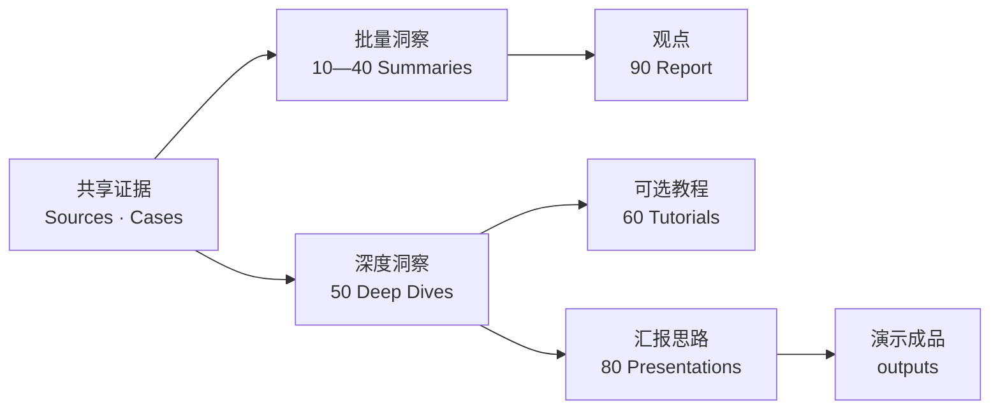

# Agent 技术在 CI/CD 中的应用与实践洞察

> [!abstract] 研究目的
> 帮助 CTO、研发效能负责人和平台工程负责人判断未来两年 Agent 将如何重构 CI/CD，哪些场景已经具备落地条件，企业应如何调整平台能力、工作流程、人员职责与治理机制，并据此制定分阶段演进路线。

## 项目的三个核心作用

1. **批量洞察，形成观点：** 对多公司、行业趋势和 CI/CD 阶段进行批量研究，经分类总结和交叉分析形成主报告。
2. **针对公司或功能进行深度洞察：** 对单一公司、功能、技术或场景建立完整专题研究。
3. **基于深度洞察形成汇报思路：** 从已完成且适合汇报的 Deep Dive 中提炼页面主张、作业流和企业启示。

## 快速阅读

- [[90_report/seven-dimension-analysis|七维交叉分析工作台]]：从七个维度检验批量研究的候选观点，不作为第二份最终报告。
- [[90_report/README|主报告]]：决策结论、八阶段影响、参考架构、18 个月路线与 2027—2028 展望。
- [[80_presentations/README|演示文稿层]]：管理 PPT 的叙事、页面文案、作业流表达和来源映射；最终渲染文件仍放在 `outputs/`。
- [[00_sources/agentic-cicd-source-landscape|81 条核心一手资料景观]]：精简并增补后的 L0 来源与逐条 Brief。
- [[00_sources/source-pruning-2026-07-14|信息源精简审计]]：从 107 条候选源缩减到 80 条核心源，并补入 CLI-Anything 后形成 81 条当前核心源的记录。
- [[00_sources/README|深度 Source Brief 索引]]：68 个高频来源的独立分析。
- [[00_sources/incremental-source-research-2026-07-14|本轮增量研究记录]]：25 条新增源的排重与选源依据。
- [[05_case_library/README|实践案例库]]：把跨专题复用的外部实践整理成架构、流程、控制边界和证据强度明确的案例卡。
- [[10_summaries/tools/README|Agent 工具与技术栈]]、[[20_summaries/companies/README|公司维度]]、[[30_summaries/stages/README|阶段维度]]、[[40_summaries/crosscutting/README|横向变化]]：主报告的四组中间证据。
- [[50_deepdives/README|专题深研索引]]：问题树、证据矩阵、Findings 和专题报告，以及按需开展的案例比较、实验与 Playbook。
- [[60_tutorials/README|配置与实践教程]]：用最小 YAML/Frontmatter 示例解释关键字段、默认值、风险、常见错误和验证方法。
- [[50_deepdives/cli-agent-interface/90_report|CLI 深度报告]]、[[50_deepdives/mcp-protocol/90_report|MCP 深度报告]]、[[50_deepdives/cli-anything/90_report|CLI-Anything 项目深度报告]]、[[50_deepdives/github-agentic-workflows/90_report|GitHub Agentic Workflows 深度报告]]、[[50_deepdives/cicd-self-healing/90_report|CI/CD 问题自愈深度报告]]、[[50_deepdives/harness-company/90_report|Harness 公司深度报告]]：分别研究执行接口、协议、接口生成项目、Agent Workflow 平台、端到端自愈场景与 Harness Inc. 的产品/架构/实践；跨 CLI/MCP 选型见 [[50_deepdives/cli-vs-mcp-decision-guide|决策指南]]。

## 研究边界

- 时间：纳入 2025 年 7 月 1 日以来的材料，重点关注 2026 年；每个批次和专题单独记录观察截止日，趋势判断可延伸至 2027—2028 年。
- 地域：全球实践为主，中国企业作为重要对照。
- 起点：编码完成，变更进入代码评审和交付系统。
- 终点：发布后验证、观测、回滚和故障恢复。
- 不单独研究传统 CI/CD；现有流程仅作为定位 Agent 介入点的坐标。
- 单次批量洞察、专题和演示项目分别记录自己的观察窗口、状态与 `as_of`。

## Agent 纳入标准

一项能力至少具备上下文理解、任务规划、工具调用、多步骤执行或结果反馈中的两项，并实际介入 CI/CD 工作。Agent 运行时、编排、权限、审计和评测平台也纳入。

纯代码补全、普通聊天、单次摘要和没有执行能力的 AI 建议原则上不纳入，除非它们已经改变门禁、审批或责任流程。

## 自主等级

| 等级 | 定义 |
|---|---|
| L0 | AI 辅助，只生成信息或建议 |
| L1 | Agent 自主分析并给出行动方案 |
| L2 | Agent 生成可审查的变更、PR、策略或发布计划 |
| L3 | 经人类批准后调用工具执行 |
| L4 | 在预设权限和风险边界内闭环执行、验证并恢复 |

## CI/CD 阶段

1. 代码评审与质量检查
2. 静态分析、安全、依赖与合规检查
3. 自动化测试、质量门禁与风险决策
4. 编译、构建与出包
5. 制品、软件供应链与版本管理
6. 环境准备、基础设施与部署
7. 发布策略、审批与变更管理
8. 发布后验证、观测、回滚与故障恢复

门禁和 Agent 治理同时作为跨阶段能力研究。

## 目录与所有权

- [[00_sources/README|信息源层]]：原始来源、Source Brief 和事实证据。
- [[05_case_library/README|实践案例库]]：三条作业流共享的规范案例资产，不是必经步骤。
- [[10_summaries/tools/README|工具视图]]、[[20_summaries/companies/README|公司视图]]、[[30_summaries/stages/README|阶段视图]]、[[40_summaries/crosscutting/README|横向变化视图]]：批量洞察的四组分析视图。
- [[50_deepdives/README|专题深研]]：单一公司、功能、技术或场景的分析事实源。
- [[60_tutorials/README|配置与实践教程]]：Deep Dive 的可选实践衍生物。
- [[80_presentations/README|演示文稿]]：从 Presentation-ready Deep Dive 生成汇报叙事，不维护独立研究事实。
- [[90_report/seven-dimension-analysis|七维交叉分析]]：批量洞察的分析框架和候选观点工作台。
- [[90_report/README|主报告]]：批量洞察最终形成的跨行业观点和决策结论。

## 三条作业流

- **批量洞察：** 范围与观察窗口 → 批量收集与排重 → Source Brief → 维度归类 → 七维交叉分析 → 主报告观点。
- **深度洞察：** Charter → Question Tree → Evidence Map → 案例/实验（按需）→ Findings → 专题报告 → Presentation-ready 判断。
- **汇报思路：** 选择 Presentation-ready Deep Dive → Deck Brief → Slide Outline → 单页主张 → Source Map → 内容评审与成品。

## 增量洞察路由

- 批量研究的新洞察更新信息源、相关分类视图和主报告，不要求为每个公司或案例建立 Deep Dive。
- 单一公司、功能、技术或场景的新洞察进入对应 Deep Dive；只有改变演示主张或边界时才同步 Presentation。
- Presentation 中发现的事实缺口必须回到 Deep Dive 补证据；没有对应专题时，页面保持阻塞。
- 跨专题结论只有在改变全局观点时才回流主报告。
- Git 采用单分支协作：所有变更直接进入 `main`；需要提交或推送时直接操作 `main`，不新建额外分支，也不创建 Pull Request。
- 面向后续 Agent 的完整执行规则见 `AGENTS.md`。

## 证据规则

- 能力状态严格区分：正式可用、预览或实验、仅宣布或路线图。
- 主报告中的重要判断必须能下钻到分类总结和 Source Brief。
- 优先采用官方文档、官方工程实践、源代码、规范和原始研究。
- 厂商效果数据标明为厂商自述；没有独立验证时不外推为行业结论。
